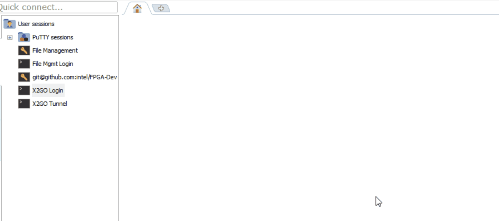

**Login Script**

Below are the instructions to the Devcloud login script. The picture below shows what the current script appears as. When you type the command “login”, the following output is shown. It separates the available nodes into 130-136, and 137-139, as well as stating what the nodes have.



               

Figure 1: Login Script Running


 

You can source the script in your .bashrc by including these two lines inside the .bashrc:
```
if [ -f ~/data/intel_fpga/devcloudLoginToolSetup.sh ]; then
    . ~/data/intel_fpga/devcloudLoginToolSetup.sh
fi


```
 


 

 

 

 


 

Once you select a node, it will also output the command required to set up the x2go window. Just copy and paste into a new mobaxterm terminal. 

 

   

Figure 3: x2go Command

 

 
