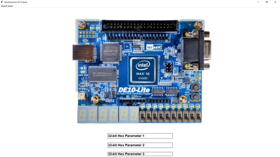
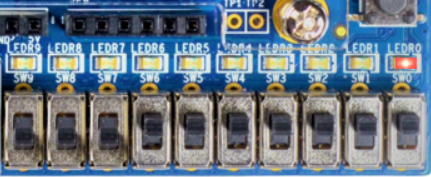
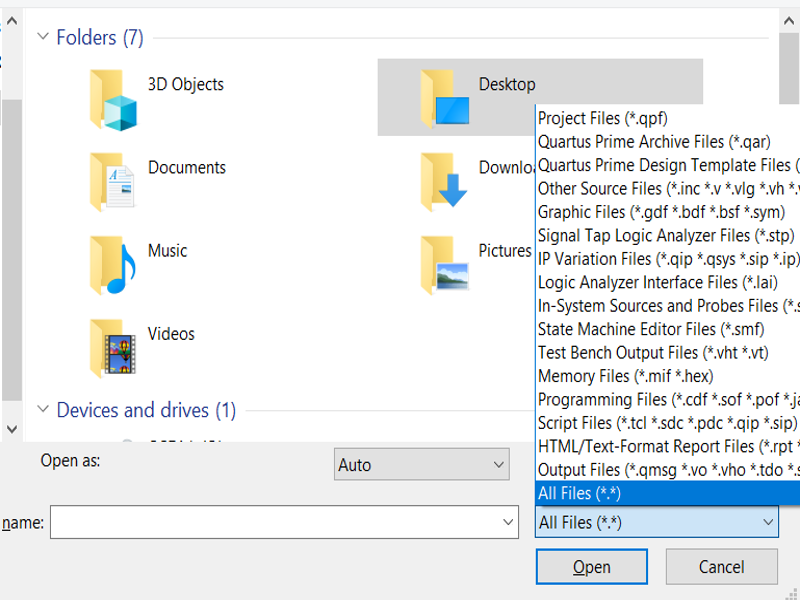

# 1 Introduction

This package provides a cookbook for creating hands free FPGA labs. Using the provided resources, a user's project may be programed to remote Intel FPGA development kits using a local Quartus installation connected to a remote server hosting one or more development kits. The input/output (slide-switches/LEDs) of the connected development kit is streamed to a GUI providing flexible remote lab development capabilities. An advanced user may develop their own GUIs to suit their project's specific needs. The connection to the hosted development kit, remote board programming and GUI configuration are all automated away from the user, enabling even the most inexperienced user to connect, program, and validate remotely programmed Intel FPGA development kits. A high-level overview of the system is shown below.


This documentation provides resources for [IT](#IT Resources), [instructors](#Instructor Resources), and [users](#User Resources) (students). The  [IT](#IT Resources) section provides instructions for setting up a Quartus Prime JTAG server. The [instructors](#Instructor Resources) section describes how an instructor can adapt the provided package to convert existing or new labs to a hands free format. The [users](#User Resources) section provides a tutorial for users to run an example project.  For more assistance or to report a bug please contact the Intel FPGA University Program.

# 2 IT Resources

## 2.1 Network Requirements

A systems administrator is required to setup the Quartus Prime JTAG server software that hosts development kits and manages connection requests. The software is included in the free Quartus Prime Lite 19.1 installation, and is also available in Windows. This software enables a daemon to continuously monitor connection requests coming in from network port 1309. Once a connection request arrives, the JTAG server software requests a password. Once the user's credentials have been verified, a user may access boards connected directly to the server's USB ports or connected via a USB port replicator. Before proceeding ensure with a systems administrator that port 1309 is visible from the network accessed via an external IP address. External access to the JTAG server software is password protected, however consult with network administrators before proceeding.

Once the network is setup, ensure that the Intel FPGA development kits are connected to the host device and all available device drivers are installed (i.e. USB-Blaster drivers included in Quartus Prime). If there is not a QUARTUS_ROOTDIR environment variable, it is useful to make one. This variable should hold the path to the "quartus" subdirectory in the Quartus Prime installation directory.

## 2.2 Setup  Tutorial

### Host a JTAG server on a Windows machine from Quartus Prime GUI

1. Before configuring, ensure that the  [Quartus Prime  Programmer tool](https://fpgasoftware.intel.com/19.1/?edition=lite) is installed on the host machine.
2. Open a local installation of Quartus Prime
3. Open the Programmer Tool by navigating Tools &rarr; Programmer
4. In the Programmer tool pane, select Hardware Setup
5. Select the JTAG Settings pane
6. Press Configure Local JTAG Server
7. Check the "Enable remote clients to connect to the local JTAG server" box
8. Enter a JTAG server access password and press OK

### Host a JTAG server on a Windows machine from Command Prompt

1. Open command prompt as an administrator

2. Change directory (cd) to the Quartus Prime installation directory (i.e.`cd C:\intelFPGA_lite\19.1\quartus\`)

3. Halt any outstanding JTAG server by typing the following

   `jtagserver --stop`

4. Install any updates needed to run the JTAG server on current Quartus version

   `jtagserver --install`

5. Configure the JTAG server to enable remote clients and set a password

   `jtagconfig --enableremote <password>`

6. Start the JTAG server

   `jtagserver --start`

7. Check the JTAG server status

   `jtagserver --status`

8. Ensure remote clients are enabled and server is running by reading the status output

### Host a JTAG server on a Linux machine

1. Before configuring, ensure that the  [Quartus Prime  Programmer tool](https://fpgasoftware.intel.com/19.1/?edition=lite) is installed on the host machine.

2. Ensure there are no running instances of the daemon or configuration processes 

   ```bash
   sudo killall -9 $QUARTUS_ROOTDIR/bin/jtagconfig
   sudo killall -9 $QUARTUS_ROOTDIR/bin/jtagd
   ```

3. The JTAG server daemon needs to use a directory in the "etc/" folder. Create this folder and ensure the user setting up the daemon has read and write access.

   ```bash
   sudo rm -rf /etc/jtagd/
   sudo mkdir /etc/jtagd/
   sudo chmod +rwx /etc/jtagd/
   ```

4. A user hosting the Quartus Prime JTAG server can now start the daemon.

   ```bash
   $QUARTUS_ROOTDIR/bin/jtagd
   ```

5. With the JTAG server daemon up and running, a user can now configure remote access and set a password.

   ```bash
   $QUARTUS_ROOTDIR/bin/jtagconfig --enableremote password
   ```

6. Verify the dev kits are now made available to connected clients

   ```bash
   $QUARTUS_ROOTDIR/bin/jtagconfig
   ```

If successful, the terminal should display a list of connected device names and device path information. These commands may be placed in a startup file to ensure the JTAG server re-initializes any time the server reboots.

## 2.3 Troubleshooting

Coming soon, please contact support for issues, and common resolutions will be posted here.

## 2.4 Additional Material

[Intel Quartus Prime Standard Edition User Guide: Programmer](https://www.intel.com/content/www/us/en/programmable/documentation/qnz1529450399707)

# 3 Instructor Resources

With a JTAG server setup and proper network adjustment completed, lab materials may now be created for remote users to perform on the hosted development kits. Currently, only labs that utilize slide-switches, LEDs, 7-segment displays, and push-buttons are supported directly, although instructors are free to adjust the scripts in the `tcl/` folder of the provided Quartus archive files to add custom widgets to their own GUIs.

The purpose of a given remote lab is to create an environment as close as possible to programming and interacting with a physical FPGA development kit. Accordingly, the user is not expected to configure complex modules, network connections, or create GUIs. The user is only responsible for providing a design, and connecting the design instantiation to the top level. The provided package accommodates this by automatically performing a script after the standard compilation flow completes. This script automatically performs the following operations:

1. Query the configured Quartus Prime JTAG server to generate a list of available development kits.
2. Query the user to select one of the available development kits.
3. Attempt to program the selected development kit.
4. If successful, open a GUI so that the user may interact with the programmed FPGA development kit.

Configuration and verification steps must be completed before a given lab is distributed to a user. The next section provides an implementation example instructors may use to implement and perform an existing lab. After the lab is validated the instructor may remove the solution portion of the lab, and archive the project for distribution.

## 3.1 Lab Creation Tutorial

This tutorial describes how to adjust the provided package materials to generate customized, virtual, Intel FPGA development kit labs. This tutorial assumes an instructor has an existing lab which performs a 10-bit parity check on 10 slide switch inputs and displays the result to an led. The instructor will use a provided project to implement and test their lab before distribution. Once validated the instructor will remove the solution to the lab, and archive the project for distribution. Before beginning the tutorial, ensure Quartus Prime is installed on the machine being used to create the lab.

1. Download the provided blank project Quartus archive file (.qar),  `blankProject.qar`

2. Open the downloaded archive in Quartus Prime

   * This can be done in one of the following ways:
     * Double click on the .qar file
     * Right-click and open with Quartus Prime Lite
     * With Quartus Prime open navigate to File  $ \rarr $ Open, then navigate to the folder the .qar was downloaded, filter Quartus Prime Archive Files, select the .qar, and select Open.
   * Once unarchived a directory should be created with the following three subdirectories
     * `hdl/` : This directory contains all HDL files necessary to design a GUI-compatible, hands free lab
     * `tcl/` : This directory contains all the scripts necessary to automate the GUI deployment, connection, and termination
     * `quartus/` : This directory contains the typical Quartus Prime project files (i.e. compilation data, and project settings)

3.  **Configure network settings** by adjusting the  JTAG server host's external IP address and JTAG server password variables in the `post_script.tcl` file found in the `tcl/` directory. These parameters should be available from the systems administrator that configured the JTAG server.

   ```bash
   #JTAG server configuration data
   set jserv_pwd "jtagServerPassword"
   set ip_FPGA   "xx.xxx.xxx.xxx"
   ```

4. Ensure the project is opened in Quartus

5. **Perform a test** of the project by completing the lab prompt and validating functionality. 

   * The user design file provided in the project must be changed to the 10-bit parity check from the prompt. To change the design navigate to the "UserDesign.v" file in the project and replace the design with a solution to the prompt such as the following.

     ```verilog
       module parity10b(	input  [9:0] ins,
     					output parity);
     						
            assign parity = ^ins;
      endmodule
      ```
     
   * Next, the solution must be instantiated at the top level, and connected to the Qsys IP. This adjustment must be made to the "top.v" file of the project as follows

     ```verilog
     // Include the top-level pin ip file
     `include "../hdl/pin_ip.v"
     
     module top( input clock );
     	
     	// Peripheral interconnect wires
     		
     		// Use these wires to feed outputs to LED widgets
     		wire [9:0] 	leds;
     		// Use these wires as 8-bit active-low 7-segment
     		// outputs, where the 8th bit is the decimal point
     		wire [7:0] 	seg7_0, seg7_1, seg7_2,
     						seg7_3, seg7_4, seg7_5;
     		// Use these wires as slide switch inputs
     		wire [9:0] 	sws;
     		// Use these wires as active low, push-button inputs
     		wire [1:0]	pbs;
     		// These function as programmable register inputs to a
     		// design, useful for adjusting inputs using a keyboard
     		wire [31:0] param1, param2, param3;
     	
     	// User instantiates design below
     	
     		/*
     		** Instantiated design connects to pin_ip connected wires
     		** these wires function as memory-mapped i/o which is
     		** translated to widgets on the GUI
     		*/
     		
     		parity10b parityCheckInstance(	.ins(sws[9:0]),
     										.parity(leds[0]));
     									
     	// IP to allow simple user design interfacing with developent kit					
     		
     		pin_ip			platform_designer_pin_ip(	.clock(clock),
     													.leds(leds),
     													.seg7_0(seg7_0), 
     													.seg7_1(seg7_1), 
     													.seg7_2(seg7_2),
     													.seg7_3(seg7_3), 
     													.seg7_4(seg7_4), 
     													.seg7_5(seg7_5),
     													.sws(sws),
     													.pbs(pbs),
     													.param1(param1),
     													.param2(param2),
     													.param3(param3));
     	
     endmodule
     
     ```

   * To complete the test, press the compile icon (play button). After 80% of the compilation has  completed, the GUI should appear as shown below

     

     

     

   * Selecting the Board Select menu in the top left will show boards available for programming on the remote server. Select an available board. If the board is unavailable, after the programming attempt has failed, the board option will be greyed out.

   * Once an available board has been programmed, the GUI may be interacted with. Clicking the slide switches toggles the input to the 10-bit parity check programmed on the FPGA. The result of the parity check will be displayed on LED0 as shown below

     

     

     

   * Closing the System Console window will move the compilation progress to 100%.

6. **Archive the project for distribution to users** by removing the completed prompt sections. If it is desired to have students gain experience with instantiating modules, it may be useful to remove the instantiated solution from the "top.v" file as well.

   * To archive the project for distribution navigate to Project $ \rarr $ Archive Project as shown below.

     

     

     

   * The archive tool does not recognize that the images required to create the GUI are part of the project. Add these to the archive by selecting Advanced. In the "Advance Archive Settings" pane select Add. Navigate to `tcl/Image`. In this folder select all images by pressing `ctrl+a` then select Open. Select Okay.

   * To complete the archiving process make a Quartus Archive file name, and press Archive.

   * The archive file will appear in the `quartus/` directory.

## 3.2 Additional Material

[Intel Quartus Prime Standard Edition User Guide: Debug Tools](https://www.intel.com/content/www/us/en/programmable/documentation/kxi1529965561204.html)

# 4 User Resources

This section is intended for users who will perform virtual labs using remote Intel FPGA development kits.  [Quartus Prime Lite Edition 18.1 and above](https://fpgasoftware.intel.com/19.1/?edition=lite) is required to be installed on a user's system.

## 4.1 Unarchiving Quartus Project

A Quartus Archive File (.qar) contains a compressed version of a Quartus Prime project. A good starting point for all remote labs is to download and unarchive the "RemoteLab.qar" Quartus archive file. The project within the archive provides facilities for a user to interact with remote Intel FPGA development kits, and to implement and test arbitrary digital designs. In order to recover the archived Quartus Prime project, perform the following steps:

1. Download the "blankProject.qar" Quartus archive file.

2. Open Quartus Prime.

3. At the home screen navigate to File $ \rarr $ Open as shown below.

   

   

   

4. Allow all files to be visible as shown below.

   

   

   

5. Navigate to the .qar file downloaded in Step 1, select it, and then select Open.

6. Name the destination directory, and select okay.

## 4.1 OR-Gate Tutorial

The project unarchived in the previous section implements no digital logic design in it's "UserDesign.v" file. This section provides an example digital logic design, and a tutorial for implementing and validating the design on a remote Intel FPGA development kit. Perform all the following steps:

1. Navigate to Files in the "Project Navigator" pane as shown below.

   

   

   

2. Double click on the file named `../hdl/UserDesign.v`.

3. In this file replace the comment "// User design goes here!" with the following Verilog code.

   

   ```verilog
   module OR2X1(	input  A,
                  input  B,
                  output Y  );
      assign Y = A|B;
   endmodule
   ```

   

   * This code represents a simple 2-input OR logic gate, where the output Y represents the OR of the single-bit inputs A and B

   * The truth table for the function is shown below.

     

     | Input-A | Input-B | Output-Y |
     | :-----: | :-----: | :------: |
     |  False  |  False  |  False   |
     |  False  |  True   |   True   |
     |  True   |  False  |   True   |
     |  True   |  True   |   True   |

   

4. The logic function now must be added to the top-level of the project. Once again, go to the Files section of the Project Navigator pane. This time select `../hdl/top.v`.

5. Instantiation is the action of including a defined Hardware Description Language (HDL) module in a higher level HDL module. In the top file opened in the previous step, instantiate the OR2X1 module defined in step 3 as shown below.

   

   ```verilog
   // Include the top-level pin ip file
   `include "../hdl/pin_ip.v"
   
   module top( input clock );
   	
   	// Peripheral interconnect wires
   		
   		// Use these wires to feed outputs to LED widgets
   		wire [9:0] 	leds;
   		// Use these wires as 8-bit active-low 7-segment
   		// outputs, where the 8th bit is the decimal point
   		wire [7:0] 	seg7_0, seg7_1, seg7_2,
   				seg7_3, seg7_4, seg7_5;
   		// Use these wires as slide switch inputs
   		wire [9:0] 	sws;
   		// Use these wires as active low, push-button inputs
   		wire [1:0]	pbs;
   		// These function as programmable register inputs to a
   		// design, useful for adjusting inputs using a keyboard
   		wire [31:0] param1, param2, param3;
   	
   	// User instantiates design below
   	
   		/*
   		**
   		**	Instantiated design connects to pin_ip connected wires
   		** these wires function as memory-mapped i/o which is
   		** translated to widgets on the GUI
   		**
   		*/
   		
   		OR2X1 or_instance(	.A(sws[0]),
                              .B(sws[1]),
                              .Y(leds[0]));
   									
   	// IP to allow simple user design interfacing with developent kit					
   		
      pin_ip   platform_designer_pin_ip( .clock(clock),
   												  .leds(leds),
                                         .seg7_0(seg7_0), 
                                         .seg7_1(seg7_1), 
                                         .seg7_2(seg7_2),
                                         .seg7_3(seg7_3), 
                                         .seg7_4(seg7_4), 
                                         .seg7_5(seg7_5),
                                         .sws(sws),
                                         .pbs(pbs),
                                         .param1(param1),
                                         .param2(param2),
                                         .param3(param3));
   	
   endmodule
   
   ```

   

   * The "." indicates a port name. For example, ".A(sws[0])" can be read as port A of the OR2X1 module is connected to the wire sws[0]. 
   * To allow multiple OR2X1 modules to be instantiated, the instance name "i0" is placed before the port connections are defined.

6. With the design OR2X1 module instantiated, the design is now ready to be compiled. In Quartus Prime, project compilation is a multi-stage process that translates a user's project to a format capable of being programmed to an Intel FPGA. To compile this project perform the following steps. 

   * Select File $ \rarr $ Save Project
   * Select Processing $ \rarr $ Start Compilation

7. After a couple minutes, the graphical user interface to communicate with a remote development kit will appear as follows

   
   
   
   
   
   
8. Select the Board Select option in the top left to view available boards.

   * These are available Intel FPGA Development Kits. Select one and proceed.

9. Interact with the GUI to explore the following concepts

   * This GUI allows a user to interact directly with the connected Intel FPGA development kit. 
   * Recall from step 5 that wires "sws[0]" and "sws[1]" are connected to the OR2X1 module's inputs while the "leds[0]" wire is connected to the module's output.
   * Verify the truth table shown in step 3 by toggling the SW0 and SW1 buttons (the switches farthest to the right), and validate the corresponding output on LED0 (the LED farthest to the right).

10. Close the window and verify the compilation has completed without error by viewing the tasks pane as shown below.

   

   

