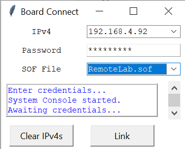
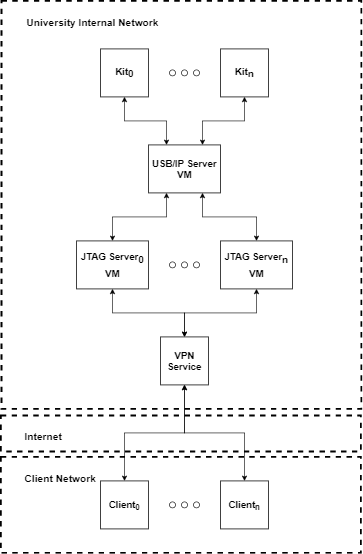

# Remote Console Guide

<p align="center">
  
</p>

## 1 Overview

The Remote Console framework is an application that uses Quartus Prime Lite to allow instructors to develop remote GPIO-based labs on Intel FPGA development kits. These labs can be performed remotely given a user has been provided credentials to access a development kit, and has VPN capabilities to connect to the network hosting the development kits. This guide is divided into three sections: Student, Instructor, and Systems Administrator. The Student section provides instructions for students to write the HDL code for Remote Console-compatible labs starting with a provided project. The section also details how to program/connect to a development kit, and interface with the development kit GUI. The Instructor section details how instructors can easily migrate existing GPIO-based labs to Remote Console compatible labs in a few simple steps. The Systems Administrator section details different scenarios to setup development kits on a university's network.

## 2 Student

Intel FPGA development kits are fantastic tools to learn and develop skills in digital design. Using these development kits users can provide input signals and validate/collect output signals in a number of ways. The most fundamental input/output methods utilize simple peripherals connected to an FPGA's general purpose  I/O (GPIO) pins. Common peripherals are slide switches, push-button switches, 7-segment displays, and simple LEDs. The Remote Console framework allows students to perform labs that use these common GPIO-connected peripherals on remote Intel FPGA development kits. The system connecting to a remote development kit must have an installation of Quartus Prime Lite, and a means of connecting to the network hosting the development kits. The user can either be on the host network or use a VPN to connect to it.

### 2-1 Remote Console Example Lab

When performing labs developed with the Remote Console framework, a student implements digital logic in a hardware description language (HDL) and places their HDL code in a provided Quartus Prime project. On this GitHub site many completed example projects are provided in the ``Example Projects`` directory of a given development kit. To create a new lab for a particular development kit download the ``blankProject.qar`` Quartus archive file in the ``Example Projects`` directory for the kit.

#### 2-1-1 Setting Up a Remote Console GUI Launch Task

The Remote Console GUI can be launched from a command line interface (CLI), but this can be avoided by creating a Quartus task to execute the GUI launch script. To make a Remote Console GUI launch task perform the following steps:

1. Extract the ``RemoteConsole[DevKitName].zip`` file to a directory that will not be cleared or moved (i.e. documents). This directory cannot have spaces in it's path.
2. Open Quartus Prime Lite.
3. In the Tasks pane, click the icon with three lines and press "Customize..." as shown below.

<p align="center">
  
</p>

4. Click "New...".

5. Provide a name for the GUI launch flow in "Custom flow name", and be sure to specify the development kit type (i.e. GUILaunchDE10Lite).

6. Leave "Based on an existing flow" as "none" and press Ok.

7. Click "Tcl Scripts..." in the bottom left of the window.

8. In the next window name the task the script will perform by clicking `<<new>>` under "Task Name (Shown In Tree)". Next, provide a path to the ``launch.tcl`` script in the top directory of the folder extracted from ``RemoteConsole[DevKitName].zip`` by clicking `<<new>>` under "Tcl Script File Name" as shown below.

<p align="center">
  
</p>

9. Press OK until all windows are closed.

#### 2-1-2 Unarchive a Quartus Archive File

Much like a zip folder compresses the contents of a directory into a single file, a Quartus archive file (.qar) compresses the contents of a Quartus project into a single file. To unarchive a given Quartus archive file to restore a Quartus project perform the following steps:

1. Open Quartus Prime.
2. Click File &#8594; Open.
3. In the bottom right dropdown menu, filter for .qar files.
4. Navigate to .qar, click the file, and click Open.
5. The "Archive name" field should be automatically completed.
6. Select a "Destination folder" and be sure to unarchive the project to a directory that will not be cleared or overwritten.

or

1. Double click a .qar file in a file explorer and Quartus Prime should automatically unarchive the project.

   	2. The "Archive name" field should be automatically completed.
 	3. Select a "Destination folder" and be sure to unarchive the project to a directory that will not be cleared or overwritten.

#### 2-1-3 Simple Remote Console Lab Tutorial

The image below shows the structure of Remote Console-compatible Quartus projects. The user's design is made up of at least one HDL module. The inputs and outputs of a user's design are routed through the Pin IP Module which communicates these signals to the Remote Console GUI. If a clock signal is needed in the user design it does not come from the Pin IP Module like the other signals, but rather from the top-level clock signal. Everything in the Top Module box is realized in hardware on the FPGA of an Intel FPGA development kit, and the clock signal comes from another piece of hardware also on the development kit. However, the Remote Console GUI is a piece of software running on a student's computer that allows a student to communicate with a remote development kit through an interactive GUI.

<p align="center">
  
</p>

After setting up the Remote Console GUI launch task and unarchiving blankProject.qar, any given lab that requires simple GPIO-connected peripherals may now be completed. As a simple example, assume an instructor's lab requires students to perform a basic OR function on the state of two slide switches and display the output to an LED. **Ensure you are connected to the host network either locally or via a VPN connection and you have been given a board's IP address and password before performing the example lab.**

A VPN client allows a user to connect and route traffic through a network as if locally connected. In the Remote Console framework VPN access to the local network hosting the development kits also allows hosts to validate users. This ensures only authorized users can access the network hosting the development kits. To gain access to a specific board a password and IPv4 address is also required.

The lab can be performed as follows. Note that the solution to this lab is also posted on the GitHub in .qar format under "Example Projects":

1. Create HDL code to satisfy the prompt.

   1. Open Quartus Prime Lite.

   2. Click File &#8594; Open Project.

   3. Navigate to the RemoteLab.qpf file in the quartus subdirectory of the directory created by unarchiving blankProject.qar.

   4. After Quartus Prime Lite successfully opens the project, something similar to the following screen will be displayed.

<p align="center">
  
</p>

   5. The first line on the Hierarchy page in the Project Navigator panel will change depending on the type of Development Kit you are using. To view all of the design files included in this project, change the drop-down menu in the Project Navigator panel from Hierarchy to Files.

   6. Double click the UserDesign.v file. It is not necessary to place the project's HDL code in this file, however, it is included for ease of use. To satisfy the OR function required in the lab prompt, place the following lines of Verilog code in the UserDesign.v file:

      ```verilog
      module OR2X1 ( a, b, y);
          
          input  wire a, b;
          output wire y;
          
          assign y = a|b;
          
      endmodule
      ```

   7. Now that the logic to be performed on the FPGA is completed, the connections between the Pin IP Module and the OR2X1 module need to be specified. In the Project Navigator panel open top.v.

   8. To instantiate the OR module into the top-level, place the following Verilog code after the "//User instantiates design below" comment.

      ```verilog
      OR2X1 OR_INST_1(.a(), .b(), .y());
      ```

   9. Now there is an instance of a 2-input OR module at the top level, however, it needs to be connected to the Pin IP Module. To connect the instance, two slide switch signals will be connected to inputs (a, b) and a single LED signal will be connected to the output (y). The following addition to the instance will connect switch 0 and switch 1 to the a and b inputs of the OR2X1 module and LEDR 0 to the y output:

      ```verilog
      OR2X1 OR_INST_1(.a(SW[0]), .b(SW[1]), .y(LEDR[0]));
      ```

2. Assign the clock signal to the target development kit's clock pin.

   1. To populate a list of available pin assignments the Analysis & Elaboration compilation step is necessary. Click Processing&#8594;Start&#8594;Analysis & Elaboration to perform this step.
   2. After Analysis & Elaboration completes, open the Pin Planner pin assignment tool by clicking Assignments&#8594;Pin Planner.
   3. Under the "Node Name" column a clock signal name should be listed that matches the one in "top.v". Assign this signal to the 50 MHz clock of the project's target board by clicking location and typing the pin name (for DE10-Lite this is PIN_P11).
   4. Close the Pin Planner window.
   5. Compile the project by pressing the play button, or click Processing&#8594;Start Compilation.

3. Launch the Remote Console GUI.

   1. Once compilation is complete, launch the Remote Console GUI by navigating to the tasks panel and select the task created in 2-1-1. Under Tcl Scripts, double-click the text next to the feather icon, or right click and select "Start".

      1.  Depending on network speed and the previous connection settings it may take a few minutes to clear the previous Quartus Prime programmer settings and start the GUI.

   2. Once launched, a login pane should appear as shown below. If this panel does not show up, check that the path to ``launch.tcl`` is correct. 

      1. You can edit this path by clicking the three lined icon shown in 2-1-1, selecting "Customize...", then select the flow name, and finally, select "Tcl Scripts...". Update the path and select OK until all windows are closed.

<p align="center">
  
</p>

   3. To identify a development kit on the host network, the IPv4 of the kit's host machine and a password is required. These credentials should be available to the systems administrator who manages the Remote Console framework. After typing an IPv4 it will be logged. To clear the list of logged IPv4s, click "Clear IPv4s".

      1. A student may also run the remote console using a development kit physically connected to the student machine by typing or selecting "local" in the IPv4 drop-down menu. No password is required if a local development kit is connected.

   4. After the proper credentials are entered, click "Link". After pressing "Link" the remote development kit at the provided IPv4 will be connected to, the design will be programmed, and, finally a communication link will be established to the development kit.

      1. If a failure occurs, you may be able to try again depending on the type of failure. Typical sources of failure are:
         1. Incorrect IPv4 or Password.
         2. Clock pin was not assigned correctly. Use pin planner and your development kit's user guide to ensure a 50 MHz clock is properly connecter to the top module.
         3. Top module not set correctly. To check that Quartus is recognizing "top.v" as the top module, click Assignments&#8594; Settings and navigate to General. The Top-level entity field should be populated with "top". If it is not, click the three dots icon, and scroll down to top. Once top has been set as the top-level entity press OK.
         4. VPN is not active, and therefore no connection to the network hosting the development kits is possible. VPN access is provided by an organization's network administrator.
         5. Network or server hosting the kits may be down. Check with the organization that is hosting the development kits to ensure no maintenance or outages are scheduled.

4. If the device was successfully linked a GUI for the target development kit will appear and the IPv4, ping (response time), and session remaining time will be displayed in the status window as shown below. To reset the remaining session time press "Reset Timer".  

   1. If any status window items are missing check 4.1.1 to 4.1.5 to ensure no configuration errors occurred.
   2. When the session times out the GUI will automatically terminate.

<p align="center">
  
</p>

   2. Note that the speed at which outputs can be updated is dependent on the Ping. The farther a user's geographic  location from the development kit host, the longer packets containing the state of development kit peripherals takes to transmit and receive. If a ping is 100 ms, then the max number of updates in one second would be 10. If a project requires a fast I/O response time, then a locally connected board is preferred. *** 
      1. For example, if a lab simply blinks a single LED every 100 ms, and there is a ping of 150 ms, there will be a reduction in resolution (most blinks will not be visible). However, if the lab is adjusted to support the lower response time, and the LED is adjusted to blink every 300 ms, there will be no loss in resolution.

5. Validate the functionality of the OR2X1 module using the Remote Console interactive GUI.

   1. Clicking and then releasing while hovering over the slide switches of the interactive GUI toggles the switch state. Click and release the Remote Console GUI's slide switches to validate that they toggle.
      
      1. Based on the logic implemented in UserDesign.v, when either switch 0 or switch 1 is in it's on state, LEDR0 will be illuminated.
   2. Clicking while hovering over a push-button switch simulates pressing a push-button, while releasing over a push-button switch stops the push-button from being held down. Although this example doesn't use push-buttons, click the push-buttons to activate and deactivate them.
   3. After validating the lab prompt has been satisfied close the Remote Console GUI.


## 3 System Administrator

The Remote Console framework allows clients (students) to access remote Intel FPGA development kits on a host network (university or organization network). This framework requires clients have a means of accessing the host network (i.e. VPN connection privileges). The following items must be provided to clients:

1. VPN access instruction.
   
   1. The client's VPN access privileges must allow them to connect to the subnet hosting the development kits.
2. Static IPv4 of the machine (physical or virtual) hosting their assigned development kit.
3. JTAG server password to allow connection and link to development kit.

   A client will be instructed to perform the following steps to connect to a development kit:

   ​	1. Connect via VPN to the host network.

     1. Run the Remote Console application on their local machine.
     2. Connect, program and link to a development kit using their assigned IPv4 and password.
     3. Perform assignment using Remote Console GUI interface.
     4. Disconnect from VPN.

### 3-1 Remote Console Virtual Machine Solution Setup

This solution is the most scalable, allowing multiple development kits to be hosted on a single physical machine. One virtual machine (VM) is required per development kit. In this section a detailed example is provided to implement this solution using VirtualBox and Ubuntu 18.04 VMs. Each VM is capped at 1 processor core, 1GB system memory, and 10GB dynamically allocated storage space. **Note that Virtual Box has a facility to clone virtual machines, so a system administrator need only setup two virtual machines, while the rest may be cloned**.

<p align="center">
  
</p>

The diagram above shows the layout of the solution for a single physical machine. One VM functions as a landing server for all of the development kits connected to the machine, and the USB/IP software is used to broadcast the development kit connections to the other VMs. The USB/IP Server VM provides a more robust connection solution that supports the use of USB-hub connected development kits. The remaining JTAG Server VMs host a service that connects incoming clients to a development kit. Clients are enabled to access their assigned JTAG Server VMs by connecting via VPN to the host network. The software running on each VM has low performance needs, which keeps processor utilization low, however each VM requires up to 1GB of memory and 10GB of dynamically allocated storage. Assuming a physical machine has enough resources to host 8 virtual machines, it can host 7 development kits (1 USB/IP Server VM and 7 JTAG Server VMs). 

**Each virtual machine requires a static IPv4 address assignment.**

In this example, the Virtual Machine management software used is Virtual Box VM from Oracle. Both the host platform package and the extension pack is required. Both packages can be downloaded [here](https://www.virtualbox.org/). First install the Virtual Box platform package using the installation wizard for the host machine's OS, then double click the extension pack and follow the installation wizard. Additionally, this example uses Linux Ubuntu 18.04 as the operating system for all VMs. The same optical disk image (.iso file) can be reused for each new machine. The image used in the example can be downloaded [here](https://releases.ubuntu.com/18.04/). Note that on this page AMD64 is nomenclature for the 64-bit version of the x86 architecture, not a CPU vendor requirement.

### 3-1-1 Setting Up an Ubuntu 18.04 VM using VirtualBox 

This section is provided in case a System Administrator is unfamiliar with installing an Ubuntu VM using VirtualBox. Instructions for setting up the device, and resource allocation are listed for the two VM types (USB/IP and JTAG Servers). These instructions should be followed whenever setting up a VM used in the Remote Console framework.

1. Create a new VirtualBox VM
   1. Open the Oracle VM Virtual Box Manager.
   2. Select the "New" icon.
   3. Name the Virtual Machine "USBIPHost" if setting up the USB/IP Server VM or "JTAGServer0" if setting up the JTAG Server VM.
   4. If the default Machine Folder is not desirable, change to a preferred location.-
   5. Set the "Type" option to Linux.
   6. Set the "Version" option to "Ubuntu (64-bit)".
   7. Press "Continue".
   8. Set the memory size to 1024 MB.
   9. Press "Continue".
   10. Select the "Create a virtual hard disk now" option.
   11. Press "Create"
   12. Set the hard disk file type to VDI.
   13. Press "Continue".
   14. Set the storage on physical hard disk to be dynamically allocated.
   15. Press "Continue".
   16. If the default virtual hard disk file location is not desirable, change to a preferred location.
   17. Set the size of the virtual hard disk to 10 GB.
   18. Press "Create".
2. Configure VirtualBox VM settings.
   1. The virtual machine should be available in the VirtualBox Manager window, with a state of "Powered Off"
   2. Right click the VM and select "Settings..."
   3. Under the "System" settings tab, navigate to the "Motherboard" subtab and ensure that "Base Memory" is set to 1024 MB.
   4. Navigate to the "Processor" subtab, and ensure that "Processor(s)" is set to 1.
   5. Navigate to the "Storage" tab, and click the icon with a disk and a green plus to the right of "Controller: IDE".
   6. Select the icon with the disk, a green plus, and the text "Add".
   7. Navigate to the downloaded Ubuntu 18.04 .iso file, and press "Open".
   8. The disk image should be populated in the "Not Attached" drop-down menu. Select it and press "Choose".
   9. Navigate to the "Network" tab, and click the "Adapter 1" subtab.
   10. Set "Attached to" to "Bridged Adapter".
       1. Note that the MAC address listed in this tab needs a static IP assignment on the network.
       2. If an alternate MAC address is desired press the refresh icon and a new one will be issued.
   11. **If setting up a JTAG server VM**, navigate to the the "Ports" tab, and uncheck the "Enable USB Controller" box.
   12. **If setting up the USB/IP server VM** perform the configuration:
       1.  Navigate to the the "Ports" tab, check the "Enable USB Controller" box.
       2.  Select "USB 3.0 (xHCI) Controller"
       3. Connect the USB-Blaster cables and Intel FPGA development kits to the physical machine's USB-ports.
          1. This solution also supports USB hub connections.
       4. Click the USB port icon with the green plus sign.
          1. Note all USB-Blaster devices appear as "Altera USB-Blaster [0400]".
       5. Create a rule that automatically connects these USB-Blaster devices to the USB/IP machine by selecting one of the "Altera USB-Blaster [0400]".
   13. Press "OK" to exit the Settings menu.
3. Install and initialize Ubuntu 18.04.
   1. Double clicking the newly created VM in the VirtualBox manager window will launch it.
   2. To scale the resolution of the VM instance, select the monitor icon with a rectangle inside, then navigate to "Virtual Screen 1" and scale the display to a desired size.
   3. After a few minutes, the welcome page for Ubuntu will appear, select "Install Ubuntu".
   4. In the next screen select a language preference and select "Continue".
   5. Under "What apps would you like to install to start with?", select "Minimal Installation".
   6. Under "Other options", check the "Download updates while installing Ubuntu".
   7. Press "Continue".
   8. Select "Erase disk and install Ubuntu".
   9. Press "Install Now".
   10. Select the VM's region preference.
   11. Fill out the VM's identification information. It is recommended to make the "Your name",  "Computer name" and "User name" identifiers for the type of VM in the Remote Console framework (i.e. both machine name & user name "jtagserver" or "usbiphost").
   12. Select "Login Automatically".
   13. Press "Continue"
   14. After Ubuntu 18.04 finishes installing, the VM will need to reboot.
   15. During reboot, press enter when prompted to detach the disk image.
4. Update the VM and install USB/IP packages
   1. After the Ubuntu VM reboots, launch the terminal application by typing ctrl+alt+t
   2. Update the Ubuntu VM by typing ``sudo apt update`` and then ``sudo apt upgrade``. Allow any operations and type the root password whenever prompted.
   3. Both VM variants require the USB/IP software. The JTAG Servers will be USB/IP clients and the USB/IP Server will be a USB/IP host. To install the software run the following two commands.
      1. ``sudo apt install linux-tools-common``
      2. ``sudo apt install linux-tools-5.4.0-42-generic``
5. It may be desirable to setup SSH so the machines can be accessed remotely. There are many ways to setup a SSH server with varying degrees of security, but the simplest is to run the following commands.
   1. Install SSH with the command ``sudo apt install openssh-server``
   2. Allow the SSH port through the firewall with the command ``sudo ufw allow ssh``
   3. Disable the firewall with the command ``sudo ufw disable``
6. Enable the firewall with the command ``sudo ufw enable``.
7. Disable Power saving settings.
   1. Click the icons in the top right of the Ubuntu GUI.
   2. Click the Settings icon in the bottom left.
   3. In settings click "Power".
   4. Make sure "Blank screen" is set to never and "Automatic suspend" is set to "off".
8. Reboot VM
   1. Close the Settings window, and navigate back to the terminal.
   2. Reboot by typing ``sudo reboot`` into the terminal.
9. Continue either the USB/IP and JTAG Server VM Setup in the following sections.

### Setting up USB/IP Server VM

This VM must be setup in order for the JTAG Servers to connect to development kits. Before beginning, configure an Ubuntu 18.04 VM as shown in the "Setting Up an Ubuntu 18.04 VM using VirtualBox" section. Perform all optional steps for setting up USB/IP server.

After the initial VM setup, perform the following steps. Other than the firewall configuration, these steps must be performed every time the USB/IP Server VM is started, and should be placed in a startup script (instructions coming soon):

1. After machine reboots from the last step of the initial setup, open the terminal by typing ctrl+alt++t.
2. Allow the USB/IP server port through the firewall by typing the command ``sudo ufw allow 3240``.
3. Disable the firewall by typing the command ``sudo ufw disable``.
4. Enable the firewall by typing the command ``sudo ufw enable``.
5. The filter generated in step 30.5 of the initial VM setup is in place to capture all devices named "Alter USB-Blaster [0400]" after a reboot. Make sure all USB devices with this name are captured by clicking the USB icon at the bottom of the VirtualBox window. Make sure every device with the "Alter USB-Blaster [0400]" identifier has a check mark next to it. If it does not click the device until it does.
6. Update the kernel to include the usbip-host module by typing ``sudo modprobe usbip-host``.
7. Generate a list of all local USB device buses capable of being bound to the USB/IP host process by typing ``sudo usbip list -l``. 
   1. Note the busid (i.e. 1-2) of the devices with the "09fb" vendor ID.
8. Bind all devices noted above with the command ``sudo usbip bind -b [busid]``, run this command for each "busid" noted above.
9. Now the USB/IP Server VM has bound all Intel FPGA development kits to the USB/IP process and needs to run a daemon to listen for incoming connections to these development kits with the command ``sudo usbipd -D``.
10. The USB/IP Server VM is now ready for JTAG Server VMs to connect through the LAN to the Intel FPGA development kits. To connect, a USB/IP client running on the JTAG Server will need to be assigned a bound busid and the ip address of the USB/IP Server VM.
    1. Get the USB/IP Server VM's IP address by typing ``ip address show`` , and noting the IP address after "inet" for the adapter with the "BROADCAST, MULTICAST, UP, LOWER_UP" interface capabilities.

### Setting up the JTAG Server VMs

These servers can only provide access for clients to Intel FPGA development kits if the USB/IP server VM is initialized as shown in the steps 5-10 above and powered on.

This VM runs the JTAG server software which connects a client (student) to an Intel FPGA development kit on a host network (university or organization network). The JTAG Server VM is not physically connected to a development kit, and uses a USB/IP client to connect to the USB/IP Server VM set up in the previous step. Each JTAG Server VM will need a static IP assignment, an assigned busid from the list of busids generated in the USB/IP Server VM setup, and the IP address of the USB/IP Server VM. Before beginning, configure an Ubuntu 18.04 VM as shown in the "Setting Up an Ubuntu 18.04 VM using VirtualBox"  section. Perform all optional steps for setting up the JTAG server.

Only one JTAG Server needs to be setup fully, the rest can be cloned and modified as shown in the next section.fpga

After the initial VM setup, perform the following steps. Other than the installation of the Quartus Prime Programmer Tools and the firewall configuration, these steps must be performed every time the VM is started, and should be placed in a startup script (instructions coming soon):

1. After the machine reboots from the last step of the initial setup, open the terminal by typing ctrl+alt++t.

2. Make sure that there is no USB icon in the bottom of the VirtualBox window. If there is shut down the machine, right click the VM in the VirtualBox manager, navigate to "Settings..", and in the "Ports" settings make sure "Enable USB controller" is unchecked.

3. Download the Quartus Prime Programmer and Tools setup .run file using the Firefox web browser included in Ubuntu. 

   1. Navigate to [fpgasoftware.intel.com]().
   2. Login or Create an Account.
   3. Select the "Lite" edition.
   4. Select the most recent release.
   5. Click the "Additional Software" tab.
   6. Click the download icon next to "Quartus Prime Programmer and Tools".

4. Install the Quartus Prime Programmer and Tools

   1. Open terminal by typing ctrl+alt+t.
   2. Change directory to the Ubuntu downloads folder by typing the command ``cd Downloads/``.
   3. Check that the Quartus Programmer Setup .run file has been downloaded to this folder by typing the command ``ls``.
   4. Make the file executable by typing the command ``sudo chmod +x ./[Quartus Programmer Setup .run file name]``.
   5. Run the Quartus Programmer setup by typing the command ``sudo ./[Quartus Programmer Setup .run file name]``.
   6. Follow the wizard and note the installation directory, as this will be used later in the JTAG Server configuration script.
   7. Do not run the tools after installation completes. There are very few resources allocated to this VM and it may take too long to launch and then close the applications.

5. Update the firewall to allow the JTAG Server port by running the following commands.

   1. ``sudo ufw allow 1309``
   2. ``sudo ufw disable``
   3. ``sudo ufw enable``

6. Create a JTAG Server startup bash script.

   1. Open a new document in the nano editor by typing the command ``sudo nano ~/[JTAG server startup script name].sh``

   2. Place the following into the shell script:

      ```bash
      #!/bin/bash
      
      # Fill out these parameters for each new JTAG server VM
      usbip_host_bus_id=""
      JTAG_pw=""
      
      # Fill out this parameters for each new host USBIP server VM
      usbip_host_ipv4=""
      
      # Fill out this parameter for first JTAG server VM
      qp_install_directory=""
      
      # Do not edit below
      
      # Add USBIP client to kernel
      sudo modprobe vhci-hcd
      
      # Get list of USB devices and attempt to detech them from USBIP
      sudo rm -rf usb_list.txt
      lsusb > usb_list.txt
      num_usb_dev=$(wc -l <usb_list.txt)
      eval "sudo rm -rf startup_log.txt"
      for (( i=0; i<=${num_usb_dev[0]}; i++ ))
      do
         eval "sudo usbip detach -p ${i} atr >> startup_log.txt 2>&1"
      done
      
      # Get number of USB devices before attaching to USBIP server bus
      sudo rm -rf usb_list.txt
      lsusb > usb_list.txt
      num_usb_dev_pre_attach=$(wc -l <usb_list.txt)
      num_usb_dev_pre_attach=$(( num_usb_dev_pre_attach + 0 ))
      
      # Attach to the usb device on the bus_id bus of the machine at usbip_ipv4
      eval "sudo usbip attach -r ${usbip_host_ipv4} -b ${usbip_host_bus_id}"
      
      sleep 2
      
      sudo rm -rf usb_list.txt
      lsusb > usb_list.txt
      num_usb_dev_post_attach=$(wc -l <usb_list.txt)
      num_usb_dev_post_attach=$(( num_usb_dev_post_attach + 0 ))
      
      # Check that device was actually added
      if (( "$num_usb_dev_pre_attach" >= "$num_usb_dev_post_attach" )) ; then
        eval "echo \"Error attaching. Target bus ${usbip_host_bus_id} at USB/IP host on ${usbip_host_ipv4} not attached.\""
        exit 1
       else
        eval "echo \"Target bus ${usbip_host_bus_id} at USB/IP host on ${usbip_host_ipv4} successfully attached.\""
        eval "echo "
      fi
      
      # Stop all jtagconfig and jtag daemon processes
      eval "sudo killall -9 jtagconfig >> startup_log.txt 2>&1"
      eval "sudo killall -9 jtagd >> startup_log.txt 2>&1"
      
      # Double check
      eval "sleep 1"
      eval "sudo killall -9 jtagconfig >> startup_log.txt 2>&1"
      eval "sudo killall -9 jtagd >> startup_log.txt 2>&1"
      
      # Remove all data from previous jtagd
      eval "sudo rm -rf /etc/jtagd/ >> startup_log.txt 2>&1"
      
      # Create new directory for jtagd and update priveledges
      eval "sudo mkdir /etc/jtagd/ >> startup_log.txt 2>&1"
      eval "sudo chmod +rwx /etc/jtagd/ >> startup_log.txt 2>&1"
      
      # Startd jtagd
      eval "sudo ${qp_install_directory}qprogrammer/bin/jtagd --debug --port 1309 >> startup_log.txt 2>&1"
      
      # Start JTAG server with JTAG_pw password
      eval "sudo ${qp_install_directory}qprogrammer/bin/jtagconfig --enableremote $JTAG_pw >> startup_log.txt 2>&1"
      eval "sleep 1"
      
      # Display local ipv4
      eval "echo \"Local IP address: \""
      eval "ip addr show eth0 | grep \"inet\b\" | awk '{print $2}'|cut -d/ -f1"
      
      # Display JTAG server password
      eval "echo"
      eval "echo \"JTAG server password: ${JTAG_pw}"
      
      # Display list of available development kits
      eval "echo "
      eval "echo \"JTAG server available device(s): \""
      eval "sudo ${qp_install_directory}qprogrammer/bin/jtagconfig"
      
      ```

   3. Assign a ``usbip_host_bus_id`` for this JTAG server from the set of available busids available on the USB/IP server VM. This will need to be different for each JTAG server accessing the same host USB/IP server VM.

   4. Assign the ``JTAG_server_pw`` variable to a desired login password that will be used by a client to connect to the remote development kit. This may be different for each JTAG server VM.

   5. Assign the ``usbip_host_ipv4`` to the IPv4 of the USB/IP server VM. This will be the same for all JTAG servers accessing the same USB/IP server VM.

   6. Assign the ``qp_install_directory`` to the path noted in step 4.6.

   7. Save by typing ctrl+s.

   8. Close the nano editor by typing ctrl+x.

7. Power down the JTAG server VM.

8. Before running the startup script, it is a good idea to clone as many JTAG Servers as the physical hardware can support. Each JTAG server VM will provides the ability for 1 client to remotely login to 1 development kit. Recall that each VM will require up to 1GB of system memory, 10GB storage, and 1 CPU core. To clone more JTAG servers perform the following steps until the desired number of JTAG server VMs has been generated:

   1. In the VirtualBox Manager right click the existing JTAG server VM and select "Clone...".
   2. In the clone menu, provide a Name for the clone (i.e. JTAG Server 1).
   3. Change the "MAC Address Policy" to "Generate a new MAC address for all new network adapters".
   4. Leave all other boxes unchecked.
   5. Press "Continue".
   6. Select "Full clone".
   7. Wait for the VirtualBox Manager to clone the VM.

9. Launch each JTAG server VM, and start the JTAG server and USB/IP client processes. Perform these steps for every JTAG server VM.

   1. Right click a powered off JTAG server VM.
   2. Once the machine starts up open the terminal by typing ctrl+alt+t.
   3. For each newly cloned machine, edit the setup script from section 6 with nano by typing ``sudo nano ~/[JTAG server startup script name].sh``.
      1. Change the ``usbip_host_bus_id`` variable.
      2. Optionally change the ``JTAG_server_pw`` variable.
   4. Run the setup script using the command ``sudo bash ~/[JTAG server startup script name].sh``
   5. Note the IPv4 provided, and ensure there are no errors attempting to attach to the USBIP server VM's USB bus or launching the Intel JTAG server software.
   6. Repeat these steps for all JTAG server VMs cloned in the previous step

10. If a reboot occurs, the startup script listed above should be run with the command ``sudo bash ~/[JTAG server startup script name].sh``

   1. Note configuration of the JTAG server VM is only possible if the USB/IP server VM is initialized first.

## 4 Instructors

An instructors existing FPGA curriculum can be easily modified and converted into Remote Console compatible lab material. The following GPIO-based peripherals are supported:

* LEDs
* 7-segment displays
* Push-button switches
* Slide switches

Several example labs are available on this GitHub site to serve as references for students and instructors. To create or port an existing lab, it is recommended to begin with the blankProject.qar for a target development kit. More Intel FPGA development kit GUI interfaces are planned to be released in Fall 2020.

### 4-1 Standard to Remote Console Lab Conversion

Typically, introductory hierarchical FPGA labs follow the following workflow:

1. Define the top-level abstraction of the project's design including top-level I/O, and design functionality.
2. Define hierarchical structure of the project including I/O and functionality of submodules.
3. Design and validate submodules.
4. Instantiate and interconnect submodules until the top-level abstraction is satisfied.
5. Define pin assignments.
6. Compile project.
7. Program development kit.
8. Validate design functionality on physical FPGA.

Using the Remote Console interface, students are able to perform each of these stages of development with minimal adjustments.

