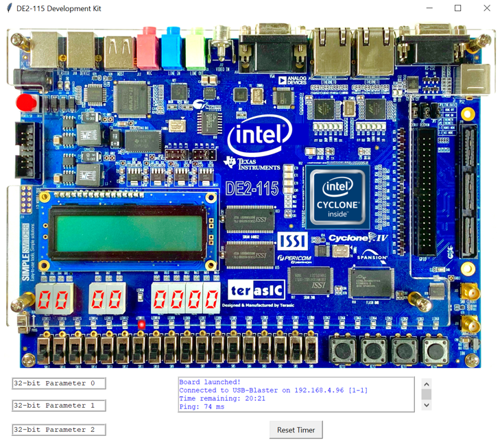
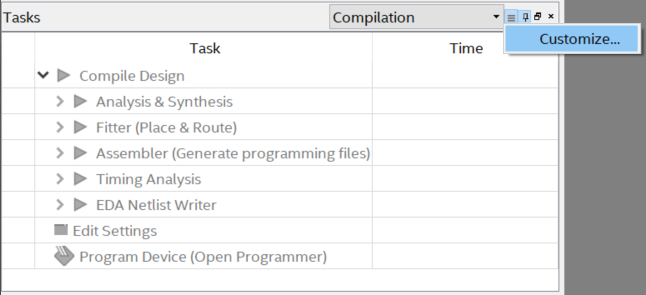
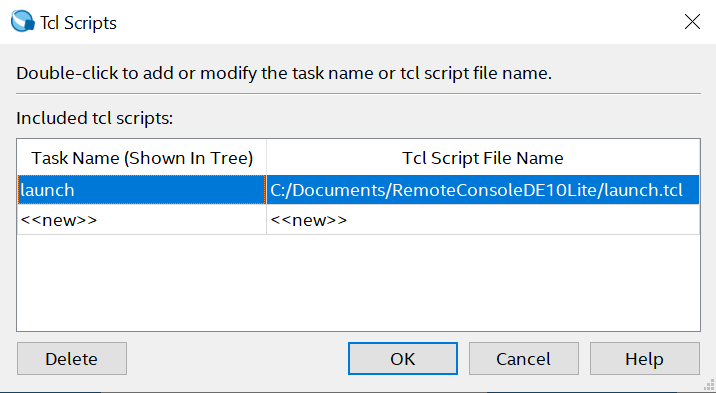
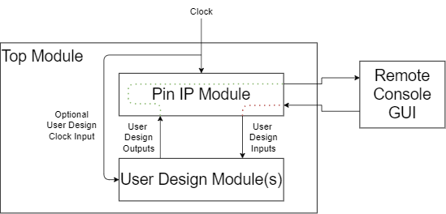
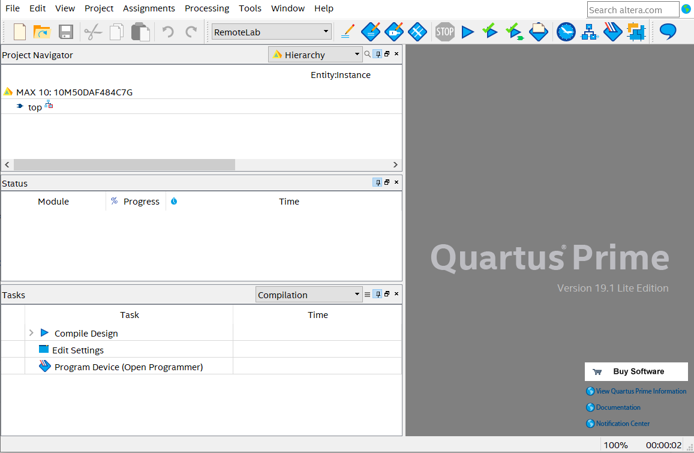
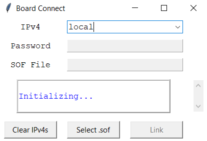
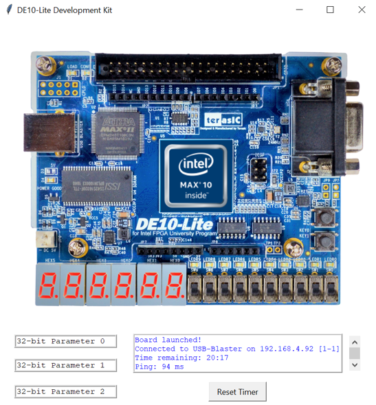

<p align="center">
  
</p>

Remote Console Guide
======================


Overview
------------

The Remote Console application provides a means for university students to perform remote GPIO-based FPGA lab assignments. Remote Console requires a university or organization to set up a development kit host. Students (with VPN privileges) access the hosted development kits as clients. The Remote Console application provides a user-friendly GUI that depicts the status of a connected FPGA's memory-mapped I/O, providing an immersive lab experience.

**Note:** even if your development kit is not listed below, it can still support the Remote Console application. See the adapting non-supported development kits section.

**Currently supported development kit GUIs:**

-   DE10-Lite (MAX 10)
-   DE2-115 (Cyclone IV)

**Development kit GUIs Coming Soon:**

-   DE1-SoC
-   DE0-CV

**Remote Console client requirements:**

-   A Windows 10 machine with Quartus Prime Lite or Quartus Prime Programmer and Tools 18.1 and above.
-   VPN or virtual desktop interface (VDI) access privileges to the development kit host machine.
-   Login credentials for specific development kit (not applicable in VDI implementation).

**Remote Console host requirements:**

- Linux machine (Ubuntu 18.04 tested) with Quartus Programmer and Tools 18.1 and above.

  or

* A group of VDI capable-machines hosting Quartus Prime LIte 18.1 and above, and the Remote Console application.

Student
-----------

Intel FPGA development kits are fantastic tools to learn and develop skills in digital design. Using these development kits, users can interact with FPGA devices in a number of ways. The simplest input/output (I/O) methods utilize peripherals connected to an FPGA's general purpose I/O (GPIO) pins. Common peripherals are slide switches, push-button switches, 7-segment displays, and simple LEDs.

The Remote Console framework allows students to perform labs that use common GPIO-connected peripherals on remote Intel FPGA development kits. The system connecting to a remote development kit must have an installation of Quartus Prime Lite or Quartus Programmer and Tools. Users can connect to a hosted development kit if they are on the same network as the development kit or if they have VPN or virtual desktop interface access privileges.

If a user is designing and compiling their Remote Console compatible project on a different machine than the one that they are running the Remote Console application with, then they do not need a full installation of Quartus Prime Lite. Instead, they can use the much smaller Quartus Prime Programmer and Tools package, and launch the GUI by configuring the the ``run_GUI.bat`` Windows batch script found in the top-level of the HandsFree github repository. 

### Remote Console Example Lab

When performing labs developed with the Remote Console framework, a student implements digital logic in a hardware description language (HDL) and places their HDL code in a provided Quartus Prime project. On this GitHub site many completed example projects are provided in the `Example Projects` directory of a given development kit. To create a new lab for a particular development kit download the `blankProject.qar` Quartus archive file in the `Example Projects` directory for the kit.

#### Setting Up a Remote Console GUI Launch Task

**Note:** Only perform the following steps if you **are** running Quartus Prime Lite on the same machine running the Remote Console application.

The Remote Console GUI can be launched from a command line interface (CLI), but this can be avoided by creating a Quartus task to execute the GUI launch script. To make a Remote Console GUI launch task perform the following steps:

1.  Extract the `RemoteConsole[DevKitName].zip` file to a directory that will not be cleared or moved (i.e. documents). This directory cannot have spaces in it's path.
    
2. Open Quartus Prime Lite.

3.  In the Tasks pane, click the icon with three lines and press "Customize..." as shown below.
    
<p align="center">
	
	</p>

4.  Click "New...".

5.  Provide a name for the GUI launch flow in "Custom flow name", and be sure to specify the development kit type (i.e. GUILaunchDE10Lite).
    
6.  Leave "Based on an existing flow" as "none" and press Ok.

7.  Click "Tcl Scripts..." in the bottom left of the window.

8.  In the next window name the task the script will perform by clicking `<<new>>` under "Task Name (Shown In Tree)". Next, provide a path to the `launch.tcl` script in the top directory of the folder extracted from `RemoteConsole[DevKitName].zip` by clicking `<<new>>` under "Tcl Script File Name" as shown below.
    
    <p align="center">
      
    </p>

9. Press OK until all windows are closed.

#### Setting Up The Remote Console GUI Launch Batch Script

**Note:** Only perform the following steps if you are **not** running Quartus Prime Lite on the same machine running the Remote Console application, and have Quartus Programmer and Tools installed.

1. Extract the `RemoteConsole[DevKitName].zip` file to a directory that will not be cleared or moved (i.e. documents).
2. Download and open the `run_GUI.bat` batch script.
3. Set the `path_to_main` variable to contain the path to `main.tcl` in the Remote Console `Source` directory.
4. Set the `quartus_bin` variable to contain the path to the `bin64` directory of the `quartus` install directory.

####  Unarchive a Quartus Archive File

The Remote Console application is now ready to be launched, however it needs a Remote Console compatible design to load into a target FPGA. In the `Example Projects` directory for any supported development kit, you will find example projects and a blank project to create your own Remote Console compatible design.

Much like a zip folder compresses the contents of a  directory into a single file, a Quartus archive file (.qar) compresses the contents of a Quartus project into a single file. The tutorial in this section requires the `blankProject.qar` file in the `Example Projects` directory to be unarchived. Download this file, and perform the following steps:

1. Open Quartus Prime.
2. Click File &#8594; Open.
3. In the bottom right dropdown menu, filter for .qar files.
4. Navigate to .qar, click the file, and click Open.
5. The "Archive name" field should be automatically completed.
6. Select a "Destination folder" and be sure to unarchive the project to a directory that will not be cleared or overwritten.

or

1. Double click a .qar file in a file explorer and Quartus Prime should automatically unarchive the project.

   	2. The "Archive name" field should be automatically completed.
 	3. Select a "Destination folder" and be sure to unarchive the project to a directory that will not be cleared or overwritten.

#### Connection Scenarios

A VPN client allows a user to connect and route traffic through a remote network, while virtual desktop interfaces (VDI) use similar methods to allow a user to control a specific machine on a remote network. In the Remote Console framework VPN  or VDI access to the local network or specific machine hosting the development kits must be granted to a client. This ensures only authorized users can access the network hosting the development kits. If a VPN service is used, users will gain access to a specific board on the network with an additional password and IPv4 address. If a VDI service is used, users will not need a password or IPv4 so long as the devkit is attached to the machine the user is controlling. 

Clients should determine which type of remote access will be used by consulting the lab manager or IT hosting the dvelopment kits, and be sure to have all access credentials before beginning a Remote Console lab.

#### Simple Remote Console Lab Tutorial

The image below shows the structure of Remote Console-compatible Quartus projects. The user's design is made up of at least one HDL module. The inputs and outputs of a user's design are routed through the Pin IP Module which communicates these signals to the Remote Console GUI. If a clock signal is needed in the user design it does not come from the Pin IP Module like the other signals, but rather from the top-level clock signal. Everything in the Top Module box is realized in hardware on the FPGA of an Intel FPGA development kit, and the clock signal comes from another piece of hardware also on the development kit.

<p align="center">
  
</p>
The Remote Console GUI, however, is a piece of software running on a student's computer that allows a student to communicate with a remote development kit through an interactive GUI. After setting up the Remote Console GUI launch task or batch script and collecting any neccessary credentials, clients can access and communicate to remote development kit. unarchive blankProject.qar. This simple example assumes an instructor's lab requires students to perform a basic OR function on the state of two slide switches. The result is then displayed to an output LED.

The lab can be performed as follows. Note that the solution to this lab is also posted on the GitHub in .qar format under `Example Projects/OR2X1.qar`:

1. Create HDL code to satisfy the prompt.
   1. Open Quartus Prime Lite.

   2. Click File &#8594; Open Project.

   3. Navigate to the RemoteLab.qpf file in the quartus subdirectory of the directory created by unarchiving blankProject.qar.

   4. After Quartus Prime Lite successfully opens the project, something similar to the following screen will be displayed.

<p align="center">
  
</p>

   5. The first line on the Hierarchy page in the Project Navigator panel will change depending on the type of Development Kit you are using. To view all of the design files included in this project, change the drop-down menu in the Project Navigator panel from Hierarchy to Files.

   6. Double click the UserDesign.v file. It is not necessary to place the project's HDL code in this file, however, it is included for ease of use. To satisfy the OR function required in the lab prompt, place the following lines of Verilog code in the UserDesign.v file:

      ```verilog
      module OR2X1 ( a, b, y);
          
          input  wire a, b;
          output wire y;
          
          assign y = a|b;
          
      endmodule
      ```

   7. Now that the logic to be performed on the FPGA is completed, the connections between the Pin IP Module and the OR2X1 module need to be specified. In the Project Navigator panel open top.v.

   8. To instantiate the OR module into the top-level, place the following Verilog code after the "//User instantiates design below" comment.

      ```verilog
      OR2X1 OR_INST_1(.a(), .b(), .y());
      ```

   9. Now there is an instance of a 2-input OR module at the top level, however, it needs to be connected to the Pin IP Module. To connect the instance, two slide switch signals will be connected to inputs (a, b) and a single LED signal will be connected to the output (y). The following addition to the instance will connect switch 0 and switch 1 to the a and b inputs of the OR2X1 module and LEDR 0 to the y output:

      ```verilog
      OR2X1 OR_INST_1(.a(SW[0]), .b(SW[1]), .y(LEDR[0]));
      ```

2. Assign the clock signal to the target development kit's clock pin.

   1. To populate a list of available pin assignments the Analysis & Elaboration compilation step is necessary. Click Processing&#8594;Start&#8594;Analysis & Elaboration to perform this step.
   2. After Analysis & Elaboration completes, open the Pin Planner pin assignment tool by clicking Assignments&#8594;Pin Planner.
   3. Under the "Node Name" column a clock signal name should be listed that matches the one in "top.v". Assign this signal to the 50 MHz clock of the project's target board by clicking location and typing the pin name (for DE10-Lite this is PIN_P11).
   4. Close the Pin Planner window.
   5. Compile the project by pressing the play button, or click Processing&#8594;Start Compilation.

3. Launch the Remote Console GUI.

   1. Once compilation is complete, launch the Remote Console GUI using one of the following methods.
   1. If running the Remote Console application from the Quartus Prime Lite GUI, navigate to the tasks panel and select the task created at the beginning of this section. Under Tcl Scripts, right-click the text next to the feather icon and select "Start".
         1. Depending on network speed and the previous connection settings it may take a few minutes to clear the previous Quartus Prime programmer settings and start the GUI.
   2. Alternatively, if the Remote Console application is being run on a machine that is not running Quartus Prime Lite, then launch the Remote Console GUI by right clicking the batch file setup in the beginning of the section and click "Run as Administrator".
         1. Administrator privileges are only needed because the batch script terminates any idle Quartus Shell or System Console processes that run the backed of the GUI.
2. Once launched, a login GUI should appear as shown below. If this GUI does not show up, check that the path to ``launch.tcl`` is correct, or, if using a batch script, check that the paths to the `main.tcl` and the `quartus` directory's bin are correct. 
      
      1. In Quartus you can edit the task's path by clicking the three lined icon in the Task pane, then selecting "Customize...". Select the flow name and, finally, select "Tcl Scripts...". Update the path and select OK until all windows are closed.

<p align="center">
  
</p>


   3. To identify a development kit on the host network, the IPv4 of the kit's host machine and a password is required. These credentials should be available to the systems administrator who manages the Remote Console framework. After typing an IPv4 it will be logged. To clear the list of logged IPv4s, click "Clear IPv4s".

      1. A client may also run the remote console using a development kit physically connected to the student machine by typing or selecting "local" in the IPv4 drop-down menu. No password is required if a local development kit is connected.
   4. After entering a password (or no password if local is selected), the path to the Quartus project's output .sof must be provided.

         1. Click the "Select .sof"
         2. Navigate to .sof folder

               1. If .sof is generated on a separate computer, then it will need to be downloaded to the computer Remote Console is hosted on.
               2. If the .sof file is generated from a local Quartus Prime installation, it will typically be stored in the "output_files" folder of the project's root directory.
      5. After the proper credentials are entered, click "Link". After pressing "Link" the remote development kit at the provided IPv4 will be connected to, the design will be programmed, and, finally a communication link will be established to the development kit.

      1. If a failure occurs, you may be able to try again depending on the type of failure. Typical sources of failure are:
         1. Incorrect IPv4 or Password. Re-attempt login with the proper credentials.
         2. Clock pin was not assigned correctly. Use pin planner and your development kit's user guide to ensure a 50 MHz clock is properly connecter to the top module.
         3. Top module not set correctly. To check that Quartus is recognizing "top.v" as the top module, click Assignments&#8594; Settings and navigate to General. The Top-level entity field should be populated with "top". If it is not, click the three dots icon, and scroll down to top. Once top has been set as the top-level entity press OK.
         4. VPN is not active, and therefore no connection to the network hosting the development kits is possible. VPN access is provided by an organization's network administrator.
         5. Network or server hosting the kits may be down. Check with the organization that is hosting the development kits to ensure no maintenance or outages are scheduled.
   6. If the device was successfully linked a GUI for the target development kit will appear and the board identification information, ping (response time), and session remaining time will be displayed in the status window as shown below. To reset the remaining session time press "Reset Timer".  

   1. If any status window items are missing check 4.1.1 to 4.1.5 to ensure no configuration errors occurred.
   2. When the session times out the GUI will automatically terminate.

<p align="center">
  
</p>

   2. Note that the speed at which outputs can be updated is dependent on the "Ping" field. Although, if using a VDI implementation this field is inaccurate, and may be ignored. The farther a user's geographic  location from the development kit host, the longer packets containing the state of development kit peripherals takes to transmit and receive. If a ping is 100 ms, then the max number of updates in one second would be 10. If a project requires a fast I/O response time, then a locally connected board is preferred.
      1. For example, if a lab simply blinks a single LED every 100 ms, and there is a ping of 150 ms, there will be a reduction in resolution (most blinks will not be visible). However, if the lab is adjusted to support the lower response time, and the LED is adjusted to blink every 300 ms, there will be no loss in resolution.

5. Validate the functionality of the OR2X1 module using the Remote Console interactive GUI.

   1. Clicking and then releasing while hovering over the slide switches of the interactive GUI toggles the switch state. Click and release the Remote Console GUI's slide switches to validate that they toggle.
      
      1. Based on the logic implemented in UserDesign.v, when either switch 0 or switch 1 is in it's on state, LEDR0 will be illuminated.
   2. Clicking while hovering over a push-button switch simulates pressing a push-button, while releasing over a push-button switch stops the push-button from being held down. Although this example doesn't use push-buttons, click the push-buttons to activate and deactivate them.
   3. After validating the lab prompt has been satisfied close the Remote Console GUI.


## System Administrator

The Remote Console framework allows clients (students) to access remote Intel FPGA development kits on a host network (university or organization network). This framework requires clients have a means of accessing the host network (i.e. VPN connection privileges) or a machine on the host network hosting Quartus Prime Lite and a development kit (i.e. virtual desktop interface). The following items must be provided to clients:

1. VPN or virtual desktop intfrastructure (VDI) access instructions.
   
   1. The client's VPN access privileges must allow them to connect to the subnet hosting the development kits.
2. Static IPv4 of the machine (phyical or virtual) hosting their assigned development kit.
   1. Only applicable if VDI is not used.
3. JTAG server password to allow connection and link to development kit.
   1. Only applicable if VDI is not used.

A client will be instructed to perform the following steps to connect to a development kit if a VPN is being used:

1. Connect via VPN to the host network.
2. Perform a lab assignment on their local machine.
3. Run the Remote Console application on their local machine.
4. Connect, program and link to a development kit using an assigned IPv4 and password.
5. Validate assignment using the Remote Console GUI interface.
6. Disconnect from VPN.

A client will be instructed to perform the following steps to connect to a development kit if VDI is being used to access a machine hosting Quartus Prime Lite and a development kit:

1. Connect via VDI to the host machine.
2. Perform their lab on the host machine to generate .sof file.
3. Run the Remote Console application using a run task imaged onto the machine or by using the `run_GUI.bat` batch script on the host machine.
4. Connect, program and link to a development kit using an IPv4 setting of "local".
5. Validate assignment using the Remote Console GUI interface.
6. Disconnect from VDI.

A client will be instructed to perform the following steps to connect to a development kit if VDI is being used to access a machine not hosting Quartus Prime Lite, but is hosting Quartus Prime Programmer and Tools, and has a development kit attached:

1. Connect via VDI to the host machine.
2. Perform their lab on any machine other than theirs.
3. Run the Remote Console application on the host machine using the `run_GUI.bat` batch script on the host machine.
4. Connect, program and link to a development kit using an IPv4 setting of "local".
5. Validate assignment using the Remote Console GUI interface.
6. Disconnect from VDI.

The following sections detail the supported setup approaches, their bennefits, and 

### Setting up Development Kit Host Machine VPN approach

#### Description

In this setup approach the 

#### Pros

* Least resource hungry approach for the host. 
  * Requires 1 machine to host a number of development kits (10 kits/machine tested).

#### Cons

* The worst response time for a client.
  * Large delay imposed by running Remote Console on a machine separate from a development kit.
  * Requires client install Quartus Prime Lite, or use a separate machine hosting the tool.

#### Setup

### Setting up Development Kit Host Machine VDI approach w/ Quartus Prime Lite

#### Description

In this setup approach the 

#### Pros

* Least resource hungry approach for the host. 
  * Requires 1 machine to host a number of development kits (10 kits/machine tested).

#### Cons

* The worst response time for a client.
  * Large delay imposed by running Remote Console on a machine separate from a development kit.
  * Requires client install Quartus Prime Lite, or use a separate machine hosting the tool.

#### Setup

### Setting up Development Kit Host Machine VDI approach w/ Quartus Programmer and Tools

#### Description

In this setup approach the 

#### Pros

* Least resource hungry approach for the host. 
  * Requires 1 machine to host a number of development kits (10 kits/machine tested).

#### Cons

* The worst response time for a client.
  * Large delay imposed by running Remote Console on a machine separate from a development kit.
  * Requires client install Quartus Prime Lite, or use a separate machine hosting the tool.

#### Setup

## Instructors

An instructors existing FPGA curriculum can be easily modified and converted into Remote Console compatible lab material. The following GPIO-based peripherals are supported:

* LEDs
* 7-segment displays
* Push-button switches
* Slide switches

Several example labs are available on this GitHub site to serve as references for students and instructors. To create or port an existing lab, it is recommended to begin with the `blankProject.qar` for a target development kit. More Intel FPGA development kit GUI interfaces are planned to be released in Fall 2020, however there is nothing requiring a particular development kit GUI be hosted on that development kit. All I/O widgets in the GUI are simply data in a memory map. In the example provided in the "Using Supported GUI on Non-Supported Development Kits" section a DE10-Lite GUI is and hosted on a DE2-115 development kit by editing the provided `blankProject` Quartus project.

### Standard to Remote Console Lab Conversion

### Using Supported GUI on Non-Supported Development Kits