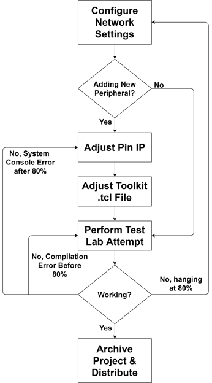
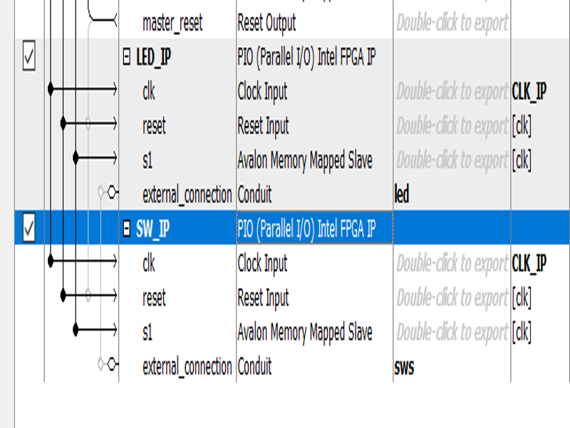
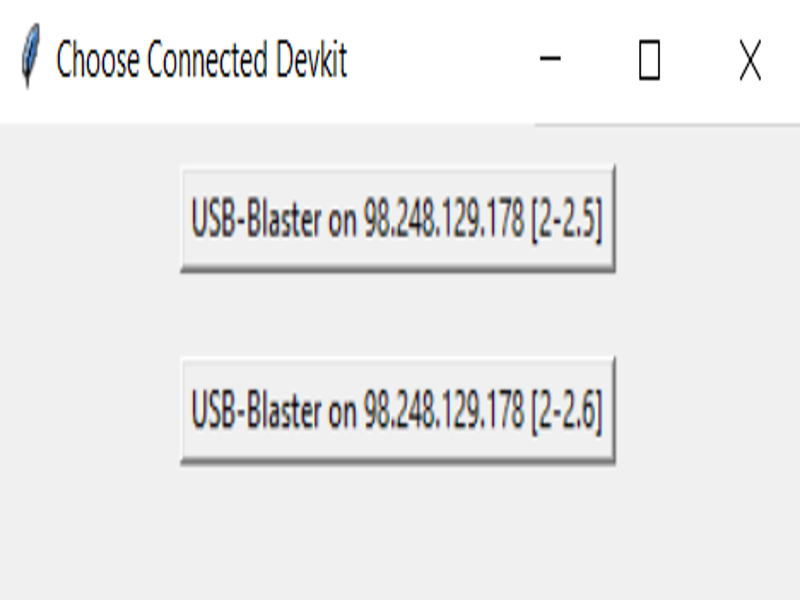

# 1 Introduction

This package provides a cookbook for creating hands free FPGA labs. Using the provided resources, a user's project may be programed to remote Intel FPGA development kits using a local Quartus installation connected to a remote server hosting one or more development kits. The input/output (slide-switches/LEDs) of the connected development kit is streamed to a GUI providing flexible remote lab development capabilities. An advanced user may develop their own GUIs to suit their project's specific needs. The connection to the hosted development kit, remote board programming and GUI configuration are all automated away from the user, enabling even the most inexperienced user to connect, program, and validate remotely programmed Intel FPGA development kits. A high-level overview of the system is shown below.

<p align="center">
  
</p>

This documentation provides resources for IT, instructors, and users (students). The  IT section provides instructions for setting up a Quartus Prime JTAG server. The instructors section describes how an instructor can adapt the provided package to convert existing or new labs to a hands free format. The users section provides a tutorial for users to run an example project.  For more assistance or to report a bug please contact the Intel FPGA University Program.

# 2 IT Resources

## 2.1 Network Requirements

A systems administrator is required to setup the Quartus Prime JTAG server software that hosts development kits and manages connection requests. The software is included in the free Quartus Prime Lite 19.1 installation, and is also available in Windows. This software enables a daemon to continuously monitor connection requests coming in from network port 1309. Once a connection request arrives, the JTAG server software requests a password. Once the user's credentials have been verified, a user may access boards connected directly to the server's USB ports or connected via a USB port replicator. Before proceeding ensure with a systems administrator that port 1309 is visible from the network accessed via an external IP address. External access to the JTAG server software is password protected, however consult with network administrators before proceeding.

Once the network is setup, ensure that the Intel FPGA development kits are connected to the host device and all available device drivers are installed (i.e. USB-Blaster drivers included in Quartus Prime). If there is not a QUARTUS_ROOTDIR environment variable, it is useful to make one. This variable should hold the path to the "quartus" subdirectory in the Quartus Prime installation directory.

## 2.2 Setup  Tutorial

### Host a JTAG server on a Windows machine

1. Before configuring, ensure that the  [Quartus Prime  Programmer tool](https://fpgasoftware.intel.com/19.1/?edition=lite) is installed on the host machine.
2. Open a local installation of Quartus Prime
3. Open the Programmer Tool by navigating Tools &rarr; Programmer
4. In the Programmer tool pane, select Hardware Setup
5. Select the JTAG Settings pane
6. Press Configure Local JTAG Server
7. Check the "Enable remote clients to connect to the local JTAG server" box
8. Enter a JTAG server access password and press OK

### Host a JTAG server on a Linux machine

1. Before configuring, ensure that the  [Quartus Prime  Programmer tool](https://fpgasoftware.intel.com/19.1/?edition=lite) is installed on the host machine.

2. Ensure there are no running instances of the daemon or configuration processes 

   ```bash
   sudo killall -9 $QUARTUS_ROOTDIR/bin/jtagconfig
   sudo killall -9 $QUARTUS_ROOTDIR/bin/jtagd
   ```

3. The JTAG server daemon needs to use a directory in the "etc/" folder. Create this folder and ensure the user setting up the daemon has read and write access.

   ```bash
   sudo rm -rf /etc/jtagd/
   sudo mkdir /etc/jtagd/
   sudo chmod +rwx /etc/jtagd/
   ```

4. A user hosting the Quartus Prime JTAG server can now start the daemon.

   ```bash
   $QUARTUS_ROOTDIR/bin/jtagd
   ```

5. With the JTAG server daemon up and running, a user can now configure remote access and set a password.

   ```bash
   $QUARTUS_ROOTDIR/bin/jtagconfig --enableremote password
   ```

6. Verify the dev kits are now made available to connected clients

   ```bash
   $QUARTUS_ROOTDIR/bin/jtagconfig
   ```

If successful, the terminal should display a list of connected device names and device path information. These commands may be placed in a startup file to ensure the JTAG server re-initializes any time the server reboots.

## 2.3 Troubleshooting

Coming soon, please contact support for issues, and common resolutions will be posted here.

## 2.4 Additional Material

[Intel Quartus Prime Standard Edition User Guide: Programmer](https://www.intel.com/content/www/us/en/programmable/documentation/qnz1529450399707)

# 3 Instructor Resources

With a JTAG server setup and proper network adjustment completed, lab materials may now be created for remote users to perform on the hosted development kits. Currently, only labs that utilize slide-switches and LEDs are supported. 7-segment displays and push buttons are expected soon, and more advanced peripherals (such as VGA and audio) are under development.

The purpose of a given remote lab is to create an environment as close as possible to programming and interacting with a physical FPGA development kit. Accordingly, the user is not expected to configure complex modules, network connections, or create GUIs. The user is only responsible for providing a design, and connecting the design instantiation to the top level. The provided package accommodates this by automatically performing a script after the standard compilation flow completes. This script automatically performs the following operations:

1. Query the configured Quartus Prime JTAG server to generate a list of available development kits.
2. Query the user to select one of the available development kits.
3. Attempt to program the selected development kit.
4. If successful, open a GUI so that the user may interact with the programmed FPGA development kit.

Configuration and verification steps must be completed before a given lab is distributed to a user. The following block diagram shows the flow for instructors to convert their existing labs to a virtual lab using the provided package contents:

<p align="center">
  
</p>

The next section provides an implementation example instructors may use to add peripherals, and test lab functionality before distributing to users.

## 3.1 Lab Creation Tutorial

This tutorial describes how to adjust the provided package materials to generate customized virtual Intel FPGA development kit labs. 

This tutorial assumes an instructor has an existing lab which performs a 16-bit parity check on 16 slide switch inputs and displays the result to an led. The peripherals needed for this lab are 16 slide switches and 1 LED.

The provided package only includes 10 slide switches, so the instructor must adjust the package contents to add six additional slide-switch peripherals to the Qsys IP and adjust the "pin_IP.v". Additionally, the instructor must add six additional slide switch widgets to the system console toolkit GUI by adjusting the "total_ssws" parameter in the "SysConsoleToolkit.tcl" file.

**Note: If your target lab uses less than or equal to 10 Slide-switches and/or 10 LEDs, then the provided peripherals are sufficient to virtualize your lab and steps 3 through 4 may be skipped.**

Before beginning the tutorial, ensure Quartus Prime is installed on the machine being used to create the lab.

1. Download the provided package and open the project in Quartus. This may be done by opening the Quartus Project File (.qpf) found in the Quartus/ directory with Quartus Prime.

2. **Configure network settings** by adjusting the  JTAG server host's external IP address and JTAG server password variables in the post_script.tcl file found in the Source/ directory. These parameters should be available from the systems administrator that configured the JTAG server.

   

   ```bash
   #JTAG server configuration data
   set jserv_pwd "jtagServerPassword"
   set ip_FPGA   "xx.xxx.xxx.xxx"
   ```

   

3. **Adjust the pin IP**  to accommodate the additional slide switches needed for the example described above. In this case six additional slide switches are required, so the slide-switch PIO IP needs to be made six bits wider, and it's instantiation in the "pin_IP.v" file must be adjusted. 

  * First, navigate to IP components in the Quartus Prime project navigator, an click on the "internal_pin_if" IP.

<p align="center">
  
</p>

  * With Qsys open double click the slide switch IP.

<p align="center">
  
</p>

  * Finally, change the PIO width to 16 bits. 
   
<p align="center">
  
</p>

  * To save, click "Generate IP". In the Generation window select "Generate". After completion, select "Finish".
  * Now that the Qsys IP component of the pin IP is adjusted, the top-level module must be adjusted. This module simply instantiates the Qsys IP and performs an initialization reset. To accommodate the updated Qsys IP the "sws" output bus width must be expanded to 16 bits as shown below.

     
     
     ```verilog
     module pin_ip(clock, sws, leds);
     	
     	input clock;
     	output [15:0] sws;
     	input  [9:0]  leds;
     	
     	//Reset makes time to connect to JTAG lower
     	parameter reset_timeout = 2**8-1;
     	reg [7:0] reset_count = 8'b0;
     	//Allow device reset to be active for many clock cycles			
     	always@(posedge clock)
     		if(reset_count != (reset_timeout))
     			reset_count = reset_count + 8'd1;
         
      //Connect to QSys IP
      internal_pin_if 	i1	( .clk_clk(clock), .led_export(leds), .reset_reset_n(reset_count == reset_timeout), .sws_export(sws));
      
     endmodule
     ```

   

4. **Adjust the toolkit .tcl file** to include six more slide-switch widgets by editing the "total_ssws" variable in the "SysConsoleToolkit.tcl" file found in the Source/ directory.

   

   ```bash
   set total_leds 10
   set total_ssws 16
   ```

   

5. **Perform a test** of the updated system by completing the lab prompt and validating functionality. 

  * The user design provided in the package must be changed to the 16-bit parity check from the prompt. To change the design navigate to the "UserDesign.v" file in the project and replace the design with a solution to the prompt such as the following.

     

     ```verilog
     module parity16b(  input  [15:0] ins,
                        output parity);
     						
     	assign parity = ^ins;
     	
     endmodule
     ```

     

  * Next, the solution must be instantiated at the top level, and connected to the Qsys IP. This adjustment must be made to the "top.v" file of the project as follows.

     

     ```verilog
     `include "../Verilog/pin_ip.v"
     module top( input clock );
     	
     	wire [9:0]  leds;
     	wire [15:0] sws;
     							
     	parity16b 				i0( .ins(sws), .parity(leds[0]));
     	
     	// Provided to Student/Profs Don't Touch!
     	pin_ip					i1( .clock(clock), .sws(sws), .leds(leds));
     	
     endmodule
     ```

     

  * To complete the test, press the compile icon (play button). After 80% of the compilation has  completed, a prompt similar to the following should be displayed asking which FPGA development kit to program.
 
<p align="center">
  
</p>

  * Selecting any of the available devices should bring up the System Console Quartus Prime tool, and, after a small delay, bring up the following toolkit with widgets corresponding to slide switches and output LEDs.
  
<p align="center">
  
</p>

  * Toggle the slide switches to validate the odd parity function has been satisfied. 

  * Closing the System Console window will move the compilation progress to 100%.

6. **Archive the project for distribution to users** by removing the completed prompt sections. If it is desired to have students gain experience with instantiating modules, it may be useful to remove the instantiated solution from the "top.v" file as well.

  * To archive the project for distribution navigate to Project $ \rarr $ Archive Project as shown below.

<p align="center">
  
</p>

  * The archive tool does not recognize .toolkit files, so they must be added to the list of files included in the archive.  To do this, in the archive window, select Advanced, then select Add, and then add the .toolkit file found in the Source/ directory of the package, then press OK.

  * Finally, select Archive. The generated archive can be shared, and users may be directed to the User Resources section of this documentation for support in unarchiving and running their labs.

## 3.2 Additional Material

[Intel Quartus Prime Standard Edition User Guide: Debug Tools](https://www.intel.com/content/www/us/en/programmable/documentation/kxi1529965561204.html)

# 4 User Resources

This section is intended for users who will perform virtual labs using remote Intel FPGA development kits.  [Quartus Prime Lite Edition 18.1 and above](https://fpgasoftware.intel.com/19.1/?edition=lite) is required to be installed on a user's system.

## 4.1 Unarchiving Quartus Project

A Quartus Archive File (.qar) contains a compressed version of a Quartus Prime project. A good starting point for all remote labs is to download and unarchive the "RemoteLab.qar" Quartus archive file. The project within the archive provides facilities for a user to interact with remote Intel FPGA development kits, and to implement and test arbitrary digital designs. In order to recover the archived Quartus Prime project, perform the following steps:

1. Download the "RemoteLab.qar" Quartus archive file.

2. Open Quartus Prime.

3. At the home screen navigate to File $ \rarr $ Open as shown below.

<p align="center">
  
</p> 

4. Allow all files to be visible as shown below.
   
<p align="center">
  
</p> 

5. Navigate to the .qar file downloaded in Step 1, select it, and then select Open.

6. Name the destination directory, and select okay.

## 4.1 OR-Gate Tutorial

The project unarchived in the previous section implements no digital logic design in it's "UserDesign.v" file. This section provides an example digital logic design, and a tutorial for implementing and validating the design on a remote Intel FPGA development kit. Perform all the following steps:

1. Navigate to Files in the "Project Navigator" pane as shown below.

<p align="center">
  
</p> 

2. Double click on the file named ""../Verilog/UserDesign.v".

3. In this file replace the comment "// User design goes here!" with the following Verilog code.

   

   ```verilog
   module OR2X1( input  A, input  B, output Y );
   					
   	assign Y = A|B;
   
   endmodule
   ```

   
  * This code represents a simple 2-input OR logic gate, where the output Y represents the OR of the single-bit inputs A and B  
  * The truth table for the function is shown below.


     | Input-A | Input-B | Output-Y |
     | :-----: | :-----: | :------: |
     |  False  |  False  |  False   |
     |  False  |  True   |   True   |
     |  True   |  False  |   True   |
     |  True   |  True   |   True   |

   

4. The logic function now must be added to the top-level of the project. Once again, go to the Files section of the Project Navigator pane. This time select "../Verilog/top.v".

5. Instantiation is the action of including a defined Hardware Description Language (HDL) module in a higher level HDL module. In the top file opened in the previous step, instantiate the OR2X1 module defined in step 3 as shown below.

   

   ```verilog
   `include "../Verilog/pin_ip.v"
   module top( input clock );
   	
   	wire [9:0] 	leds; 
   	wire [9:0]	sws;
   	
   	// User instantiates design below
   	
   	OR2X1            		i0	(	.A(sws[0]), .B(sws[1]), .Y(leds[0]));
   	
   	// Remote Pin IP Do not touch below!
   	pin_ip					    i1	(	.clock(clock), .sws(sws), .leds(leds));
   	
   endmodule
   ```

   

  * The "." indicates a port name. For example, ".A(sws[0])" can be read as port A of the OR2X1 module is connected to the wire sws[0]. 
  * To allow multiple OR2X1 modules to be instantiated, the instance name "i0" is placed before the port connections are defined.

6. With the design OR2X1 module instantiated, the design is now ready to be compiled. In Quartus Prime, project compilation is a multi-stage process that translates a user's project to a format capable of being programmed to an Intel FPGA. To compile this project perform the following steps. 

  * Select File $ \rarr $ Save Project
  * Select Processing $ \rarr $ Start Compilation

7. After a couple minutes, an icon similar to the one shown below should appear.

<p align="center">
  
</p>  
   
  * These are available Intel FPGA Development Kits. Select one and proceed.
   
8. After a short delay the selected Intel FPGA development kit will connect to the local Quartus Prime installation, and the  Graphical User Interface (GUI) shown below will appear.

<p align="center">
  
</p>  

  * This GUI allows a user to interact directly with the connected Intel FPGA development kit. 
  * Recall from step 5 that wires "sws[0]" and "sws[1]" are connected to the OR2X1 module's inputs while the "leds[0]" wire is connected to the module's output.
  * Verify the truth table shown in step 3 by toggling the SW0 and SW1 buttons, and viewing the corresponding output on LED0.

9. Close the window and verify the compilation has completed without error by viewing the tasks pane as shown below.

 <p align="center">
  
</p>  
