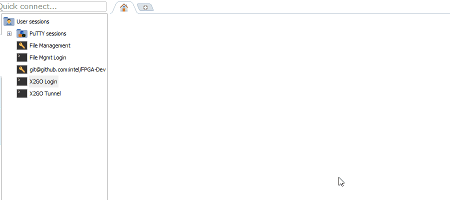

**Login Script**

Below are the instructions to the Devcloud login script. The picture below shows what the current script appears as. When you type the command “login”, the following output is shown. It separates the available nodes into 130-136, and 137-139, as well as stating what the nodes have.



               

Figure 1: Login Script Running

The script is located inside the .bashrc, and looks as follows:


Figure 2: Login Script inside .bashrc

 

 

 

 

 

 

 

 

 

 

 

 

 

 

 

 

 

Below is the script, which you can copy and paste into the .bashrc.

Before pasting though, you must run the command “:set paste” and then paste. If not it will auto-indent and change the formatting of the script. 

 

```
devcloud_login()
{
        red=$'\e[1;31m'
        blu=$'\e[1;34m'
        end=$'\e[0m'
        echo
        echo "                               Showing available nodes below:                          "
        echo --------------------------------------------------------------------------------------
        printf "%s\n" "${blu}Nodes with no attached hardware:${end}          "
        pbsnodes |grep -B 1 "state = free"| grep -T '13[0-9]' | grep -o '...$'
        echo
        echo --------------------------------------------------------------------------------------
        printf "%s\n" "${blu}Nodes with Arria 10${end}         "
        pbsnodes -s v-qsvr-fpga | grep -B 4 'arria10' | grep -B 1 "state = free"| grep -B 1 '13[0-9]' | grep -o '...$'
        printf "%s\n" "${blu}Nodes with Stratix 10${end}         "
        pbsnodes -s v-qsvr-fpga | grep -B 4 'darby' | grep -B 1 "state = free"  | grep -B 1 '189' | grep -o '...$'
        echo --------------------------------------------------------------------------------------
        echo
        echo What node would you like to use?
        read -e node
        until  [ $node -lt 140 ] && [ $node -gt 129 ]  ||  [ "$node" == 189 ]
        do
                echo Please input an available node number:
                read -e node
        done
        echo
        echo --------------------------------------------------------------------------------------
        printf "%s\n" "${blu}Please copy and paste the following text in a new mobaxterm terminal: ${end} "
        echo
        printf  "%s\n" "${blu}ssh -L 4002:s001-n"$node":22 colfax-intel${end} "
        echo
        echo --------------------------------------------------------------------------------------
        echo
        if [ "$node" -le 136 ]; then
                qsub -I -l nodes=s001-n"$node":ppn=2
        else
                qsub -q batch@v-qsvr-fpga -I -l nodes=s001-n"$node":ppn=2
        fi
}
```


 

 

 

 

 

 

 

 

 

 

 

 

 

Once you select a node, it will also output the command required to set up the x2go window. Just copy and paste into a new mobaxterm terminal. 

 

   

Figure 3: x2go Command

 

 