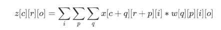
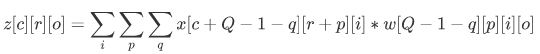
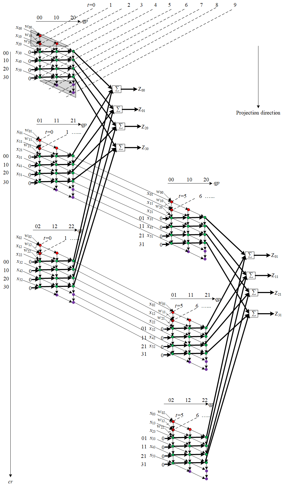
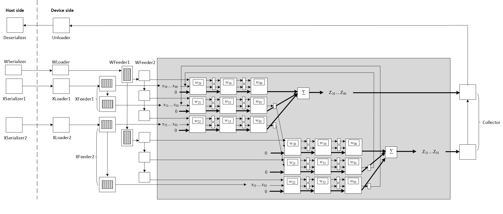

# Convolution Tutorial

> Mingzhe Zhang, Tsinghua University & University of Science and Technology of China, zhangmz1210@mail.ustc.edu.cn
>
> Hongbo Rong, Parallel Computing Lab of Intel, hongbo.rong@intel.com


### Table of Contents

[1. A basic design](#1-a-basic-design)
[2. STT](#2-stt)
[3. Tiling and vectorization](#3-Tiling and vectorization)
[4. Isolating I/O](#4-isolating-io)
[5. An elaborate design](#5-an-elaborate-design)


## 1. A Basic Design

For traditional convolution, the compute is:



Define macros for convenience. 

```
#define A                      q,     p,     r,     c,         i,     o
#define A_r_minus_1            q,     p,     r - 1, c,         i,     o
#define A_o_minus_1            q,     p,     r,     c,         i,     o - 1
#define A_q_minus_1            q - 1, p,     r,     c,         i,     o
#define A_p_minus_1            q,     p - 1, r,     c,         i,     o
#define A_i_minus_1            q,     p,     r,     c,         i - 1, o
#define A_no_p_q_i                           r,     c,                o
```

`w[p][q][i][o]` is not related with dimension `r, c`, so we broadcast it along `r, c`, loading weights only once during the compute. We can easily write `X` and `W` in the form of UREs:

```
X(A) = x(c + q, r + p, i);
W(A) = select(c == 0 && r == 0, w(q, p, i, o), W(A_r_minus_1));
```

Note that the compute includes three reductions. A basic idea is to perform reductions separately, i.e. 

```
4. Isolating I/OH(A) = select(q == 0, 0, H(A_q_minus_1)) + X(A) * W(A);
V(A) = select(q == Q - 1, select(p == 0, 0, V(A_p_minus_1)) + H(A), 0 /* arbitrary value, not contributing to output anyway*/);
Z(A) = select(q == Q - 1 && p == P - 1, select(i == 0, 0, Z(A_i_minus_1)) + V(A), 0 /* arbitrary value, not contributing to output anyway*/);
```

Output the final results after reduction:

```
z(A_no_p_q_i) = select(q == Q - 1 && p == P - 1 && i == I - 1, Z(A));
```

Then merge UREs and set bounds explicitly:

```
X.merge_ures(W, H, V, Z, z) // Put all the UREs into the same loop nest
 .set_bounds(p, 0, P, q, 0, Q)
 .set_bounds(r, 0, R, c, 0, C)
 .set_bounds(o, 0, O, i, 0, I);
```

We have finished our first design! 


## 2. STT

Apparently, the previous design is very inefficient because convolution kernel processes elements sequentially. To explore parallelism in the compute, it is natural to apply space-time transform like this:

```
X.space_time_transform(q, p);
```

As a result, the convolution kernel is mapped to a `p x q` systolic array. After weights are loaded to their corresponding PEs, they will stay in the PEs. Then all PEs perform multiplication simultaneously: 


## 3. Tiling and vectorization

Next we can partition the image into tiles and process tiles one by one. Since `p, q` is small enough(usually `3 x 3`), there is no need to tile them. We tile every of the rest loops(`r, c, i, o`) once, and order the new loops as `ii, q, p, rr, cc, oo, outi, outr, outc, outo`. The spec is modified slightly:

```
#define A                      ii,          q,     p,     rr,     cc, oo, outi,     outr, outc, outo
#define A_rr_minus_1           ii,          q,     p,     rr - 1, cc, oo, outi,     outr, outc, outo
#define A_q_minus_1            ii,          q - 1, p,     rr,     cc, oo, outi,     outr, outc, outo
#define A_p_minus_1            ii,          q,     p - 1, rr,     cc, oo, outi,     outr, outc, outo
#define A_ii_minus_1           ii - 1,      q,     p,     rr,     cc, oo, outi,     outr, outc, outo
#define A_outi_minus_1         ii + II - 1, q,     p,     rr,     cc, oo, outi - 1, outr, outc, outo
#define A_no_p_q_i                                        rr,     cc, oo,           outr, outc, outo

X(A) = x(outc * CC + cc + q, outr * RR + rr + p, ii + outi * II);
W(A) = select(cc == 0 && rr == 0, w(q, p, ii + outi * II, outo * OO + oo), W(A_rr_minus_1));
H(A) = select(q == 0, 0, H(A_q_minus_1)) + X(A) * W(A);
V(A) = select(q == Q - 1, select(p == 0, 0, V(A_p_minus_1)) + H(A), 0 /* arbitrary value, not contributing to output anyway*/);
Z(A) = select(q == Q - 1 && p == P - 1, select(ii == 0 && outi == 0, 0, select(ii == 0, Z(A_outi_minus_1), Z(A_ii_minus_1))) + V(A), 0 /* arbitrary value, not contributing to output anyway*/);
z(A_no_p_q_i) = select(q == Q - 1 && p == P - 1 && ii == II - 1 && outi == OUTI - 1, Z(A));

X.merge_ures(W, H, V, Z, z) // Put all the UREs into the same loop nest
 .set_bounds(ii, 0, II, p, 0, P, q, 0, Q)
 .set_bounds(rr, 0, RR, cc, 0, CC, oo, 0, OO)
 .set_bounds(outi, 0, OUTI, outr, 0, OUTR, outc, 0, OUTC, outo, 0, OUTO);
 
X.space_time_transform(ii, q, p);
```

Note that `w` and `x` have common dimensions `ii, outi`, and they will be reduced at last. Similarly to `GEMM`, we can vectorize loop `ii` to enable data parallelism. `II` number of data will be loaded from `w` and `x` every cycle. 

```
X.vectorize(ii);
```

We can easily identify a code pattern like this in the generated OpenCL file:

```
int4 _33 = _32 + _x_stride_2 * (int4)(0, 1, 2, 3);
int4 _V0;
_V0.s0 = ((__address_space__x int*)_x)[_33.s0];
_V0.s1 = ((__address_space__x int*)_x)[_33.s1];
_V0.s2 = ((__address_space__x int*)_x)[_33.s2];
_V0.s3 = ((__address_space__x int*)_x)[_33.s3];
_X_shreg[_7][_7] = _V0;
(void)_V0;
```

Although we have vectorized loop `ii`, it seems kernel still loads data from noncontiguous memory address and then combines them into vectors. So why vectorization doesn't work as expected? 

Remember that we set input on host side like this: 

```
Buffer<TYPE> inx = new_data_3D<TYPE, OUTC * CC + Q - 1, OUTR * RR + P - 1, OUTI * II>(RANDOM); 
Buffer<TYPE> inw = new_data_4D<TYPE, Q, P, OUTI * II, OUTO * OO>(RANDOM);
x.set(inx);
w.set(inw);
```

Dimension `i` hasn't been put at the innermost level, so that the stride of this dimension is not equal to 1. Let's move dimension `ii, outi` inward: 

```
X(A) = x(ii + outi * II, outc * CC + cc + q, outr * RR + rr + p);
W(A) = select(cc == 0 && rr == 0, w(ii + outi * II, q, p, outo * OO + oo), W(A_rr_minus_1));
......
Buffer<TYPE> inx = new_data_3D<TYPE, OUTI * II, OUTC * CC + Q - 1, OUTR * RR + P - 1>(RANDOM);
Buffer<TYPE> inw = new_data_4D<TYPE, OUTI * II, Q, P, OUTO * OO>(RANDOM); 
```

Look at the generated OpenCL file again:

```
int _32 = _27 - _31;
int4 _33 = vload4(0, (__address_space__x int*)_x + _32);
_X_shreg[_7][_7] = _33;
(void)_33;
```

As we can see, the kernel reads vectors from a pointer to memory. 


## 4. Isolating I/O

In fact, it is unnecessary to reorder inputs manually. To address the issue in the previous section, we isolate the input/output to the host side. 

```
Func xSerializer(Place::Host), xLoader(PLACE), 
         wSerializer(Place::Host), wLoader(PLACE), 
         zUnloader(PLACE), zDeserializer(Place::Host);
z.isolate_consumer_chain(zUnloader, zDeserializer);
X.isolate_producer_chain(x, xSerializer, xLoader);
X.isolate_producer_chain(w, wSerializer, wLoader);
```

The compiler will automatically build a memory channel between the host and the device. Imagine the memory channel is a FIFO that is built using memory: it is a FIFO, and therefore is accessed sequentially  (mostly); but it is actually memory, and therefore the read/write pointer can be moved back to a previous position to re-read a series of data again, if needed. 

Look at the code in `a.cl`:

```
int _addr_temp;
 _addr_temp = 0;
 for (int _wLoader__1_s0_outo_outc_outr_outi_oo = 0; _wLoader__1_s0_outo_outc_outr_outi_oo < 0 + 64; _wLoader__1_s0_outo_outc_outr_outi_oo++)
 {
  #pragma unroll
  for (int _wLoader__1_s0_p = 0; _wLoader__1_s0_p < 0 + 3; _wLoader__1_s0_p++)
  {
   #pragma unroll
   for (int _wLoader__1_s0_q = 0; _wLoader__1_s0_q < 0 + 3; _wLoader__1_s0_q++)
   {
    int _0 = _addr_temp;
    int _1 = _0 * 4;
    int4 _2 = vload4(0, (__address_space__wSerializer__1 int*)_wSerializer__1 + _1);
    write_channel_intel(_wLoader__1_channel[_wLoader__1_s0_p][_wLoader__1_s0_q], _2);
    (void)_2;
    int _3 = _0 + 1;
    _addr_temp = _3;
   } // for _wLoader__1_s0_q
  } // for _wLoader__1_s0_p
 } // for _wLoader__1_s0_outo_outc_outr_outi_oo
```

Loop `p, q` are fully unrolled in `wLoader`, which means there are `p x q` number of PEs reading from memory channel. This is not expected behavior.  

Ideally, an efficient design loads inputs to PEs that are at the border of a systolic array and then propagates values(raw inputs or intermediate results) across PEs via shift registers. However, our first design directly loads inputs to targeted PEs. Value propagation will not happen until the reduction starts. 


## 5. An elaborate design

To achieve high performance, we must revise the basic design. First, we replace `q` with `Q-1-q` in the compute. 



A well-designed dataflow is as follow:



Note that the two triangles, highlighted in red and purple, are only for propagation. That is to say,  `cc` has to be extended from [0, CC-1] to [-Q+1, CC+Q-2] because each triangle takes Q-1 extra cycles. To workaround a limitation of the compiler that requires the loop min to be non-negative, we further adjust the domain to [0, CC + 2 * Q - 3]. 

More precisely, the design has two parts:

1. the core systolic array and its input paths, where the extended and adjusted domain is used.
2. the output paths, where the original domain [0, CC - 1] is used, so that the extended parts of results are thrown away. 

Let's consider input `w` first. The weights are loaded to the first column of the systolic array(when `q = 0`), and then they are propagated to the right PE. Assuming that the current iteration is `ii, p, q, cc_adjusted, rr, oo, outi, outr, outc, outo`, the distance vector is <0, 0, 1, 1, 0, 0, 0, 0, 0, 0>. After all weights reach their corresponding PEs, they will stay in the PEs. So the distance vector is <0, 0, 0, 1, 0, 0, 0, 0, 0, 0>. 

Similarly, we also propagate `x` from left to right, but values will not stay in particular PEs. Once the multiplication is done, the value moves to the right-hand PE immediately. The distance vector is <0, 0, 1, 1, 0, 0, 0, 0, 0, 0>. When value reaches the right border, it will be forwarded to the first PE of the previous row. So the distance vector is <0, -1, -Q+1, -Q+1, 1, 0, 0, 0, 0, 0>. 

It will be much easier to understand the propagation of `x` if we unroll loop `rr`. Our final goal is to implement a systolic array shown below:



The design roughly follows this paper: 

> H. Kung and S. W. Song. A systolic 2-d convolution chip. Interim Report Carnegie-Mellon Univ., Pittsburgh, 1981.

We specify space-time transform with `ii, p, q, rr` as space loops. There will be RR number of convolution kernel. The neighbor kernels share two same rows of input `x`, which means the data can be reused. That's why different `p x q` systolic array are connected by two datapaths. 

So Func `X` and `W` can be rewritten as:

```
Expr x_for_first_q_last_p = x(outc * CC + cc + Q - 1, outr * RR + rr + P - 1, outi * II + ii);
Expr x_for_first_q_other_p_first_rr = x(outc * CC + cc + Q - 1, outr * RR + p, outi * II + ii);

X(A) = select(q == 0, select(p == P - 1, select(cc < CC, x_for_first_q_last_p, 0 /*arbitrary value, not contributing to output anyway*/), select(rr == 0, x_for_first_q_other_p_first_rr, X(A_last_q_previous_rr))),
              select(cc >= q - (Q - 1), X(A_q_minus_1_cc_minus_1), 0 /*arbitrary value, not contributing to output anyway*/));
W(A) = select(q == 0, select(cc <= 0, w(cc + Q - 1, p, outi * II + ii, outo * OO + oo), W(A_cc_minus_1)),
              select(cc <= 0, select(cc >= q - (Q - 1), W(A_q_minus_1_cc_minus_1), 0 /*arbitrary value, not contributing to output anyway*/),
                     W(A_cc_minus_1)));
```

The reduction part remains unchanged:

```
H(A) = select(q == 0, 0, H(A_q_minus_1)) + X(A) * W(A);
V(A) = select(q == Q - 1, select(p == 0, 0, V(A_p_minus_1)) + H(A), 0 /* arbitrary value, not contributing to output anyway*/);
Z(A) = select(q == Q - 1 && p == P - 1, select(ii == 0 && outi == 0, 0, select(ii == 0, Z(A_outi_minus_1), Z(A_ii_minus_1))) + V(A), 0 /* arbitrary value, not contributing to output anyway*/);
```

And we add conditions to ignore the extended domain of the final result `z`:

```
z(A_no_p_q_i) = select(cc >= 0 && cc < CC && q == Q - 1 && p == P - 1 && ii == II - 1 && outi == OUTI - 1, Z(A));
```

Merge UREs and set bounds. Note that `cc_adjusted` has an extended bounds [0, CC+2*Q-3]:

```
X.merge_ures(W, H, V, Z, z) // Put all the UREs into the same loop nest
 .set_bounds(ii, 0, II, p, 0, P, q, 0, Q)
 .set_bounds(cc_adjusted, 0, CC + 2 * Q - 2, rr, 0, RR, oo, 0, OO)
 .set_bounds(outi, 0, OUTI, outc, 0, OUTC, outr, 0, OUTR, outo, 0, OUTO);
```

Since the original domain [0, CC -1] is used in the output paths, we must isolate the final result z and adjust its bounds:

```
z.isolate_consumer_chain(zCollector);
zCollector.set_bounds(cc_adjusted, 0, CC, rr, 0, RR, oo, 0, OO)
    .set_bounds(outc, 0, OUTC, outr, 0, OUTR, outo, 0, OUTO);
```

Now we have defined the UREs of this new design. However, we can not specify space-time transform by unscheduled approach, because in STT, we require all space loops to be contiguous and at the innermost levels. Loop `rr` has to be outside of loop `cc`, otherwise, the distance vector will be <0, -1, -Q+1, 1, -Q+1, 0, 0, 0, 0, 0>. The compiler does not allow such a negative vector. 

The original Halide syntax doesn't support recurrent functions. Our system extends Halide to express UREs, but requires the dependence of a recurrent function to be non-negative. That is to say, a syntax like `X(i) = X(i + 1)` is illegal. However, after introducing space loops, the dependences can be divided into two types: intra-PE dependence and inter-PE dependence. Obviously, a negative time distance can not appears in intra-PE dependence. In contrast, considering the semantic meaning of inter-PE dependence, if the time distance is negative(e.g. -1), it means that a value written in iteration `t + 1`  by PE0, is being read by another PE1 in iteration `t`. 

This is a limitation of our current system and we will fix the issue and report our progress in the future. 

