# Capsule Tutorial

> Xiaochen Hao, Intel & Peking University, xiaochen.hao@intel.com

The traditional conv can be expressed as:

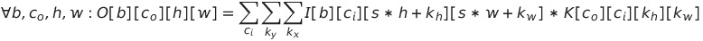

The Capsule kernel is a non-traditional convolution kernel:

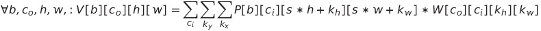

where the P and W are matrix. Actually, the P and W are six-dimensional arrays:

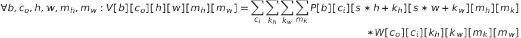

Paul and Michael find it not easy to implement Capsule kernel in existing frameworks, like Tensor Comprehension or PlaidML, and the easiest and best-performing way is to target existing high-level operations, i.e., converting the convolution into matrix multiply, at the cost of data duplication and re-layout. Besides, this approach prevents the fusion of related operations.

## Set up the environment according to [instructions]().

Basically, enter a working directory, and `source /data/t2s/setenv.sh` to set up the environment. The environment is determined based on the specific FPGA model (a10 or s10), and the version of the Intel FPGA SDK for OpenCL compiler (i.e. version of aoc).

## How to design a systolic array?

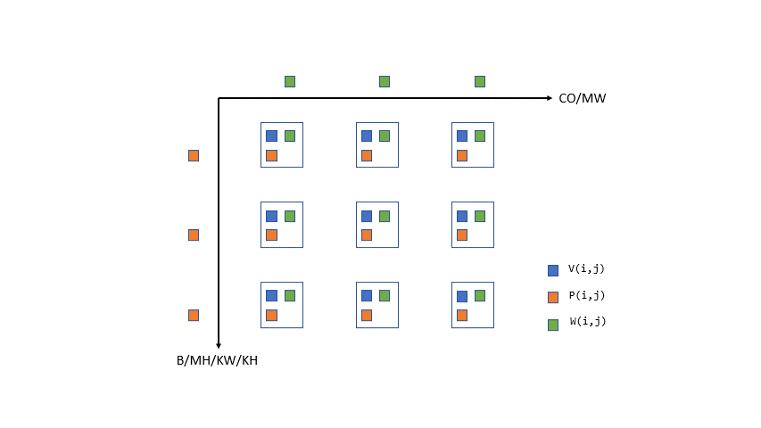

The capsule kernel combines convolution and matrix multiply. The most straightforward approach is to use the GEMM systolic array, which is inefficient since the input patches are expanded as tall/skinny matrix (we omit the reasoning process, known as im2col). Let us examine the capsule operation; it performs four reductions `k_x, k_y, c_i, m_k` on six-dimensional arrays, similar to GEMM that performs one reduction on matrix. More importantly, the `c_o, m_w` dimensions are missed in P, and `b, m_h, k_w, k_h` dimensions are missed in W. In the GEMM design, we let the missed dimension `j` of matrix A and the missed dimension `i` of matrix B flow through the PE array. Can we leverage this property to design a systolic array for capsule?

To be clear, we list the size of dimension as follows:

| Dimension | Size |
| --------- | ---- |
| B         | 64   |
| CO        | 32   |
| CI        | 32   |
| H         | 7    |
| W         | 7    |
| MH        | 4    |
| MW        | 4    |
| MK        | 4    |
| KW        | 3    |
| KH        | 3    |

Before a journey, please follow the instructions in the ` README-Binary-on-Devcloud.md` file to set up your environment.

## Design 1: Basic

Let us start with a small-scale systolic array since the large-scale one consumes more time on emulation and synthesis. The first step is to specify the mapping and dataflow, which is succinctly expressed by UREs and space-time transform. 

The UREs can express constant dependence distance among the iterations. For example, there are two dependence in the array P:
```
P(mw, mh, ci, mk, kw, kh, w, h, co, b) = P(mw, mh, ci, mk, kw, kh, w, h, co-1, b)
P(mw, mh, ci, mk, kw, kh, w, h, co, b) = P(mw-1, mh, ci, mk, kw, kh, w, h, co, b)
```

Obviously, the dimension `b, m_h, k_x, k_y` of array W also exist dependences.  We can map one of them to a systolic array and let a PE fetch the element from the other holding it, that is, executed in a systolic manner.

We decide to tile the `co` into `coi` and `coo`  then fuse the `coi` with `mw`, to get a new dimension `coimw`. The tiling factor is an adjustable parameter that determines the systolic array size in [0, 4, 8, 12, ...]. On the other hand, we decide to tile the `b`into `bi`and `bo` for the other space loop, since it is flexible among the dimensions `b, m_h, k_x, k_y` of W.  Note that we also tile the `ci` into `cii` and `coo` in advance for the next steps. You could definitely figure out other strategies, but now let us write down the UREs to realize this one:

```
#define P           coimw,   bi,   r_cii,         r_cio,         r_mk,        r_kw,        r_kh,   w,  h,  mh,  coo,  bo
#define P_coimw     coimw-1, bi,   r_cii,         r_cio,         r_mk,        r_kw,        r_kh,   w,  h,  mh,  coo,  bo
#define P_bi        coimw,   bi-1, r_cii,         r_cio,         r_mk,        r_kw,        r_kh,   w,  h,  mh,  coo,  bo
#define P_cii       coimw,   bi,   r_cii-1,       r_cio,         r_mk,        r_kw,        r_kh,   w,  h,  mh,  coo,  bo
#define P_cio       coimw,   bi,   r_cii+R_CII-1, r_cio-1,       r_mk,        r_kw,        r_kh,   w,  h,  mh,  coo,  bo
#define P_mk        coimw,   bi,   r_cii+R_CII-1, r_cio+R_CIO-1, r_mk-1,      r_kw,        r_kh,   w,  h,  mh,  coo,  bo
#define P_kw        coimw,   bi,   r_cii+R_CII-1, r_cio+R_CIO-1, r_mk+R_MK-1, r_kw-1,      r_kh,   w,  h,  mh,  coo,  bo
#define P_kh        coimw,   bi,   r_cii+R_CII-1, r_cio+R_CIO-1, r_mk+R_MK-1, r_kw+R_KW-1, r_kh-1, w,  h,  mh,  coo,  bo
#define P_Out       coimw,   bi,                                                                   w,  h,  mh,  coo,  bo

Pose(P)   = select(coimw == 0, pose(P_pose), Pose(P_coimw));
Weight(P) = select(bi == 0, weight(P_weight), Weight(P_bi));
Vote(P)   = select(r_cii==0 && r_cio==0 && r_mk==0 && r_kw==0 && r_kh==0, 0,
			  select(r_cii==0,
			    select(r_cio==0,
			      select(r_mk==0,
			        select(r_kw==0, Vote(P_kh), Vote(P_kw)),
                    Vote(P_mk)),
                  Vote(P_cio)),
                Vote(P_cii))
           ) + Pose(P) * Weight(P);
Out(P_Out) = select(last, Vote(P));

Pose.merge_ures(Weight, Vote, Out)
    .space_time_transform(coimw, bi);
```

where some details are omitted for simplicity. The URE `Vote` performs five reductions. Try to compile the `basic/main.cpp` file now:

```
rm -rf a.a* a
g++ /data/t2s/tutorials/fpga/capsule/basic/main.cpp $CXX_FLAGS -o ./a.out
env INTEL_FPGA_OCL_PLATFORM_NAME="$EMULATOR_PLATFORM_NAME"  CL_CONTEXT_EMULATOR_DEVICE_INTELFPGA=1 BITSTREAM=./a.aocx AOC_OPTION="$EMULATOR_AOC_OPTION -board=$FPGA_BOARD" ./a.out
```

The last command runs the X86 executable on CPU.  It should throw a "Success" message. Now compile it to RTL, then open the report:

```
aoc -rtl -report -board=$FPGA_BOARD ./a.cl
open a/reports/report.html
switch to Throughput Analysis -> Fmax II
```

Oops! We expect all kernels can be scheduled to maximal frequency (240MHz for A10 and 480MHz for S10), and the Block II value is 1. However, the kernel Out actually is around 100MHz and Block II is 4, which lowers the overall performance. We will figure out the reason and solve it in the next step.

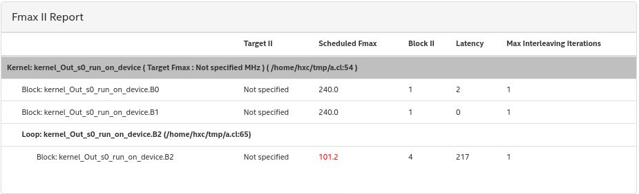

## Design 2: Reorder

"The launch frequency of a new loop iteration is called the initiation interval (II). II refers to the number of hardware clock cycles for which the pipeline must wait before it can process the next loop iteration. An optimally unrolled loop has an II value of 1 because one loop iteration is processed every clock cycle." (Intel FPGA SDK for OpenCL Pro Edition: Best Practices Guide)

The basic design has five sequential reduction loops. The previous iteration writes a value into a register that is immediately read by the next iteration. It is hard for an HLS compiler to pipeline such a small dependence distance. The basic idea is to move the independent dimensions inward; we choose the dimensions `w, h` that extend the distance to W*H=49, and other dimensions would be OK. Compile the `reorder.cpp` file and generate the static analysis report:

```
rm -rf a.a* a
g++ /data/t2s/tutorials/fpga/capsule/basic/main.cpp $CXX_FLAGS -o ./a.out
env INTEL_FPGA_OCL_PLATFORM_NAME="$EMULATOR_PLATFORM_NAME"  CL_CONTEXT_EMULATOR_DEVICE_INTELFPGA=1 BITSTREAM=./a.aocx AOC_OPTION="$EMULATOR_AOC_OPTION -board=$FPGA_BOARD" ./a.out
aoc -rtl -report -board=$FPGA_BOARD ./a.cl
```

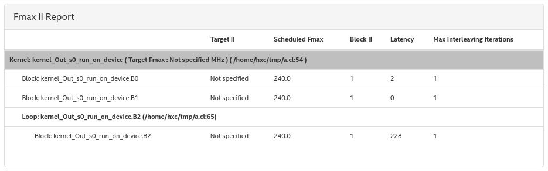

Great! The loop iterations are fully pipelined. Now we can synthesis the design:

```
rm -rf a.a* a
g++ /data/t2s/tutorials/fpga/capsule/reorder/main.cpp $CXX_FLAGS $AOCL_LIBS -o ./a.out
env INTEL_FPGA_OCL_PLATFORM_NAME="$HW_RUN_PLATFORM_NAME" BITSTREAM=./a.aocx AOC_OPTION="-board=$FPGA_BOARD -profile" ./a.out
```

The synthesis will take about three hours to complete. We suggest you save the above commands as a script and submit it as a batch job. At the end of synthesis, there is a message "aoc: Hardware generation completed successfully" and a generated `a.aocx` file.

Before running the program on the actual FPGA hardware, let us glance at the synthesis report.  Open the file `acl_quartus_report.txt`

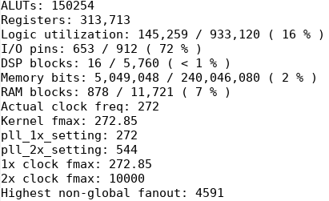

Note that the resource usage is proportional to the systolic array size, so it is not a serious problem that less than 1% DSP blocks are used. During the early stage of tuning performance, we mainly focus on comparing the achieved GFLOPs with the peak performance based on a synthesis result:

```
Peak Performance = #DSPs * #OPs per DSP per cycle * frequency = 16 * 2 * 272Mhz = 8.7GFlops
```

Can we approach this terrible peak performance? Now profile the program with the following instructions:

```
aocl report a.aocx a.source profile.mon
```


It shows the whole program executes 1.49s. The actual GFLOPs is:

```
#Computations = B * CO * H * W * MH * MW * R_CI * R_KH * R_KW * R_MK * 2 (multiply and add) = 3,699,376,128
GFlops = #Computations / time = 2.48 GFlops
```

It achieves less than 30% of the peak performance. Don't be discouraged. The bottleneck is obvious:

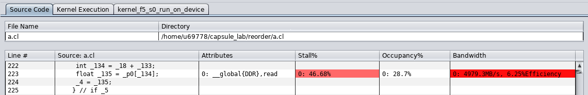

We expect the stall percentage is 0%, occupancy percentage is 100%, and bandwidth is the board's bandwidth. Apparently, the kernel issues load instruction infrequently and stalls on memory access most of the time.

## Design 3: Build I/O Network

The performance is bounded by memory access. As shown in the following figure, we need to build an I/O network to run in parallel with the compute PE array. Thus the memory access and computation are fully pipelined, significantly boost up the performance.


Our compiler can simplify the process of building an I/O network:

```
Pose.isolate_producer_chain(pose, pSerializer, pLoader, pFeeder);
Pose.isolate_producer_chain(weight, wSerializer, wLoader, wFeeder);

Out.isolate_consumer(drainer);
drainer.space_time_transform(coimw, bi);
drainer.isolate_consumer_chain(collector, unloader, outDeserializer);
```

You can find out several kernels communicated with channels, which is responsible for loading data from memory and storing results to memory. Now synthesis with the commands:

```
rm -rf a.a* a
g++ /data/t2s/tutorials/fpga/capsule/ionet/main.cpp $CXX_FLAGS $AOCL_LIBS -o ./a.out
env INTEL_FPGA_OCL_PLATFORM_NAME="$HW_RUN_PLATFORM_NAME" BITSTREAM=./a.aocx AOC_OPTION="-board=$FPGA_BOARD -profile" ./a.out
```

After synthesis and profiling, the results is shown below:

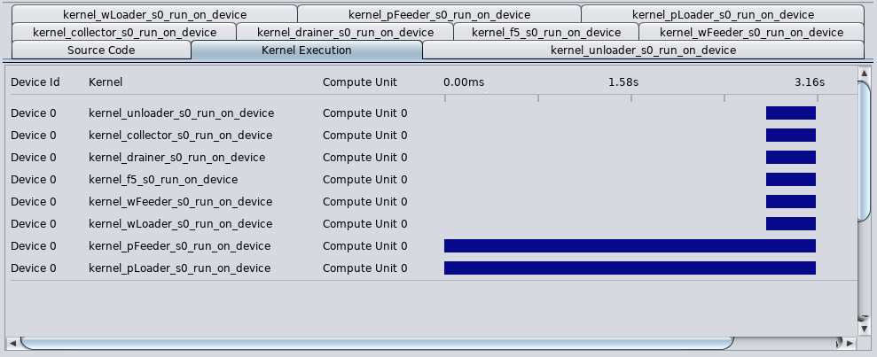

However, the kernel execution is not well pipelined. The `pLoader` and `pFeeder` dominate the time, and other kernels may wait for them. But we also found the computation kernel did not stall on channel access, and the result channel remains idle most of the time. That is to say, the I/O network for `Pose` is busy loading duplicated data, and the systolic array could have done more work.

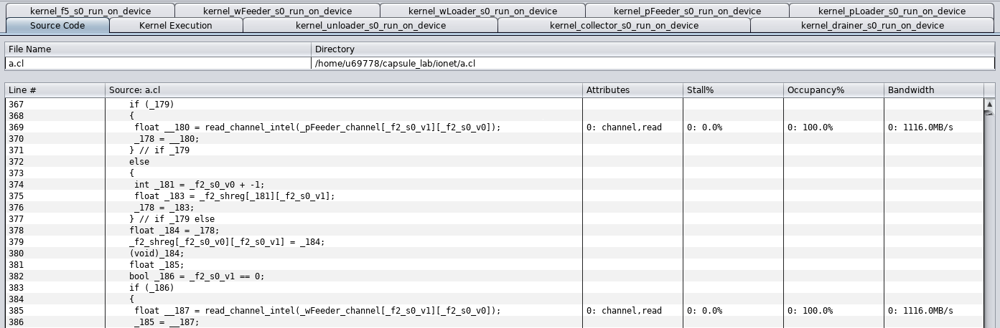

## Design 4: Vectorize

An important optimization is to load/store multiple data at once, which is called vectorization. We can move the dimension *cii* to innermost one, and apply the following primitives:

```
.space_time_transform(r_cii, coimw, bi)
.vectorize(r_cii);
```

Now synthesis with the commands:

```
rm -rf a.a* a
g++ /data/t2s/tutorials/fpga/capsule/vectorize/main.cpp $CXX_FLAGS $AOCL_LIBS -o ./a.out
env INTEL_FPGA_OCL_PLATFORM_NAME="$HW_RUN_PLATFORM_NAME" BITSTREAM=./a.aocx AOC_OPTION="-board=$FPGA_BOARD -fpc -fp-relaxed -profile" ./a.out
```

Please add the `-fpc`, `-fp-relaxed` options to the `aoc` command; otherwise, you may find out the frequency is lower to 100Mhz. These options instruct the HLS compiler to generate more efficient hardware, even though it may introduce a minor variance in the MAC results.

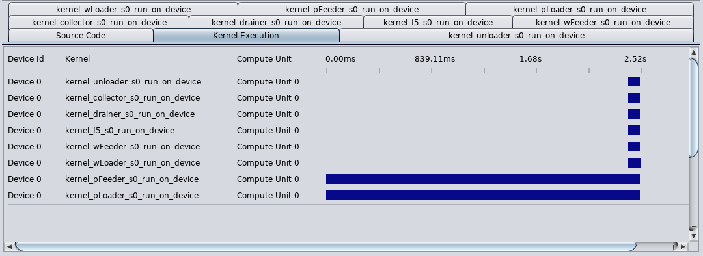

The profiling results show that the kernels execute faster than before because they handle multiple elements at the same time, indicated by a higher DSP usage. However, the data loading of `Pose` is still a bottleneck. 

## Deign 5: Scatter and Buffer

To make the design scalable, we can scatter the I/O module along the PE array, and gather the results of multiple I/O modules:

```
pFeeder.scatter(pLoader, bi);
wFeeder.scatter(wLoader, coimw);
drainer.gather(Out, bi);
collector.gather(drainer, coimw);
```

Furthermore, we can buffer the value to its internal storage, which eliminates redundant accesses:

```
pFeeder.buffer(pLoader, w, BufferStrategy::Double);
wFeeder.buffer(wLoader, r_cio, BufferStrategy::Double);
```

An efficient design should ensure `WRITES <= READS`, as described in document buffer.md. We can check if the current design satisfy it:

```
For P: READS = 1, WRITES = BI = 4.
For W: READS = W*H = 49, WRITES = COIMW = 4.
```

We can reorder the loops to avoid it, i.e., move `coo` and `w` innerward. Then let us check again:

```
For P: READS = COO * W = 112, WRITES = BI * W = 28
For W: READS = COO * W = 112, WRITES = COIMW*COO = 64
```

Now synthesis with the commands and show the report:

```
rm -rf a.a* a
g++ /data/t2s/tutorials/fpga/capsule/buffer/main.cpp $CXX_FLAGS $AOCL_LIBS -o ./a.out
env INTEL_FPGA_OCL_PLATFORM_NAME="$HW_RUN_PLATFORM_NAME" BITSTREAM=./a.aocx AOC_OPTION="-board=$FPGA_BOARD -fpc -fp-relaxed -profile" ./a.out
```

A great improvement can be seen after profiling the design:


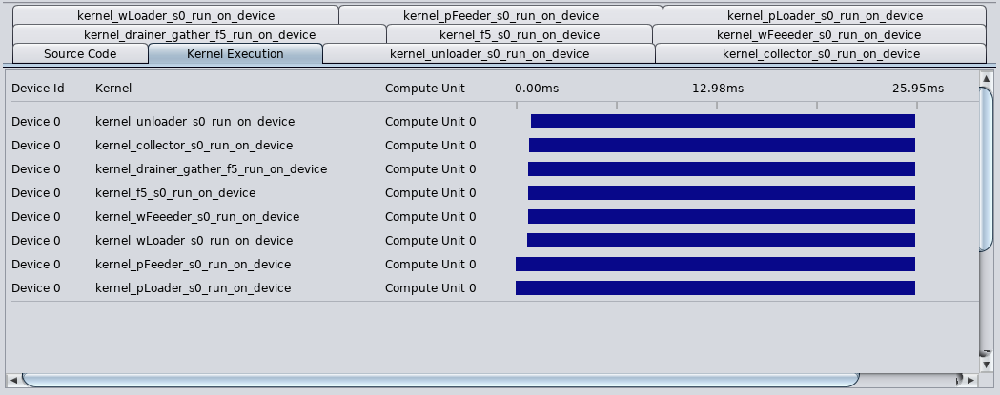

This machine peak sets up an ideal goal to achieve. Of course, it is difficult to achieve the full usage of DSPs, and the max frequency. But we would like to maximize both in a design.

The execution consumes 25.95ms, so the GFLOPs is computed as:

```
B*H*W*CO*MH*MW*R_CI*R_KH*R_KW*R_MK = 1849688064
GFlops = 1849688064 / 0.02595s = 143GFlops
Peak Performance = 292M * 256 * 2 = 150GFlops
```

## Design 6: Scaling up

The previous design shows that only about 4% of DSPs are used, and more than 90% of on-chip resources remain idle. It is simple to adjust the systolic array size with the tiling factor, but it requires several trial-and-error attempts to determine the maximal size a specific board can realize. Let us scale up the previous design to the size 16x8x11 (`cii x coimw x bi`).

Now synthesis with the commands:

```
rm -rf a.a* a
g++ /data/t2s/tutorials/fpga/capsule/scaleup/main.cpp $CXX_FLAGS $AOCL_LIBS -o ./a.out
env INTEL_FPGA_OCL_PLATFORM_NAME="$HW_RUN_PLATFORM_NAME" BITSTREAM=./a.aocx AOC_OPTION="-board=$FPGA_BOARD -fpc -fp-relaxed -profile" ./a.out
```

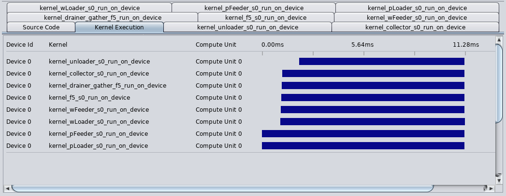

It runs only 11.28ms where a large portion of time consumes on warm-up. We can enlarge the batch size to 264 to extend the execution time to 38.99ms. The peak performance can be computed as 453GFlops and we achieved 389GFlops, nearly 86% efficiency.

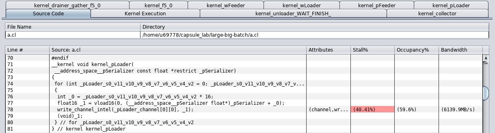

The `pLoader` and `pFeeder` becomes a bottleneck again.  Note that we change the tiling factor `coi` from one to two to get a medium-sized systolic array, but the outer loop `coo` is also decreased, which lower the ratio between READS and WRITES as analyzed above. Under the fixed setting (`CO`= 32),  the design seems limited by this issue. 


[TODO] In future, we will check if the design works well for a large `CO` and try to boost up the frequency.