# LU Decomposition Tutorial

> Mingzhe Zhang, Tsinghua University & University of Science and Technology of China, zhangmz1210@mail.ustc.edu.cn
>
> Weihao Zhang, Tsinghua University, zwh18@mails.tsinghua.edu.cn


### Table of Contents

[1. Principle](#1-principle)
[2. A basic design](#2-a-basic-design)
  [2.1. How to calculate L during the process](#21-how-to-calculate-L-during-the-process)
  [2.2. How to design a systolic array](#22-how-to-design-a-systolic-array)
  [2.3. A triangular systolic array](#23-a-triangular-array)
  [2.4. Derived UREs](#24-derived-ures)
[3. Tiling](#3-tiling)
[4. I/O network](#4-io-network)
[5. Batch](#5-batch)
[6. Vectorization](#6-vectorization)
[7. Neext](#7-next)

## 1. Principle

Let A be a `N*N` square matrix. LU decomposition, also named as LU factorization, factors matrix A as the product of a lower triangular matrix L and a upper triangular matrix U:


LU decomposition can be viewed as the matrix form of Gaussian Elimination. We apply a serial of elementary row operations to triangularize matrix A. Let us illustrate the process with a simple example.

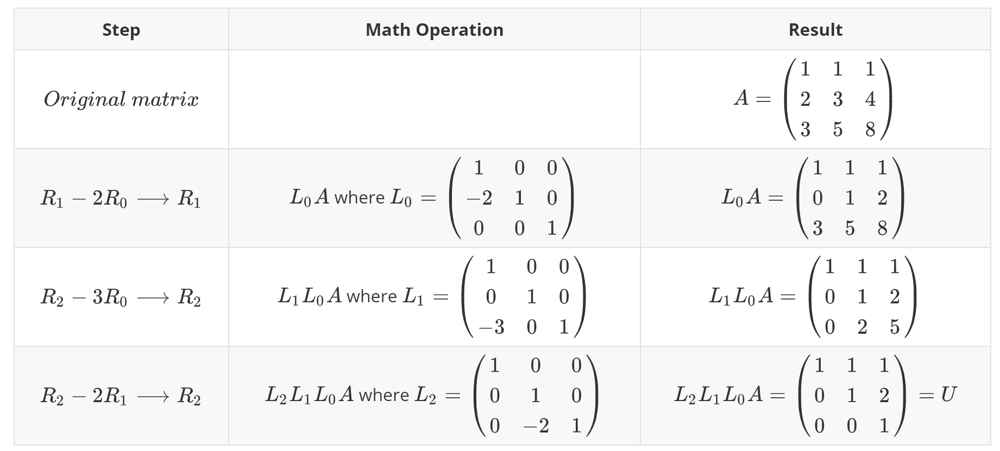

Here R0, R1, R2 refer to the first, second, third row of the current matrix to process. Every step of  Gaussian Elimination is an operation that multiplies a non-zero factor to a row and adding that row to another, i.e., 


## 2. A Basic Design

We derive the UREs for LU decomposition, inspired by the procedure shown in this paper: 

> [Gusev and Evans 92] M. Gusev and D. J. Evans. Elimination of the computational broadcast in systolic arrays: an application to the QR decomposition algorithm. Technical Report 676, Computer Department, Loughborough  University of Technology, January 1992.

Let us start from the following code skeleton: 

```
for (k = 0; k < N; k++)
	for (j = k + 1; j < N; j++)
        row k = f(previous row k, previous row j)
        row j = g(previous row k, previous row j)
```

Operation f is for pivoting and operation g is for Gaussian Elimination. For simplicity, we do not consider pivoting at first. So the code can be simplified as: 

```
for (k = 0; k < N; k++)
	for (j = k + 1; j < N; j++)
        row k = previous row k
        row j = g(previous row k, previous row j)
```

Let `U(j, k)` and `V(j, k)` represent the resulting row `k` and `j`, and let `A(j)` represent row `j` in the original matrix A. Then change the code into dynamic single assignment form. 

```
// initialization partblock Iblock I
for (j = 0; j < N; j++)
	V(j, -1) = A(j)

// computational part
for (k = 0; k < N; k++)
	U(k, k) = V(k, k - 1)	// final result: row k of upper triangular matrix U
	for (j = k + 1; j < N; j++)
        U(j, k) = U(j - 1, k)
        V(j, k) = g(U(j - 1, k), V(j, k - 1))
```

Now perfect the loop nest:

```
for (k = 0; k < N; k++)
	for (j = k; j < N; j++)	// Note that minimum of loop j becomes k
		// initialization part
		if (k == 0)
			V(j, k - 1) = A(j)
		// computational part
		if (j == k)
			U(j, k) = V(j, k - 1)	// final result: row k of upper triangular matrix U
		else
            U(j, k) = U(j - 1, k)
            V(j, k) = g(U(j - 1, k), V(j, k - 1))
```

Our system does not allow such a UREs like `V(j, k - 1) = ...`. Everything in the left hand side must have parameters `j, k` instead. So we replace `V(j, k - 1)` with another function `PrevV(j, k)` as a workaround:

```
for (k = 0; k < N; k++)
	for (j = k; j < N; j++)
		// initialization part
		if (k == 0)
			PrevV(j, k) = A(j)
		else 
			PrevV(j, k) = V(j, k - 1)
		// computational part
		if (j == k)
			U(j, k) = PrevV(j, k)	// final result: row k of upper triangular matrix U
		else
            U(j, k) = U(j - 1, k)
            V(j, k) = g(U(j - 1, k), PrevV(j, k))
```


### 2.1. How to calculate L during the process

After elementary row operations, matrix A finally becomes the upper triangular matrix U, while L still remains unknown. Note that


where `Li` is the identity matrix but with a non-zero element that equals `factor` at row j column k. The inverse matrix is also special: an identity matrix except in the lower half, its element at row j column k equals `−factor`. 

Therefore, we do not actually have to multiply them together. The lower triangular matrix L is equivalent to putting these `−factor`’s into the corresponding positions of the identity matrix. 

Now we can realize the details of operation g:

```
for (k = 0; k < N; k++)
	for (j = k; j < N; j++)
		for (i = k; i < N; i++)
            // initialization part
            if (k == 0)
                PrevV(i, j, k) = A(i, j)
            else 
                PrevV(i, j, k) = V(i, j, k - 1)
            // computational part
            if (j == k)
            	// final result: row k of upper triangular matrix U
                U(i, j, k) = PrevV(i, j, k)	
            else
                U(i, j, k) = U(i, j - 1, k)
                // operation g
                if (i == k)
                	// final result: column k of lower triangular matrix L
                	L(i, j, k) = PrevV(i, j, k) / U(i, j - 1, k)
                else 
                	L(i, j, k) = L(i - 1, j, k)
				V(i, j, k) = PrevV(i, j, k) - L(i, j, k) * U(i, j - 1, k)
```

With Gaussian Elimination, we can use the lower half of the original matrix A to store the `−factor`’s for L. The upper half, including the diagonal, of the original matrix A eventually becomes U.


### 2.2. How to design a systolic array

Now it's time for us to decide which loops are space loops. Space loops are mapped to different dimensions of a systolic array. Seeing that loop i and loop j are irregular loops(their minimum values are depent on k and do not have constant extents), loop k should be our first option. Otherwise, the systolic array might not have a determined size and shape. Then we can choose either j or i as our second space loop: 

- j represents a row of the current matrix. If `j, k` are mapped to the physical array dimensions, it means `PEs(k+1..N-1, k)` apply elementary row operations on row `k+1..N-1` simultaneously and `PE(k, k)` is for output. Every PE processes the elements in its corresponding row sequentially. 
- i represents a column of the current matrix. If `i, k` are mapped to the physical array dimensions, it means `PEs(k+1..N-1, k)` process row `k+1..N-1` sequentially and `PE(k, k)` is for output. But `PEs(k+1..N-1, k)` can calculate N-k-1 elements in one cycle. 


### 2.3. A triangular systolic array

Here we specify `j, k` as space loops. We get a triangular systolic array:

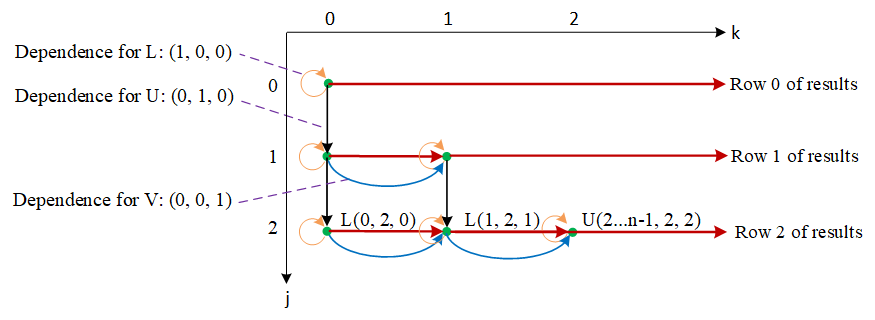

Now we add `Z` to combine results of  `L` and `U` together. For `PE(k, k)`, we expect outputs like `L(0..k-1, k, k)` and `U(k..N-1, k, k)`. Beside the 3 dependences for `L`, `U`, and `V`, we add forwarding of the final results out (See the red lines). Adding the forwarding needs to extend our domain, more specifically, needs to extend `i` to start from 0: when a PE works, it forwards the results from its left PE when `i < k`, otherwise, computes. Therefore, we can slightly modify the above code as follows:

```
for (k = 0; k < N; k++)
	for (j = k; j < N; j++)
		for (i = k; i < N; i++)
			if (i < k)
				Z(i, j, k) = Z(i, j, k - 1)	// Forward a data along k dimension
			else
                // initialization part
                if (k == 0)
                    PrevV(i, j, k) = A(i, j)
                else 
                    PrevV(i, j, k) = V(i, j, k - 1)
                // computational part
                if (j == k)
                    U(i, j, k) = PrevV(i, j, k)	
                    // final result: row k of upper triangular matrix U
                    Z(i, j ,k) = U(i, j, k)
                else
                    U(i, j, k) = U(i, j - 1, k)
                    // operation g
                    if (i == k)
                        L(i, j, k) = PrevV(i, j, k) / U(i, j - 1, k)
                        // final result: column k of lower triangular matrix L
                        Z(i, j, k) = L(i, j, k)
                    else 
                        L(i, j, k) = L(i - 1, j, k)
                    V(i, j, k) = PrevV(i, j, k) - L(i, j, k) * U(i, j - 1, k)
            // The final results are at the right boundary of the systolic array
          	if (j == k)
            	OUT(i, j) = Z(i, j, k)
```

In a systolic array, PEs communicate synchronously via shift registers. The animation below briefly demonstrates how data flows through PEs in the triangular array. 

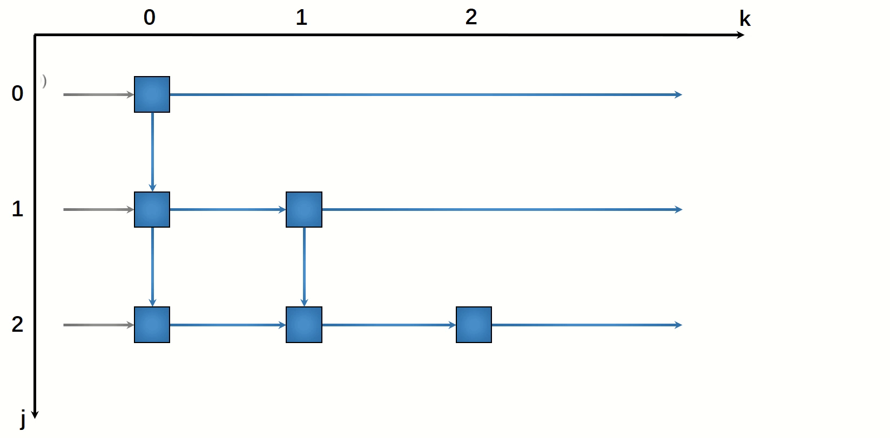


### 2.4. Derived UREs

The only thing left is to express our algorithm in the form of UREs. Let's define some macros for convenient use:

```
#define X                    i,     j,     k
#define X_no_k               i,     j
#define X_k_minus_1          i,     j,     k - 1
#define X_j_minus_1          i,     j - 1, k
#define X_i_minus_1          i - 1, j,     k
#define FUNC_DECL            HALIDE_TYPE, {X}, PLACE1
```

We can easily write the UREs based on the above code skeleton:

```
PrevV(X)  = select(i >= k, select(k == 0, A(i, j), V(X_k_minus_1)), 0);
U(X)      = select(i >= k, select(j == k, PrevV(X), U(X_j_minus_1)), 0);
L(X)      = select(j == k || i < k, 0, select(i == k, PrevV(X) / U(X_j_minus_1), L(X_i_minus_1)));
V(X)      = select(j == k || i < k, 0, PrevV(X) - L(X) * U(X_j_minus_1));
Z(X)      = select(i >= k, select(j == k, U(X), select(i == k, L(X), 0)), select(k > 0, Z(X_k_minus_1), 0));
O(X_no_k) = select(j == k, Z(X));

PrevV.merge_ures(U, L, V, Z, O);
```

Now we need to specify how we map our UREs to a systolic array. Space-time transformation requires all space loops to be continuous and at the inner-most levels. So we move loop j, k inward by loop reordering. Then map `j, k` to a physical array. The corresponding transformation is:

```
PrevV.reorder(j, k, i).space_time_transform(j, k);
```

Explicitly set bounds:

```
PrevV.set_bounds(k, 0, SIZE, j, k, SIZE - k, i, 0, SIZE);
```


So far, we've got a systolic array that works correctly for LU decomposition. But is it a high-performance systolic array? Let's start with the static reports. 

Compile source file into RTL:

```
aoc -rtl lu-basic.clspecification
```

A `report.html` will be generated at `lu-basic/reports/`. Under `Throughput Analysis-->Fmax II report`, we expect the II of every block is 1 and scheduled fmax achieves 480MHz for S10(or 240MHz for A10).

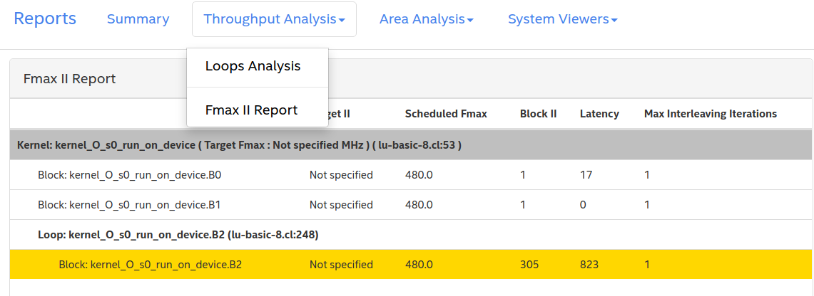

Unfortunately, in our basic design, block B2 has an II=305. If II is greater than 1, please read the details pane at the bottom. Memory/data dependency is the most likely cause of it. 

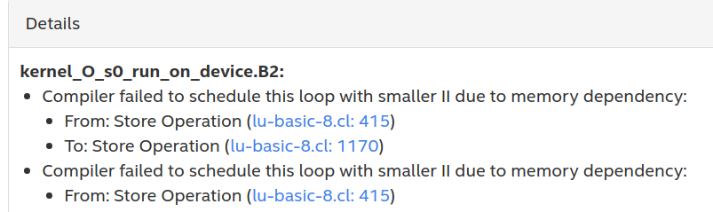

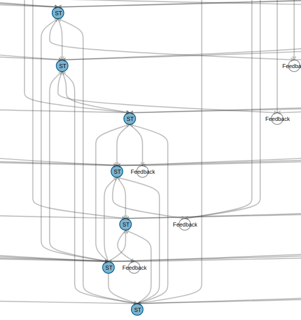

It says that there is a write-write dependency. A store operation happens only when a result reaches a diagonal PE. That is to say, there are N PEs(assuming the matrix size is N) writing to memory. As shown in the animation, PE(k, k) outputs kth row of the final results. Although these PEs write to different memory addresses, the OpenCL compiler analyzes code in a relatively conservative way and assumes that there is a conflict between every two store operations. Actually, these dependencies could be ignored directly. To explicitly instruct the compiler to remove loop-carried dependencies, we can add `#pragma ivdep safelen(N)` before a loop. `safelen(N)` indicates that there are a maximum of N iterations of the loop before dependencies might be introduced. 

In this case, we don't have to add `#pragma ivdep` immediately. This issue might be fixed by our following optimizations. 


## 3. Tiling

Unlike other benchmarks, a scalable tile algorithm for LU decomposition is more complicated. We can not tile at loop level directly. Please refer to [Building Application-Specific Overlays on FPGAs with High-Level Customizable IPs](https://arxiv.org/pdf/2009.00637.pdf) for more information. Since the support for overlay is still under development, blocked LU decomposition is left as our future work. 


## 4. I/O Network

It seems a bad idea to let multiple PEs write to memory at the same time. Naturally, we think of isolating output(maybe input as well). Without an I/O network, data transferring usually becomes bottleneck due to limited off-chip memory bandwidth. 

Isolate output from the last function `O`:

```
O.isolate_consumer_chain(collector);
collector.set_bounds(i, 0, SIZE, j, 0, SIZE);
collector.space_time_transform(j);
```

As can be seen, the output is a square matrix. Loop k is gone because of the reduction. Note that loop `j`'s bounds are (k, SIZE - k) in the UREs. We readjust its bounds to (0 ,SIZE), so that we can specify j as a unrolled loop. Output functions will inherit the new loop structure. 

```
collector.isolate_consumer_chain(unloader, deserializer);
```

Consumer PEs gather results vertically along loop `j`: 

```
collector.gather(O, j);
```

Since we haven't divided loops into tiles, there is no reuse loop for buffering. Similarly, we can isolate input paths and build the network as follow:

```
PrevV.isolate_producer_chain(A, feeder);
feeder.set_bounds(k, 0, 1, j, 0, SIZE);
feeder.isolate_producer_chain(loader, serializer);
feeder.scatter(loader, j);
```

After isolating I/O, these kernels are automatically connected with channels. Specifying the minimum depth of the output channel of a kernel can effectively decouple this kernel from its consumer. E.g.

```
loader.min_depth(512);
feeder.min_depth(512);
O.min_depth(512);
collector.min_depth(512);
unloader.min_depth(512);
```

Congratulations! We've built an I/O network shown below step by step. 

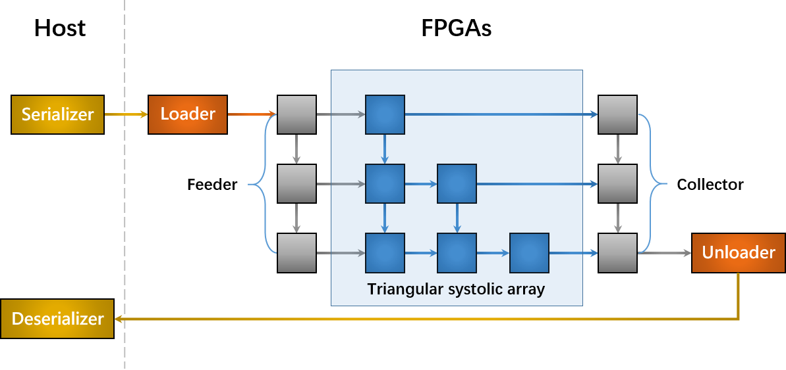

Look at the static reports again: 

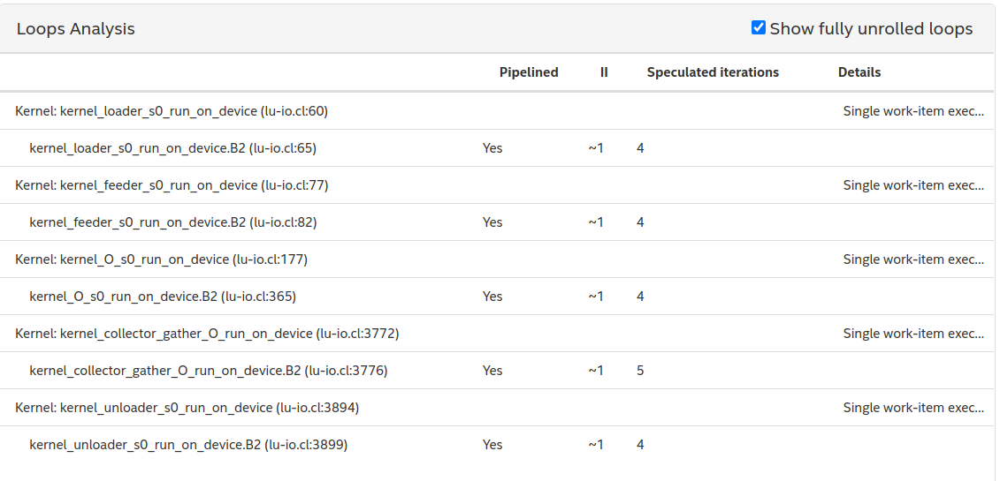

We see II of all blocks are reduced to 1, which is a good sign. Now that static reports provides limited information, let's see where the bottleneck is by dynamic profiling:  

```
aoc -v -report -profile -g lu-basic.cl -o lu-basic.aocx -board=pac_s10_dc
```

When running on hardware, a `profile.mon` file will be generated. We can view the profile like this:

```
aocl report lu-basic.aocx lu-basic.source profile.mon
```

A GUI will show up and you can find the channel or memory access bottleneck by clicking on `High Stall%`. 

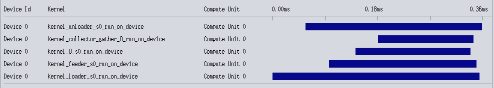

The execution took 0.35ms. That is to say, we can factor 2857 `8 x 8` matrices per second. 

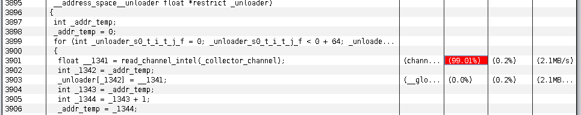

The profiler marked one performance bottleneck.  `unloader` stalls when reading from a channel connected with `collector`, which means the channel is continuously nearly empty. The read side of the channel is likely working faster than the write side. In other words, `collector` is too slow to catch up with `unloader` writing to device memory. The statistics also shows that the kernel execution is not well-pipelined. For instance, the time interval between launching kernel `unloader` and `collector` is more than a quarter of the total time. No wonder `unloader` stalls a lot when reading from `collector`. 

To confirm our suspicions of the performance bottleneck, we must enlarge the inputs, so that the execution time will be much greater than the launch interval. 

## 5. Batch

Our previous design only load a small matrix(`8 x 8`) and decomposes it once. So how to increase inputs? 

[Tiling]() is not an option as we discussed in the previous section. Besides, it is not a good idea to try a larger matrix directly, because the systolic array will be scaled up accordingly. The FPGA might not have enough resources for such a large systolic array. In fact, `32 x 32` is the limit of a triangular array, but a `32 x 32` matrix does not contribute to the inputs a lot. 

The solution is to add a batch loop at the outermost loop level, so that the systolic array can read the same data as many times as it wants without changing its size. We only need modify the macros as follow:

```
#define X                      i,     j,     k, b
```

Let `b=2^19` and see the profile:

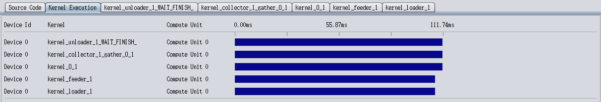

Now the pipeline looks well. The whole execution took 111.74ms. After enabling batch test, the array now can factorize 4692035 matrices per second. It is such a significant improvement!  

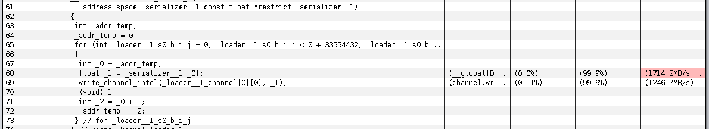

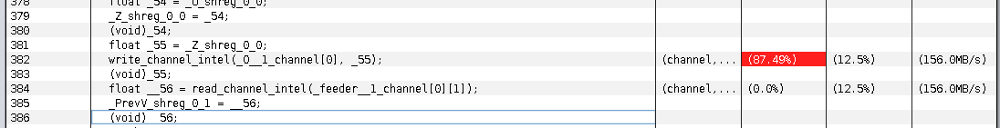


However, the profile also shows that memory bandwidth consumed by loading matrices is 1.714GB/s, which is still too small compared with the global memory bandwidth(76800 MB/s). Also, the systolic array stalls when diagonal PEs write results to `collector`(from `_O_1_channel[0]` to `_O_1_channel[7]`, we only show two stalls above). 


## 6. Vectorization

To take advantage of memory bandwidth, we achieve data parallelism by vectorization. We tile the outermost batch loop into `b` and `bb` and move `bb` inward, then vectorize `bb`. Therefore, the systolic array can decompose bb matrices at the same time. 

The specification is modified slightly:

```
#define X                      bb, i,     j,     k, b
...
PrevV.reorder(bb, j, k, i)
		    .space_time_transform(bb, j, k)
		    .vectorize(bb);
...
collector.space_time_transform(bb, j)
 				  .vectorize(bb);
```

The profile shows that 

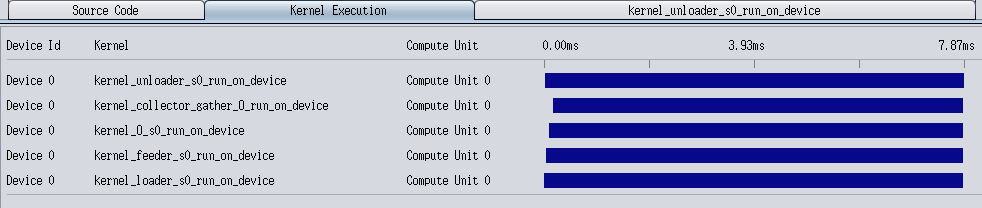

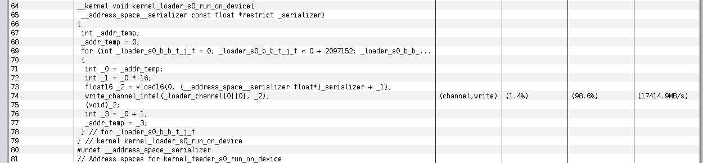

Note that `loader` loads 16 inputs from 16 different matrices every time(vload16 at line 73) and the bandwidth achieves 17GB/s. But the same bottleneck still exists: 

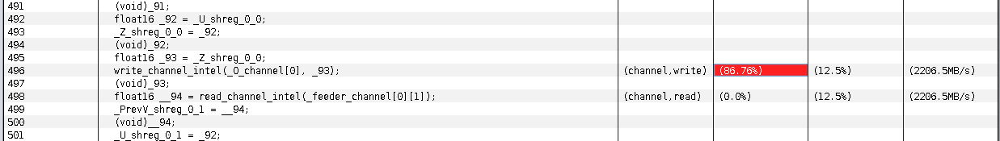

Since LU decomposition requires division, which will cost more DSP blocks on FPGA than addition and multiplication, measuring throughput and comparing it with the theoretically peak performance might not be a good choice. Instead, we calculate the absolute performance(how many matrices can be factorized per second). 

The chart below shows our improvements in performance tuning. 

| Optimization  |   b   |  bb  | SIZE | RAM  | DSP  | Frequency |   Time   |  Num/s   | Throughput  |
| :-----------: | :---: | :--: | :--: | :--: | :--: | :-------: | :------: | :------: | :---------: |
|      I/O      |   1   |  1   |  8   |  6%  |  2%  |  327MHz   |  0.35ms  |   2857   | 0.001GFLOPS |
|     Batch     | 1<<19 |  1   |  8   |  6%  |  2%  |  312MHz   | 111.74ms | 4692035  | 1.708GFLOPS |
| Vectorization | 1<<15 |  16  |  8   | 30%  | 35%  |  276MHz   |  7.87ms  | 66618551 | 24.25GFLOPS |


## 7. Next

So far, the performance has been improved significantly compared with the first design. However, it is still possible to further optimize the design since not all visible bottlenecks are solved. 

In the future, we may:

- Figure out what happened to `colllector`  and how to speed it up. 
- Isolate out control signals to simplify the systolic array.
- Tune the array size to make full use of DSP blocks. 
- Enable block LU decomposition by introducing overlay in our system. 