# Expressing matrix multiply on Intel FPGAs for productive performance

> Hongbo Rong, Parallel Computing Lab (PCL) of Intel, hongbo.rong@intel.com

>  Mingzhe Zhang, Tsinghua University & University of Science and Technology of China, zhangmz1210@mail.ustc.edu.cn

Give matrix `a` and `b`, matrix multiply is to compute a matrix `c = a * b`. Below we show how to use T2S to intuitively, and incrementally build up a high-performance matrix multiplier on an FPGA like this:
<a name="final-design-animation">
 
</a>
This design is certainly not the only one for matrix multiply. It was derived step by step, each step to address a visible performance bottleneck. This incremental design process is a power of T2S. 

### Table of Contents

[1.  A basic design](#1--a-basic-design)
[2. Tiling](#2-tiling)
[3. Space-time transform and vectorization](#3-space-time-transform-and-vectorization)
[4. Reordering](#4-reordering)
[5. Isolating I/O](#5-isolating-io)
  [5.1. Isolating the output](#51-isolating-the-output)
  [5.2. Isolating for serialization and de-serialization](#52-isolating-for-serialization-and-de-serialization)
  [5.3. Isolating full I/O paths](#53-isolating-full-io-paths)
  [5.4 Dynamic profiling](#54-dynamic-profiling)
[6. Scaling up to an medium-sized array](#6-scaling-up-to-an-medium-sized-array)
[7. Saving memory bandwidth](#7-saving-memory-bandwidth)
[8. Simplifying the output paths](#8-simplifying-the-output-paths)
[9. Scaling up to a large array](#9-scaling-up-to-a-large-array)
[10. Next](#10-next)

## 1.  A basic design

T2S expresses a compute using UREs (Uniform Recursive Equations).  For matrix multiply, the compute is


This compute has 3 loops `i, j, k`. A dataflow of the compute is shown below:

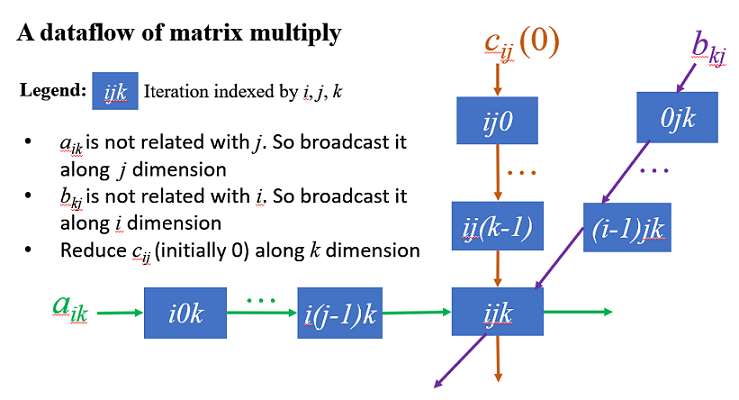

This dataflow can be expressed recursively as follows:


These equations are **uniform recurrence equations** : any iteration `ijk` depends on 3 neighbor iterations: `i(j-1)k`  for `A`, `(i-1)jk` for `B`, and `ij(k-1)`for `C`. In other words, uniformly across the entire iteration space, there are 3 kinds of dependences, whose distance vectors are constant: <0, 1, 0>, <1, 0, 0>, and <0, 0, 1>.  

The above UREs can be translated into a T2S specification straightforward:

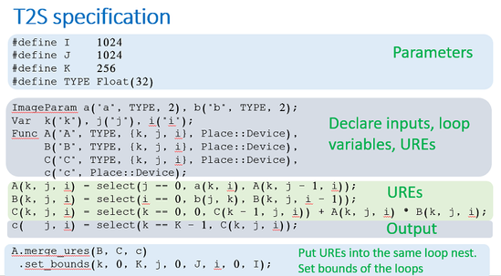

The above specification tells the T2S compiler to build a loop nest like this:

  ```
1 for (i = 0; i < I; i++)
2  for (j = 0; j < J; j++)
3   for (k = 0; k < K; k++)
4    A(k, j, i) = select(j == 0, a(k, i), A(k, j - 1, i));
5    B(k, j, i) = select(i == 0, b(j, k), B(k, j, i - 1));
6    C(k, j, i) = select(k == 0, 0, C(k - 1, j, i))+ A(k, j, i) * B(k, j, i);
7    c(   j, i) = select(k == K - 1, C(k, j, i));
  ```

T2S is built upon [Halide](https://halide-lang.org/), and extends its targets from von Neumann architectures (CPUs and GPUs) to spatial/dataflow architectures (e.g. FPGAs). Following the convention of Halide, 
 + loops are written starting from the innermost loop. That is why the arguments of the functions are written in `k, j, i` instead of `i, j, k`.
 +  Matrices/tensors are in column-major format. That is why an input is written like `a(k, i)`  instead of `a(i, k)`.

Also note that 

+ all functions are recursive except the output function `c`. A recursive function's signature (return type, arguments, place of execution (either `Place::Device` or `Place::Host`) ) must be declared before the function's definition. A non-recursive function needs only the place to be declared beforehand.
+  With`A.merge_ures(B, C, c)`, all the functions are merged into a single loop nest as shown above. Function `A` will then represent this loop nest, including all the functions inside.
+ `select(condition, true_value, false_value)` is an expression equivalent to a C-style expression `(condition? true_value : false_value)`. The `false_value` can be undefined: for example, `c(   j, i) = select(k == K - 1, C(k, j, i))` says that when `k == K - 1`, the current `C(k, j, i)` is a final result, and therefore, it is assigned to the output `c(j, i)` .  

Now that the UREs are defined, specify the input data and execution:

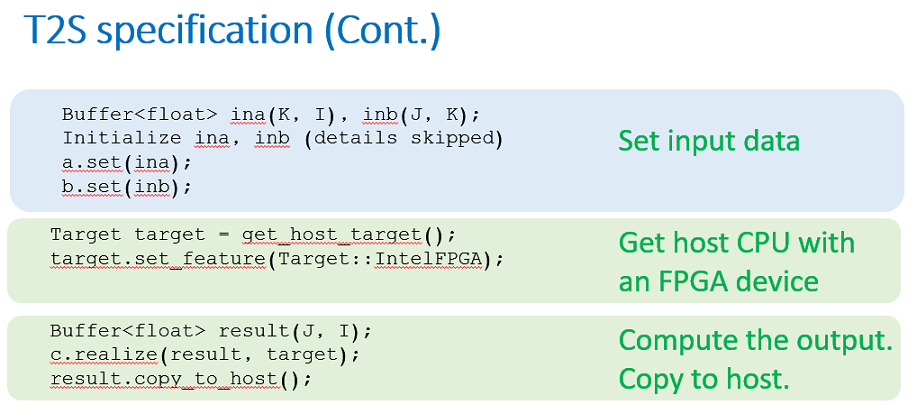

The complete specification can be seen [here](basic/main.cpp).

Let us test the design for correctness. First, follow [the instructions](../../../README.md)  to set up the environment. Choose an A10 or S10 FGPA for the experiments in this tutorial. The performance data below are all for A10. 

Second, emulate the design:

```
/data/t2s/tutorials/fpga/matrix-multiply/run.sh basic emulator
```

The specific commands executed by the  Bash script are printed out, so that you can copy them and reproduce the results to play with. Roughly speaking, these commands will invoke a standard C++ compiler (e.g. g++) to compile our specification (a C++ program) into an X86 binary, and run that binary; When the X86 binary runs to the statement `c.realize(...)` shown above, the T2S compiler is invoked, which compiles the functions into OpenCL kernels,  invokes the Intel FPGA SDK for OpenCL to compile the OpenCL kernels into a bitstream, and offload the bitstream to a device (emulator) to run.   

The basic design accepts only fixed-sized input matrices, and computes the entire output directly on an FPGA. This won't be very useful for realistic scientific computing, where input matrices could vary in sizes and could be so large that the FPGA won't have enough resources to hold the entire output on board. We will address this issue by tiling.

## 2. Tiling

To compute the output matrix, we can partition it into tiles, and compute the tiles one by one, every time invoking a systolic array, which contains multiple Processing Elements (PEs). 

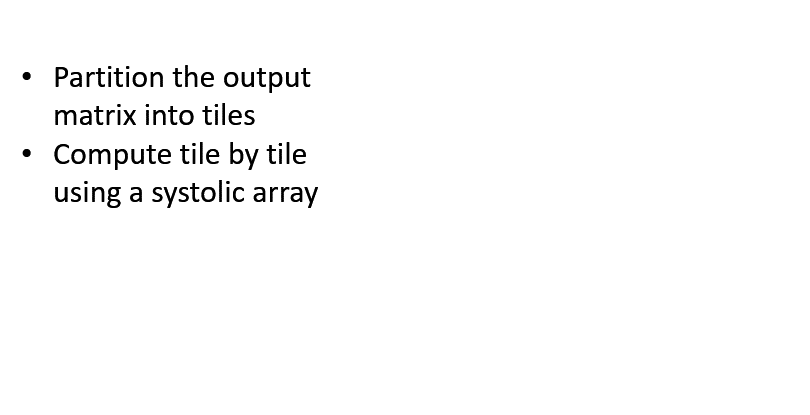

So for the original 3 loops `k, j, i`, we tile each of them twice, once for dividing the output into tiles -- one tile is to be computed by a systolic array, and the other for further dividing a tile into sub-tiles -- one sub-tile is to be computed by a PE. Thus the original 3-deep loop nest becomes a 9-deep loop nest:

```
   for i in [0, I)
     for j in [0, J)
       for k in [0, K)
         for ii in [0, II)
           for jj in [0, JJ)
             for kk in [0, KK)
               for iii in [0, III)
                 for jjj in [0, JJJ)
                   for kkk in [0, KKK)
                     i' = iii + III * ii + III * II * i
                     j' = jjj + JJJ * jj + JJJ * JJ * j
                     k' = kkk + KKK * kk + KKK * KK * k
                     c(jjj, iii, jj, ii, j, i) += a(k', i') * b(j', k')
```

We need rewrite previous UREs in terms of the new loop nest.  Since an original loop is split into 3 new loops, an original dependence distance at that loop is also split into 3 distances. For example, before tiling,  the current iteration `(k, j, i)` depends on the previous iteration`(k - 1, j, i)` , if any, for the `C` data. The dependence distance at dimension `k` is 1. Now that we split the original loop `k` into 3 new loops, `kkk, kk` and `k`, that distance (1) is split into 3 distances at the new loops. More specifically, for the current iteration`(kkk, jjj, iii, kk, jj, ii, k, j, i)` , the previous iteration, if any, is

+  `(kkk - 1, jjj, iii, kk, jj, ii, k, j, i)` when `kkk` is not zero. The distance vector is <1, 0, 0, 0, 0, 0, 0, 0, 0>. 
+ `(kkk + KKK - 1, jjj, iii, kk - 1, jj, ii, k, j, i)` when `kkk` is  zero but `kk` is not zero. So the distance vector is <-KKK + 1, 0, 0, 1, 0, 0, 0, 0, 0>. 
+ `(kkk + KKK - 1, jjj, iii, kk + KK - 1, jj, ii, k - 1, j, i)` when both `kkk`  and `kk` are zero, but `k` is not zero. So the distance vector is <-KKK + 1, 0, 0,  -KK + 1, 0, 0, 1, 0, 0>. 

Although we can handle `A` similarly, in this design, we simply propagate`A` from  `(kkk, jjj - 1, iii, kk, jj, ii, k, j, i)` when `jjj` is not zero, and re-load it from memory otherwise. `B` can be handled likely.

Now we can rewrite the previous UREs straightforward:

<a name="tiling-spec-part1">
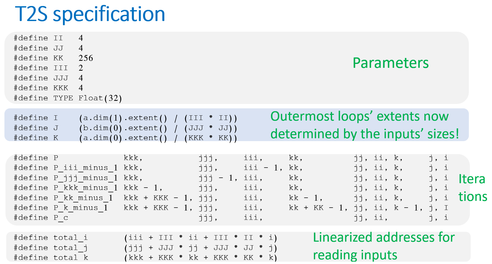
</a>

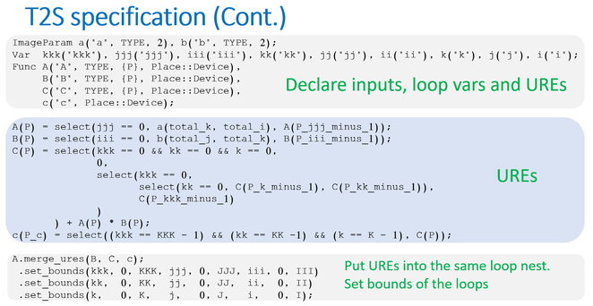

The complete specification can be seen [here](tiling/main.cpp).

Quickly test the correctness with two tiny (64 * 64) input matrices on an emulator:

```
/data/t2s/tutorials/fpga/matrix-multiply/run.sh tiling tiny emulator
```

Tiling has opened the opportunity to fit a tile of the input and output data to the finite memory/registers of an FPGA. However, this opportunity has not been taken yet. Look at the generated OpenCL file (`tutorials/a.cl`), we easily spot some issue:

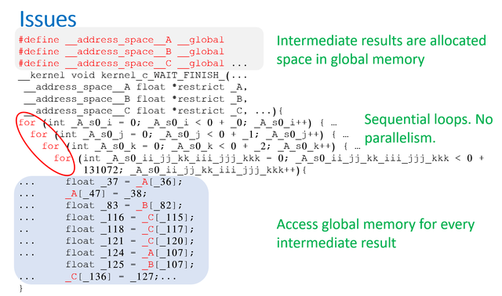

There is no parallelism, and it is certainly very inefficient using global memory for intermediate results of function `A, B`, and `C` . Besides, the compiler does not optimize the memory sizes, and simply allocate for each of them a space with the size of  `KKK * JJJ * III * KK * JJ * II * K * J * I `, i. e. the product of the extents of all the loops. When the input sizes are big, these intermediate results can waste a huge amount of memory. For example, if we test the same design with two input matrices whose sizes are 2K * 4K and 4K * 2K, respectively: 

```
/data/t2s/tutorials/fpga/matrix-multiply/run.sh tiling small emulator
```

An error will be (correctly) thrown:

 ```
CL: halide_opencl_device_malloc failed: 68719476736 bytes are requested to allocate on the device. The size exceeds 2^32 - 1.
 ```

The error message was (correctly) thrown because of extremely large memory request (68 GB). Below we will apply space-time transform and vectorization  to expose parallelism. Space-time transform will also minimize storage.

## 3. Space-time transform and vectorization

To address the issues in the tiled code, we simply add the following lines of code:

```
A.space_time_transform(kkk, jjj, iii)
 .vectorize(kkk);
```

The complete specification is [here](stt-vectorize/main.cpp).

The above lines tells the compiler that loop `kkk`, `jjj` and `iii` are **space loops**, and among them, loop `kkk` is vectorized (All the other loops are **time loops**). Therefore, the compiler will

+  fully unroll loop `jjj` and `iii`. Every iteration turns into a hardware PE. So there will be `JJJ * III` number of PEs. These PEs execute in parallel, subject only to the dependences between them.
+ vectorize loop `kkk`. This enables data parallelism: `KKK` number of data from matrix `a`  (and `b`) will be loaded together every cycle.
+  use **shift registers** instead of global memory for intermediate results. The compiler will minimize the amount of shift registers.

Quickly test the correctness with some tiny sizes of a systolic array and inputs ( `JJJ * III = 2 * 2 = 4` PEs, each PE with vectorized inputs whose lengths are `KKK = 2`):

```
/data/t2s/tutorials/fpga/matrix-multiply/run.sh stt-vectorize tiny emulator
```

Then try the 2K * 4K and 4K * 2K matrices again with a small systolic array: `JJJ * III = 4 * 2 = 8` PEs, each PE with vectorized inputs whose lengths are `KKK = 4`:

```
/data/t2s/tutorials/fpga/matrix-multiply/run.sh stt-vectorize small emulator
```
It works, but takes a long time to emulate. Just stop it, and look at the generated OpenCL file `tutorials/a.cl`:

```
__kernel void kernel_c_WAIT_FINISH_(...) {
 float _C_shreg[16][4][2];
 float4 _B_shreg[4][2];
 ...
 float4 _A_shreg[4][2];
```
All the intermediate results are allocated shift registers now. It is important to see that their sizes are constant, and have nothing to do with the (dynamic) extents of the outermost loops (`k, j, i`), which means that even if the input sizes are very big, the register sizes stay the same. The shift registers' sizes are also reasonable: for example,  function `C` take only 16 * 4 * 2 registers (i.e. 16 registers for each of the 8 PEs). Compared with the gigabytes of memory usage  in the previous section, this is a huge improvement. In fact, without this optimization, we cannot work with any realistic inputs. Also note that `A` and `B` are  vectorized types now.

Let us generate RTL and estimated performance:
```
/data/t2s/tutorials/fpga/matrix-multiply/run.sh stt-vectorize small rtl
```
A report is generated in `tutorials/a/reports/report.html`. Open the file in a web browser. First, look at the `fMAX II Report` under `Throughput Analysis`: 

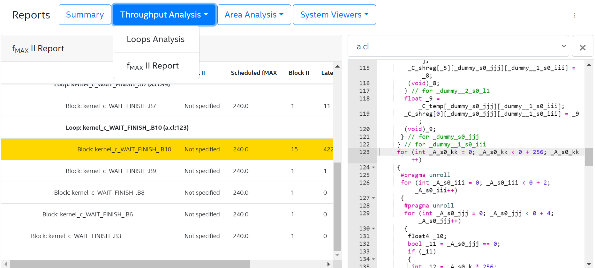

The II (Initiation Interval) of every basic block in the generated OpenCL code is 1 except block B10, which has an II=15. That is, the hardware for B10 initiates once very 15 cycles, which is very inefficient. To get good performance, we always want an II to be as small as possible. Ideally, all IIs should equal 1.  

Now let us see why B10 has such a big II. The `Throughput Analysis / Loops Analysis` tells that  the loop at line 123, which is loop `kk`, cannot be scheduled with a smaller II due to dependences on variables `_65_`, `_74_`, and `_C_shreg`:

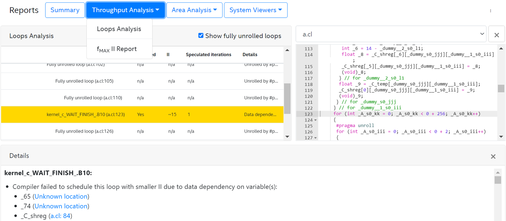

Look at the generated OpenCL file `tutorials/a.cl` (Skip everything but keep the 3 variables):

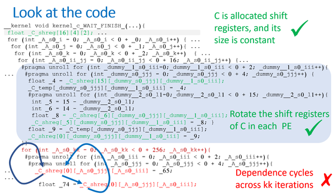

Apparently, loop `kk`  carries two dependence cycles. One `kk` iteration has to wait for the previous `kk` iteration to finish, because both `kk` iterations write/read the same register `_C_shreg[0][_A_s0_jjj][_A_s0_iii]` (Note that the registers are rotated before loop `kk`, and then stay put during the entire execution of loop `kk`). As a result, the `kk` iterations have to be initiated sequentially, 15 cycles apart.

So why the registers are rotated before, not inside, loop `kk`? Remember that we have tiled each of the original loops `k, j, i` twice, and naturally, we order the new loops as `kkk, jjj, iii, kk, jj, ii, k, j, i`. Then as we discussed in the [previous section](#2.-Tiling), function `C`  has 3 dependences whose distance vectors are

+ <1, 0, 0, 0, **0, 0**, 0, 0, 0>,
+ <-`KKK` + 1, 0, 0, 1, **0, 0,** 0, 0, 0>, and
+ <-`KKK` + 1, 0, 0,  -`KK` + 1, **0, 0**, 1, 0, 0>.

The highlighted components are the distances at loop `jj` and `ii`. Note that they all equal 0, and the two loops, `jj` and `ii`, are adjacent. In this case, the compiler linearizes the distances at `jj` and `ii` , allocates `JJ * II = 16` registers for storing values of function`C` in each PE, and rotate the registers at this linearized dimension in each PE, whenever the linearized dimension is entered. This linearized dimension (shown as loop `_A_s0_ii_jj` in the above generated code) is right above loop `kk` (shown as `_A_s0_kk` in the above generated code). That is why the rotation of the registers happen before, instead of inside, loop `kk`. 

So how to reduce II? We need move loop `jj` and `ii`  inside loop`kk`. In  that way, the linearized  `jj` and `ii` dimension will be inside loop `kk`, and therefore, rotation of the registers at the linearized dimension will also happen inside loop `kk`. When one `kk`  iteration starts, it rotates the 16 registers first, and thereafter, the `_C_shreg[0][_A_s0_jjj][_A_s0_iii]`  accessed in this  `kk`   iteration is actually `_C_shreg[15][_A_s0_jjj][_A_s0_iii]` in the previous `kk`  iteration. In other words, with the same logical register name `_C_shreg[0][_A_s0_jjj][_A_s0_iii]` , the two  `kk`  iterations are actually accessing two different physical registers , and therefore, the dependence cycles will be broken.  

## 4. Reordering

Let us move loop `kk` outside of `jj` and `ii`:

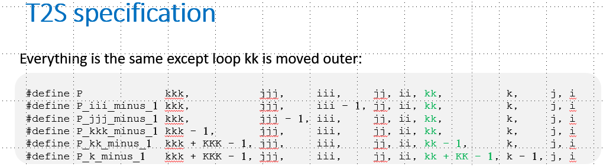

The complete specification is [here](reorder/main.cpp).

Quickly check for correctness:

```
/data/t2s/tutorials/fpga/matrix-multiply/run.sh reorder tiny emulator
```

Generate RTL and estimate performance:

```
/data/t2s/tutorials/fpga/matrix-multiply/run.sh reorder small rtl
```

An OpenCL file is generated as well. Look at the generated OpenCL file `tutorials/a.cl`:

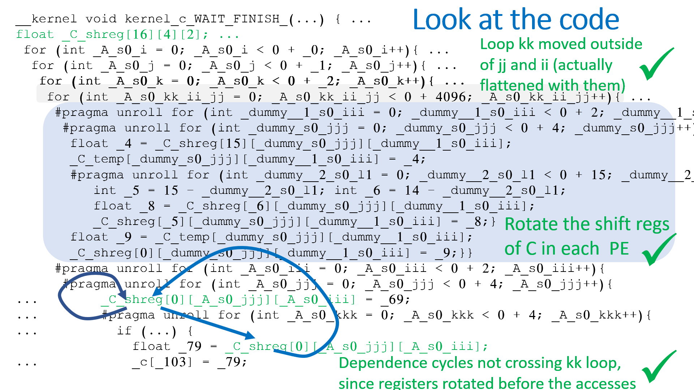

Look at the report in `tutorials/a/reports/report.html`:

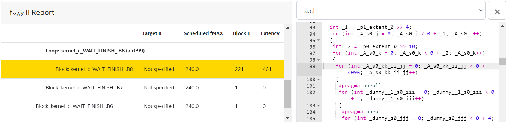

Oops! We get a even bigger II. But our previous code change is the right move ... So why? Look at the loop analysis:

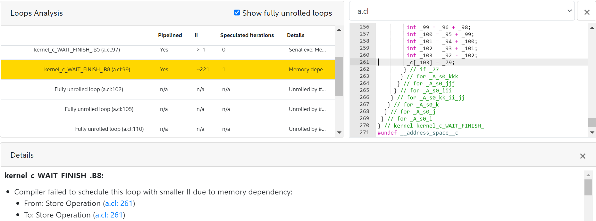

This time, the report says there is a write-write memory dependence cycle from line 261 to itself regarding variable `_c`, which is our output function. So our previous dependences for function `C` is no longer a problem. That confirms our code change. This dependence cycle for variable `_c` might have always existed, but is exposed to be a problem now.

Look at the generated OpenCL file `tutorials/a.cl`:

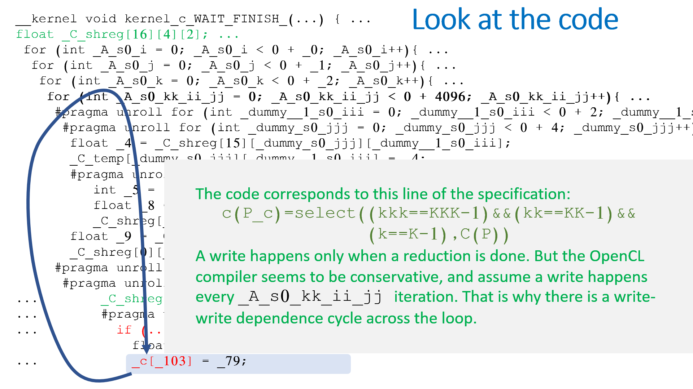

To remove the dependence cycle from this kernel, we can isolate the memory write out of the kernel. Writing to memory by every PE is a bad practice anyway.  

## 5. Isolating I/O

### 5.1. Isolating the output

Isolate the writing of the final result `c` as follows:

```
Func drainer("drainer", Place::Device);
c.isolate_consumer(drainer);
drainer.space_time_transform(jjj, iii);
```

Once isolated, drainer inherits the arguments of result `c`, `P_c`, which has less loops than the systolic array (the reduction loops `kkk, kk` and `k` are gone). For this new loop structure, we specify space-time transform with `jjj` and `iii` as the space loops, consistent with the systolic array.

The complete specification is [here](isolate/isolate-drainer.cpp).

Check for correctness:

```
/data/t2s/tutorials/fpga/matrix-multiply/run.sh isolate drainer tiny emulator
```

Generate static performance report with small inputs:

```
/data/t2s/tutorials/fpga/matrix-multiply/run.sh isolate drainer small rtl
```

Look at the report in `tutorials/a/reports/report.html`:

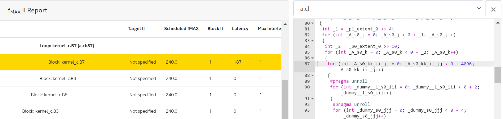

All the basic blocks of the systolic array (`kernel_c`) now have achieved an ideal II, 1. 

However, the drainer has a big II now: 

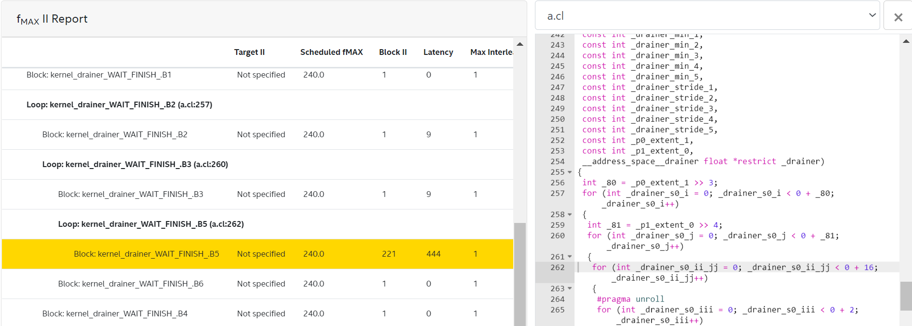

Here is the loop analysis:

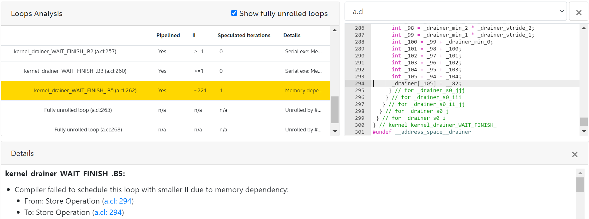

That is, there is a write-write dependence from line 294 to itself. However, the address of the write is actually changing every time. So why is there still a dependence? Let us look at the code:

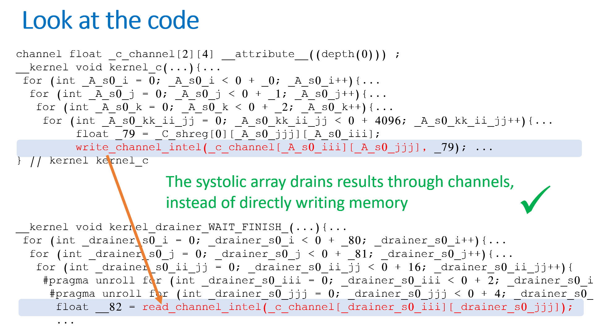

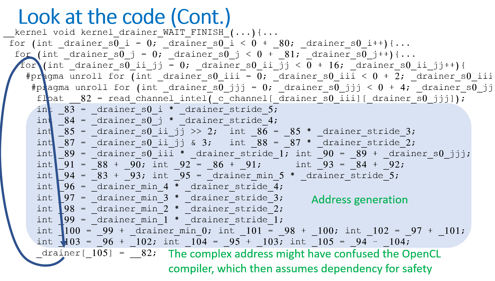

So the complex address in the drainer has led to a big II. **In general, the memory access patterns of  the FPGA device should be as simple as possible --- ideally, the access patterns are just sequential, or almost sequential**.  

To achieve this purpose, we can further isolate the output to the host CPU side. The compiler will automatically build a **memory channel** between the host and the device. Imagine the memory channel is a FIFO that is built using memory. One  may imagine that the function on the device side (`drainer`) will be writing the results serially into the device's (global) memory, the results will be transferred automatically from the device memory to the host memory, and the other newly isolated function on the host side will be reading the results serially from the host memory and writes the results into the correct locations in the host memory. That is, the function on the device side (`drainer`) will be serializing the results, and the other newly isolated function on the host side will be de-serializing the results. 

### 5.2. Isolating for serialization and de-serialization

Modify the specification slightly so as to further isolate the output to the host side:

```
Func drainer("drainer", Place::Device), deserializer("deserializer", Place::Host);
c.isolate_consumer(drainer);
drainer.space_time_transform(jjj, iii);
drainer.isolate_consumer(deserializer);
```

The complete specification is [here](isolate/isolate-drainer-deserializer.cpp).

Check for correctness:

```
/data/t2s/tutorials/fpga/matrix-multiply/run.sh isolate drainer-deserializer tiny emulator
```

Generate a static performance report with small inputs:

```
/data/t2s/tutorials/fpga/matrix-multiply/run.sh isolate drainer-deserializer small rtl
```

Look at the report in `tutorials/a/reports/report.html`:

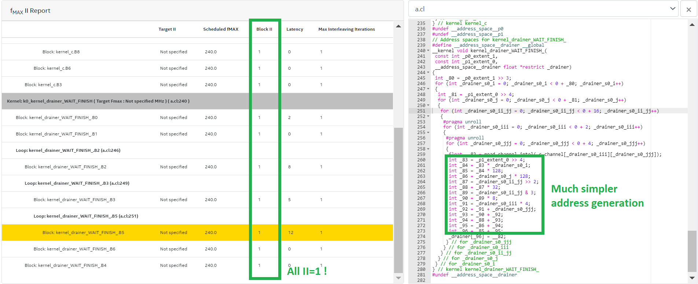 

It looks much better! The compiler needs a little more improvement to make the writing completely sequential. We are working on that.

### 5.3. Isolating full I/O paths

**In general, it is a bad practice to have random memory accesses on a FPGA board.** We want the device to be busy with computing, instead of memory accesses. We have seen that isolating the output potentially helps performance. Although inputs do not seem a bottleneck in these static analyses so far, it is good to isolate inputs to the host CPU side as well. 

At the beginning of the tutorial, we have illustrated [a design with full I/O paths](#final-design-animation). Let us modify the specification further to express that full I/O paths:

```
Func aSerializer("aSerializer", Place::Host),
     aLoader("aLoader", Place::Device),
     aFeeder("aFeeder", Place::Device), 
     bSerializer("bSerializer", Place::Host),
     bLoader("bLoader", Place::Device),
     bFeeder("bFeeder", Place::Device),
     drainer("drainer", Place::Device),
     collector("collector", Place::Device),
     unloader("unloader", Place::Device),
     deserializer("deserializer", Place::Host);

A.isolate_producer_chain(a, aSerializer, aLoader, aFeeder);
A.isolate_producer_chain(b, bSerializer, bLoader, bFeeder);
c.isolate_consumer(drainer);
drainer.space_time_transform(jjj, iii);
drainer.isolate_consumer_chain(collector, unloader, deserializer);
```

That is it! Check for correctness:

```
/data/t2s/tutorials/fpga/matrix-multiply/run.sh isolate full-IO tiny emulator
```

The complete specification is [here](isolate/isolate-full-IO.cpp).

Generate performance estimate:

```
/data/t2s/tutorials/fpga/matrix-multiply/run.sh isolate full-IO small rtl
```

Look at the report in `tutorials/a/reports/report.html`:

### 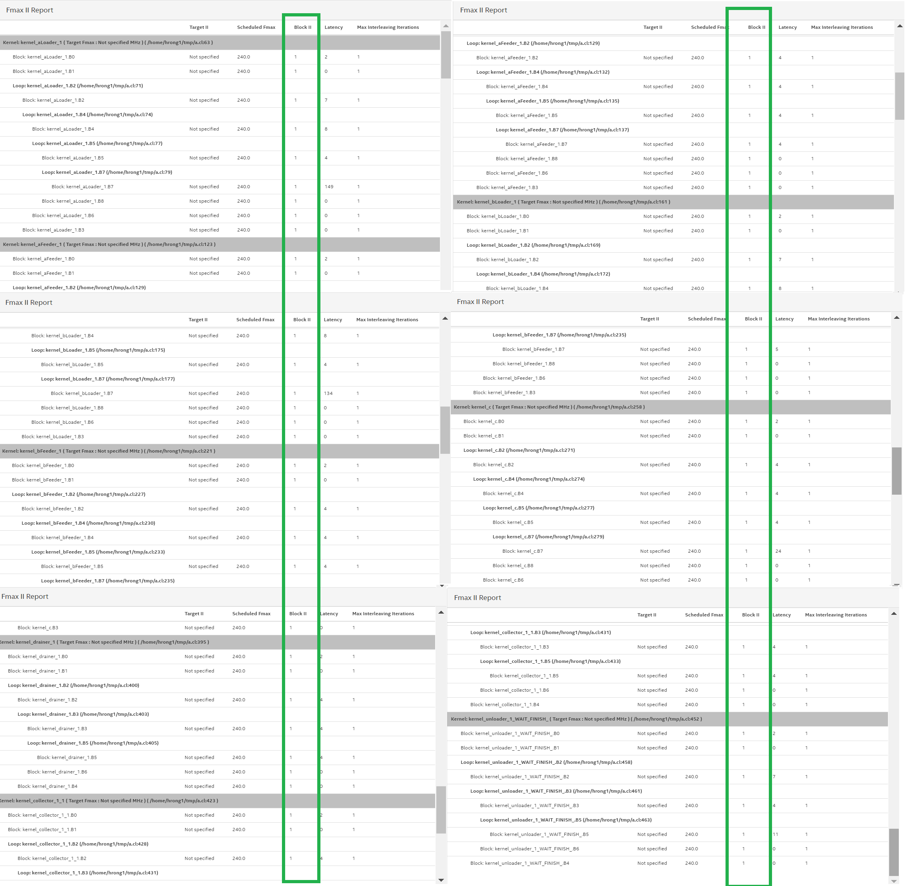

All the basic blocks of all the kernels on the FPGA device have II = 1, and also a FMax = 240 MHZ (for an A10 FPGA whose board frequency is 500 MHZ). Both numbers are good. 

So far, static analysis has been sufficient to identify performance issues. Now that  we have achieved a good II and FMax, it is time to actually run the specification on real hardware, and identify performance bottlenecks in  the dynamic execution.

### 5.4 Dynamic profiling

Synthesize a bitstream with instrumentation (It takes about 1 hour. Or skip this step and use a pre-generated bitstream in the next step by cleaning up the `tutorials` directory, instead: `/data/t2s/tutorials/fpga/matrix-multiply/run.sh clean`):

```
/data/t2s/tutorials/fpga/matrix-multiply/run.sh isolate full-IO small bits
```
+ Note:  If you lose connection to DevCloud during the execution of the above command, do the following: Wait until the synthesis is done (Synthesis is underway even when the connection is lost) and an `a.aocx` file would appear under the `tutorials` directory; Then log onto a compute node with the same FPGA model as before (A10 or S10). Set up the environment again (`cd tutorials` and `source /data/t2s/setenv.sh a10 (or s10)`), and type `/data/t2s/tutorials/fpga/matrix-multiply/run.sh unsign`.  

Offload the bitstream to run on an FPGA hardware:

```
/data/t2s/tutorials/fpga/matrix-multiply/run.sh isolate full-IO small use-bits
```

This will show

```
  FPGA GEMM exec time           = 2.32507 s

  # operations = 34359738368
  Throughput: 14.77792 GFLOPS
```

The number of operations equals 2 * the number of iterations, since every iteration performs a multiply and an add. The number of iterations equals the number of rows of matrix `a` (`III * II * I`) times  the number of columns of matrix `a` (`KKK * KK * K`) times the number of columns of matrix `b` (`JJJ * JJ * J`). Then the throughput in GFlOPS equals the number of operations * 10^(-9) / execution time. 

 The current performance, about 15 GFLOPS, is pretty bad. 

See the dynamic profile (assume you are accessing DevCloud using a GUI such as X2GO):

```
/data/t2s/tutorials/fpga/matrix-multiply/run.sh isolate full-IO small show-profile
```

<a name="loaders-stall">
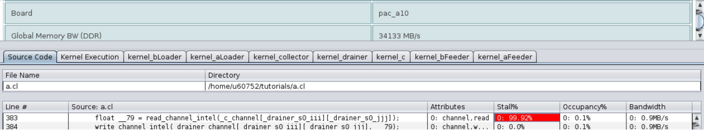

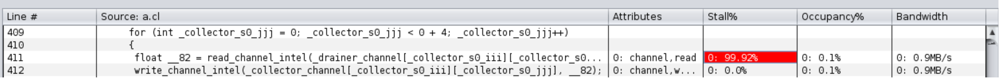
</a>

Two performance bottlenecks have been identified by the dynamic profiling. The first bottleneck (line 383) indicates that readings of the output channels from the systolic array almost always cause pipeline stalls (The stall% is very high: 99.92%) . The second bottleneck indicates that readings of the drainer channels have the same behavior.

Both bottlenecks are at the output paths. The output paths stall because the systolic array is busy with computing and does not produce an output until the end of reduction. So the systolic array is the real bottleneck. This is in fact what we want for a systolic array: we would like it to be compute-bound.

So in this case, we can try to scale up the systolic array now: increase the size of the systolic array so that it can produce more results. Hopefully, we will see the performance improved.

## 6. Scaling up to an medium-sized array

So far, we have been working with a small systolic array: `JJJ * III = 4 * 2 = 8` PEs, each PE with vectorized inputs whose lengths are `KKK = 4`. Let us try to scale up a little bit: `JJJ * III = 8 * 8 = 64` PEs, each PE with vectorized inputs whose lengths are `KKK = 8`. 

Generate a bitstream (Or skip this step and use a pre-generated bitstream in the next step by cleaning up the `tutorials` directory, instead: `/data/t2s/tutorials/fpga/matrix-multiply/run.sh clean`):
```
/data/t2s/tutorials/fpga/matrix-multiply/run.sh isolate full-IO medium bits 
```
Run the bitstream on an FPGA:

```
/data/t2s/tutorials/fpga/matrix-multiply/run.sh isolate full-IO medium use-bits
```

A message shows

```
  FPGA GEMM exec time           = 0.80683 s

  # operations = 34359738368
  Throughput: 42.58627 GFLOPS
```

The throughput is 3X bigger. Now let us look at the profile for details and more opportunities for performance:

```
/data/t2s/tutorials/fpga/matrix-multiply/run.sh isolate full-IO medium show-profile
```
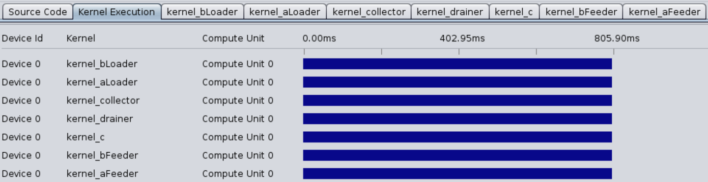

We see stalls appearing at the input paths now: the loadings of matrix `a` and `b` from the device's global memory stall most of the time:

<a name="loaders-stall">
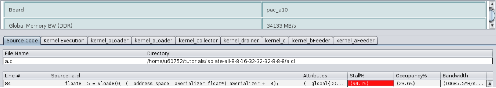

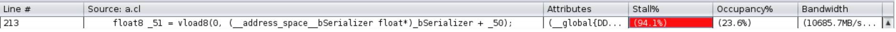
</a>

The above profile also shows that the memory bandwidth consumed by the loadings of the input matrices is totally 10685.5 + 10685.7 MB/s = <a name="loaders-bandwidth">~21 GB/s.</a>

And `bFeeder` stalls a lot when reading from `bLoader`.

<a name="bloader-feeder-stall">
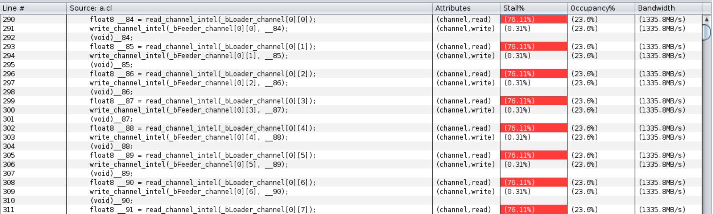
</a>

These stalls indicate that with a bigger array, the input paths become a bottleneck, which makes the design memory-bound. There are other stalls in other parts of the design as well. But let us first address the input paths: we need turn this design compute-bound in order to take full advantage of the computing power of the FPGA. We will achieve this purpose by trying to save memory bandwidth as much as possible.

## 7. Saving memory bandwidth

Matrix `a` has no dimension `jjj, jj`, or `j`. But `aSerializer` and `aLoader` have these loops, and therefore, the same set of data of matrix `a` are sent from the host memory to the device (global) memory repeatedly, and loaded from the device memory repeatedly, for `JJJ * JJ * J` times. Similarly, matrix `b` has no dimension `iii, ii`, or `i`. But `bSerializer` and `bLoader` have these loops, and therefore, the same set of data of matrix `b` are sent from the host memory to the device memory repeatedly, and loaded from the device memory repeatedly, for `III * II * I` times. When the parameters are big, this redundant data transferring from the host memory to the device memory, and the redundant loading of the data from the device memory, can lead to a huge waste of the device's memory bandwidth, and the performance may finally be bounded by the memory bandwidth.

Instead, for `aSerializer` (`bSerializer`), we can send the data only once: the data will be stored in the device memory, and `aLoader` (`bLoader`) can read the device memory whatever times. Removing all the irrelevant dimensions of the input matrices on the host side does not affect the loaders at all. We can do this via the following specification:

```
aSerializer.remove(jjj, jj, j);
bSerializer.remove(iii, ii, i);
```

Now consider the loaders. Take`aLoader` for instance. We consider `jjj, jj` as **reuse loops** for matrix `a` and can remove them from `aLoader`, which reduces the number of loading of matrix `a` by `JJJ * JJ` times. Then we can create a buffer in `aFeeder` to store the data sent from the loader. The feeder can read the same data `JJJ*JJ` times from the buffer. In that way, the dataflow of matrix `a` to the systolic array remains unchanged. 

You may wonder why we only remove `jjj` and`jj`, but not loop `j`, in `aLoader`. This is a trade-off between the buffer size and memory accesses. The size of a buffer is the product of the extents of all non-reuse loops inside the **buffer loop** (the loop at which we insert a buffer, which must enclose all the removed loops in the producer). For example, if we insert a buffer at loop `k` in `aFeeder`, loop `k` is the buffer loop. Among all the loops enclosed by loop `k` (i. e. `kkk, jjj, iii, jj, ii, kk`), loop `jjj` and `jj` are reuse loops, and therefore, the buffer size is `KKK * III * II * KK` . If we further remove loop `j` from `aLoader`, we surely reduce more redundant loads; In the meantime, the buffer will become `K` times bigger: in `aFeeder`, we have to insert buffer at loop `i`, which encloses all the loops that are removed in the producer (`aLoader`), and therefore, there will be one more non-reuse loop, `k`. Besides, since [tiling](#tiling-spec-part1), the extent of loop `k`,  i. e. `K`, is determined by the sizes of the input matrices.  This means the buffer size is not a fixed value. Our compiler does not allow such a case. 

Similarly, we can remove loop `iii` and `ii` in `bLoader`. The specification is:

```
aLoader.remove(jjj, jj);
aFeeder.buffer(aLoader, k);

bLoader.remove(iii, ii);
bFeeder.buffer(bLoader, k);
```

Finally, we see from the [previous profile](#bloader-feeder-stall) that `bLoader`  and `bFeeder` are communicating via multiple (8) channels. That is, there are multiple  `bLoader`  PEs and multiple `bFeeder` PEs, and these are communicating one-to-one. The multiple `bLoader`  PEs can compete in accessing the device memory. For better scalability, we may want a single `bLoader` PE to load all the data, and scatter the data across all the `bFeeder` PEs, like we show at the [beginning of the tutorial](#final-design-animation). In fact,  `aLoader`  and `aFeeder` work similarly, and can be improved in the same way, even if they did not show a bottleneck in the profile.

All together, we can add the following code to the specification:

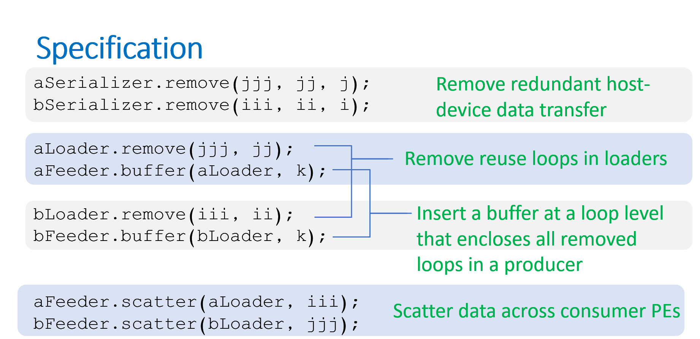

The complete specification is [here](opt-input/main.cpp).

Generate a bitstream (It takes about 3 hrs. Or skip this step and use a pre-generated bitstream in the next step by cleaning up the `tutorials` directory: `/data/t2s/tutorials/fpga/matrix-multiply/run.sh clean`):

```
/data/t2s/tutorials/fpga/matrix-multiply/run.sh opt-input medium bits 
```

Run the bitstream on an FPGA:

```
/data/t2s/tutorials/fpga/matrix-multiply/run.sh opt-input medium use-bits
```

The result is:

```
  FPGA GEMM exec time           = 0.24568 s

  # operations = 34359738368
  Throughput: 139.85691 GFLOPS
```

The throughput is further improved by 3X. Now look at the profile for details and other opportunities of improvement :

```
/data/t2s/tutorials/fpga/matrix-multiply/run.sh opt-input medium show-profile
```

Unlike [before](#loaders-stall), loading of the input matrices from device memory is no longer a bottleneck:

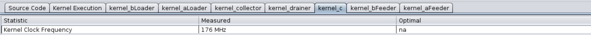

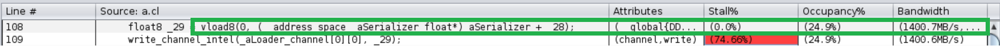

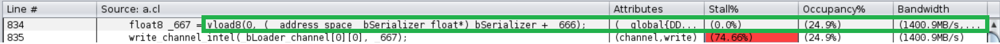

Also, the total device memory bandwidth consumed by the loaders are about 1400.7 + 1400.9 MB/s = 2.8 GB/s. Compared with the [21GB/s before](#loaders-bandwidth), this is an 8X saving of the memory bandwidth.

There are still many stalls in the output paths. Below shows only a part of them:

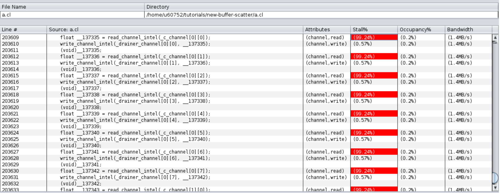

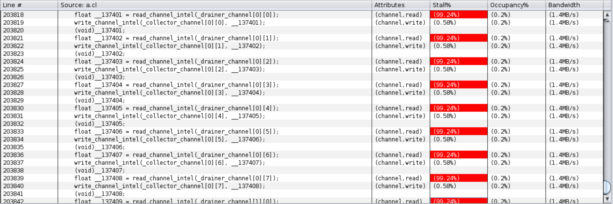

Overall, there are 8 * 8 drainer PEs, communicating with 8 * 8 systolic array PEs directly, and are stalled most of the time. Similarly, there are 8 * 8 collector PEs, communicating with 8 * 8 drainer PEs directly, and are stalled most of the time. Totally, there are <a name="128-out-stalls">128 channels, all stalled </a> most of the time. Such an output network is very big, and won't scale.

## 8. Simplifying the output paths

As we showed [at the beginning of the tutorial](#final-design-animation), we can gather output data from the systolic array across each column of the drainer PEs, then gather data cross a row of collector PEs,   and store the data sequentially to the device memory through a single unloader.

Here is the specification to achieve this purpose:

```
drainer.gather(c, iii);
collector.gather(drainer, jjj);
```

It seems we forgot to achieve data parallelism in output path. We can gather the output horizontally across the collector PEs into a vector, and save the output in vectors into the device memory, which improves the efficiency of memory stores:

```
collector.vectorize(jjj);
unloader.vectorize(jjj);
```

The complete specification is [here](opt-output/main.cpp).

Generate a bitstream (It takes ~3 hrs. Or skip this step and use a pre-generated bitstream in the next step by cleaning up the `tutorials` directory: `/data/t2s/tutorials/fpga/matrix-multiply/run.sh clean`):

```
/data/t2s/tutorials/fpga/matrix-multiply/run.sh opt-output medium bits 
```

Run the bitstream on an FPGA:

```
/data/t2s/tutorials/fpga/matrix-multiply/run.sh opt-output medium use-bits
```

```
  FPGA GEMM exec time           = 0.18169 s

  # operations = 34359738368
  Throughput: 189.11542 GFLOPS
```

The performance is 36% better than before.  There are still stalls in the output paths: 8 stalls in the drainer and 8 stalls in the collector, totally 16 stalls. Compared with the [previous 128 stalls](#128-out-stalls), this is a nice improvement. Below shows part of them.

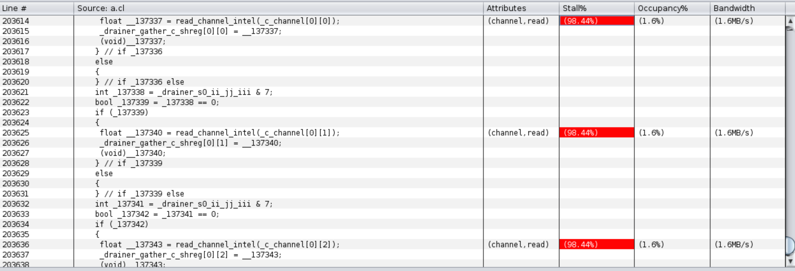

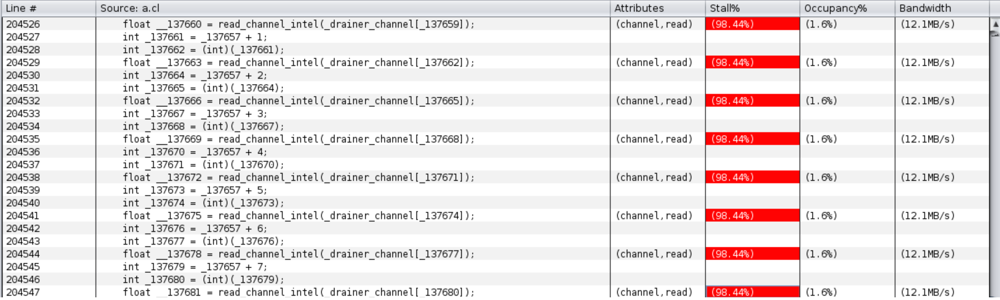

## 9. Scaling up to a large array

Now that the I/O networks seem fine, we can further enlarge the systolic array.  We choose a larger array size `KKK * JJJ * III = 16 * 8 * 10`. The sizes of the input matrices are set as `III * II * I = 10 * 32 * 32  = 10K`, `JJJ * JJ * J = 8 * 32 * 32 = 8K`, and `KKK * KK * K = 16 * 32 * 4 = 2K`.

Generate a bitstream (It takes ~8 hrs. Or skip this step and use a pre-generated bitstream in the next step by cleaning up the `tutorials` directory, instead: `/data/t2s/tutorials/fpga/matrix-multiply/run.sh clean`):

```
/data/t2s/tutorials/fpga/matrix-multiply/run.sh opt-output large bits
```

Run the bitstream on an FPGA:

```
/data/t2s/tutorials/fpga/matrix-multiply/run.sh opt-output large use-bits
```

A message shows

```
  FPGA GEMM exec time           = 0.91911 s

  # operations = 343597383680
  Throughput: 373.83862 GFLOPS
```

Look at the synthesis report in `tutorials/a/acl_quartus_report.txt`:

```
ALUTs: 188149
Registers: 399,683
Logic utilization: 190,304 / 427,200 ( 45 % )
I/O pins: 310 / 826 ( 38 % )
DSP blocks: 1,299 / 1,518 ( 86 % )
Memory bits: 32,490,792 / 55,562,240 ( 58 % )
RAM blocks: 2,065 / 2,713 ( 76 % )
Actual clock freq: 147
Kernel fmax: 147.73
1x clock fmax: 147.73
2x clock fmax: 10000
Highest non-global fanout: 119237
```

We used 1299 DSPs, and the frequency is 147.73 MHZ. We can calculate the theoretically peak performance: 

```
Peak throughput = 2 * DSPs * frequency = 2 * 1299 * 147.73 * 10E-3 = 383.8 GFLOPS
```

So our design has achieved

```
DSP efficiency = 97.4%
```

This means that our design runs very smoothly with omittable pipeline stalls,  and spends most time on computing.

To continue improving performance, we should keep such a high efficiency, increase the usage of DSPs, and increase the fmax. 

## 10. Next

We may still try several ways to further improve performance:

+ Isolate out control signals to simplify the systolic array. 
+ Further increase array size to `KKK * JJJ * III = 16 * 8 * 11` for example. 

+ Add "-fpc -fp-relaxed" to the compilation flag for simpler logic.

+ Add "-fmax=500” for possibly higher frequency.

+ Add “-high-effort” to increase the chance of success in place and route.

+ Seed sweeping. 

We will keep improving the performance. Stay tuned.