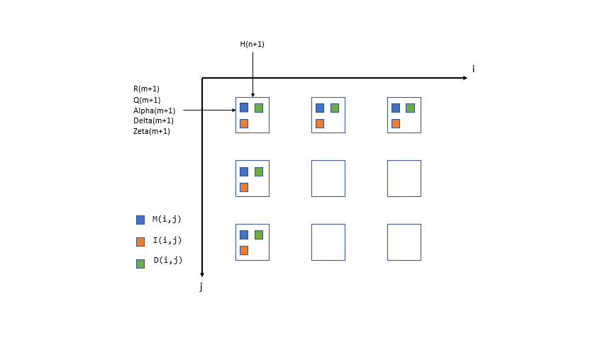
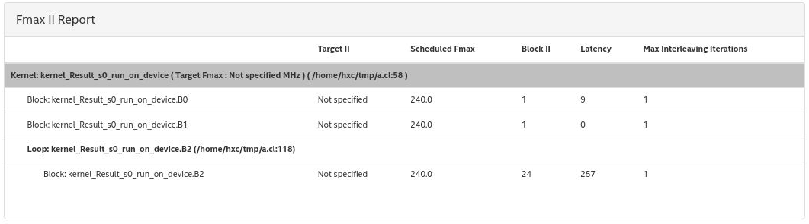
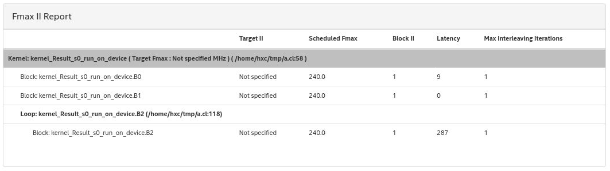
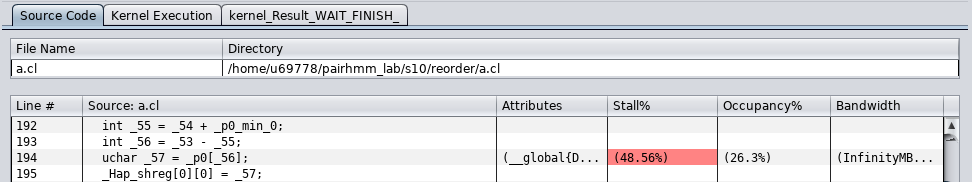
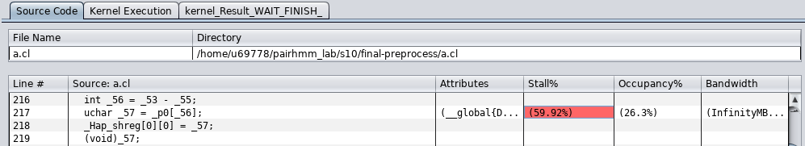
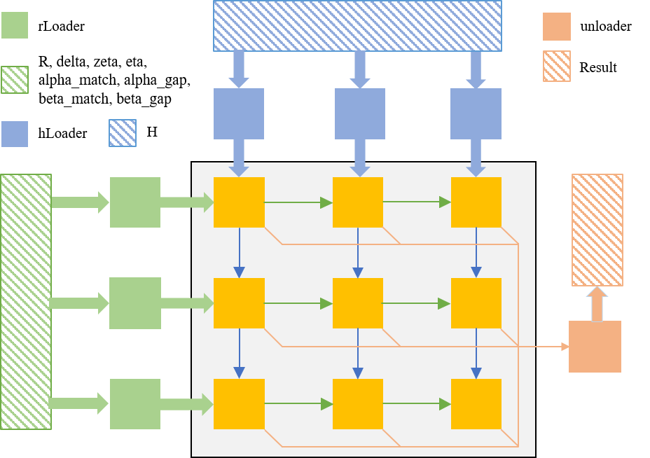
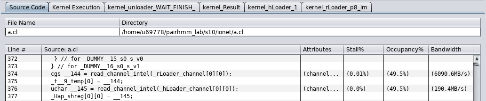
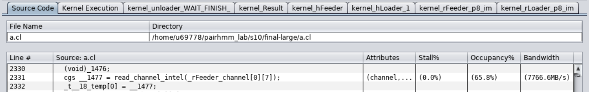
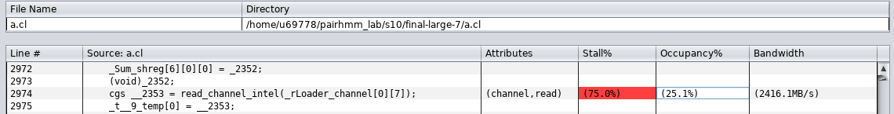
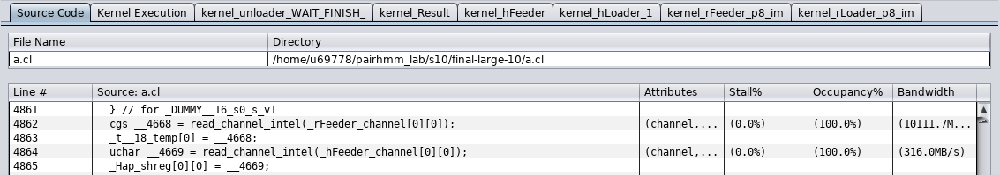

# PairHMM Tutorial

>  Xiaochen Hao, Intel & Peking University, xiaochen.hao@intel.com

Pairwise Hidden Markov Model (PairHMM) is an important part of the HaplotypeCaller of GATK 3.6 toolchain.

PairHMM aligns a string (a read) `R` with another string (a haplotype) `H`, which have the lengths of `m` and `n`, respectively. PairHMM calculates 3 matrices, `M`, `I` and `D`, according to the following equations (Source: Ren, S., Bertels, K., & Al-Ars, Z. (2018). Efficient Acceleration of the Pair-HMMs Forward Algorithm for GATK HaplotypeCaller on Graphics Processing Units. Evolutionary Bioinformatics, 14, 1-12. DOI:10.1177/1176934318760543):

Input:

```plaintext
integers: m, n
arrays:   R[m + 1], Q[m + 1], H[n + 1], alpha[m + 1], delta[m + 1], zeta[m + 1]
```

Initialization:

```plaintext
M(i, 0) = I(i, 0) = D(i, 0) = 0,  i in [0, m]
M(0, j) = I(0, j) = 0             j in [0, n]
D(0, j) = 1 / n                   j in [0, n]
```

Recurrence:

```plaintext
M(i, j) = lamda(i, j) * { alpha(i) * M(i - 1, j - 1) + beta(i) * I(i - 1, j - 1) + gamma(i) * D(i - 1, j - 1)}
I(i, j) = delta(i) * M(i - 1, j) + epsilon(i) * I(i - 1, j)
D(i, j) = zeta(i) * M(i, j - 1) + eta(i) * D(i, j - 1)
```

where

```plaintext
lamda(i, j) = 1 - Q(i) if R(i) == H(j), or Q(i) / 3 otherwise.
beta(i) = gamma(i) = 0.9
epsilon(i) = eta(i) = 0.1
```

Results:

```plaintext
Result = sum of M(m, j) + I(m, j) j in [1, n]
```

For implementing the PairHMM algorithm, the above equations are all we need, and we do not have to understand the biological background.

## Set up the environment according to [instructions]().

Basically, enter a working directory, and `source /data/t2s/setenv.sh` to set up the environment. The environment is determined based on the specific FPGA model (a10 or s10), and the version of the Intel FPGA SDK for OpenCL compiler (i.e. version of aoc).

## How to design a systolic array?



If we let loop `i` and `j` be space loops, we get a 2-D array. Note that the dependence shown above implies a systolic array design. `M(i, j)` depends on the values stored at the left upper corner, while `I(i, j)` depends on the left and `D(i, j)` depends on the top. It is a relatively complex dependence pattern compared with the dense tensor kernel such as GEMM. Our framework can easily express it with the UREs and space-time transform.

## Design 1: Tiling

We assume a set of equal-length reads to be compared with a set of equal-length haps. A practical design must handle multiple `Haps` and `Reads` strings with a long length. Similar to other workloads, mapping large input data to a systolic array requires blocking the iteration space like this:

```plaintext
  for (h = 0; h < NUM_HAPS; h++)
    for (r = 0; r < NUM_READS; r++)
      for (oj = 0; oj < (n + 1) / JJ; oj++)
        for (oi = 0; oi < (m + 1) / II; oi++)
          for (jj = 0; jj < JJ; jj++)
            for (ii = 0; ii < II; ii++) 
```

For each tile, we can apply the same space-time scheduling as above.


Unlike workloads such as GEMM, the tiling of input strings brings inter-tile dependence, which must be explicitly specified in UREs. For example, the iteration at (i, j) = (2, 1) depends on the value from the last tile (1, 0) and (1, 1). Our framework can handle such cases automatically.

```
#define A                       ii,      jj,      rrr,  hhh,  oi,   oj,   rr,  hh
#define A_ii_minus_1            ii-1,    jj,      rrr,  hhh,  oi,   oj,   rr,  hh
#define A_jj_minus_1            ii,      jj-1,    rrr,  hhh,  oi,   oj,   rr,  hh
#define A_ii_minus_1_jj_minus_1 ii-1,    jj-1,    rrr,  hhh,  oi,   oj,   rr,  hh
#define A_last_ii               ii+II-1, jj,      rrr,  hhh,  oi-1, oj,   rr,  hh
#define A_last_ii_jj_minus_1    ii+II-1, jj-1,    rrr,  hhh,  oi-1, oj,   rr,  hh
#define A_last_jj               ii,      jj+JJ-1, rrr,  hhh,  oi,   oj-1, rr,  hh
#define A_ii_minus_1_last_jj    ii-1,    jj+JJ-1, rrr,  hhh,  oi,   oj-1, rr,  hh
#define A_last_ii_last_jj       ii+II-1, jj+JJ-1, rrr,  hhh,  oi-1, oj-1, rr,  hh

Hap(A)    = select(ii == 0, H(j, h), Hap(A_ii_minus_1));
Read(A)   = select(jj == 0, R(i, r), Read(A_jj_minus_1));
Quality(A)= select(jj == 0, Q(i, r), Quality(A_jj_minus_1));
Alpha(A)  = select(jj == 0, alpha(i, r), Alpha(A_jj_minus_1));
Delta(A)  = select(jj == 0, delta(i, r), Delta(A_jj_minus_1));
Zeta(A)   = select(jj == 0, zeta(i, r), Zeta(A_jj_minus_1));
Lamda(A)  = select(Read(A) == Hap(A), 1.0f - Quality(A), Quality(A) / 3);

#define M_expr(x)    Lamda(A) * (Alpha(A) * M(x) + beta * I(x) + gamma * D(x))
#define I_expr(x)    Delta(A) * M(x) + epsilon * I(x)
#define D_expr(x)    Zeta(A) * M(x) + eta * D(x)

M(A)  = select(i_is_0(A) || j_is_0(A), 0.0f,
            select(ii == 0, select(jj == 0, M_expr(A_last_ii_last_jj),
                                            M_expr(A_ii_minus_1_last_jj)),
                            select(jj == 0, M_expr(A_ii_minus_1_last_jj),
                                            M_expr(A_ii_minus_1_jj_minus_1))));
I(A)  = select(i_is_0(A) || j_is_0(A), 0.0f,
            select(ii == 0, I_expr(A_last_ii),
                            I_expr(A_ii_minus_1)));
D(A)  = select(i_is_0(A), 1.0f / (NLEN - 1),
            select(j_is_0(A), 0.0f, 
                select(jj == 0, D_expr(A_last_jj),
                                D_expr(A_jj_minus_1))));
Sum(A) = select(i == MLEN-1,
            select(j_is_0(A), 0.0f,
                select(jj == 0, Sum(A_last_jj), Sum(A_jj_minus_1))) + M(A) + I(A), 0.0f);
Result(rrr, hhh, rr, hh) = select(i_is_last(A) && j_is_last(A), Sum(A));
```

Next compile the `tiling/main.cpp` file:

```
rm -rf a.a* a
g++ /data/t2s/tutorials/fpga/pairhmm/tiling/main.cpp $CXX_FLAGS -o ./a.out
env INTEL_FPGA_OCL_PLATFORM_NAME="$EMULATOR_PLATFORM_NAME"  CL_CONTEXT_EMULATOR_DEVICE_INTELFPGA=1 BITSTREAM=./a.aocx AOC_OPTION="$EMULATOR_AOC_OPTION -board=$FPGA_BOARD" ./a.out
```

Please remember to clean the generated file in your directory, otherwise you may encounter some errors. The emulation should throw a "Success" message. Now compile it to RTL, then open the report:

```
aoc -rtl -report -board=$FPGA_BOARD ./a.cl
open a/reports/report.html
switch to Throughput Analysis -> Fmax II
```

Oops! We expect all kernels can be scheduled to maximal frequency (240MHz for A10 and 480MHz for S10), and the Block II value is 1. However, the Block II of kernel `Result`is 24, which lowers the overall performance. We will figure out the reason and solve it in the next step.



## Design 2: Reorder

"The launch frequency of a new loop iteration is called the initiation interval (II). II refers to the number of hardware clock cycles for which the pipeline must wait before it can process the next loop iteration. An optimally unrolled loop has an II value of 1 because one loop iteration is processed every clock cycle." (Intel FPGA SDK for OpenCL Pro Edition: Best Practices Guide)

In short, the value computed at previous iterations will suddenly be used by the next iteration. The OpenCL compiler is hard to pipeline such a small dependence distance. A basic idea is to move the independent dimensions inward; we choose to tile the dimension `R, H` into `RR, HH` and `RRR, HHH` and move `RRR, HHH` inward, which extend the distance to RRR*HHH=40. First compile the file and generate the static analysis report:

```
rm -rf a.a* a
g++ /data/t2s/tutorials/fpga/pairhmm/reorder/main.cpp $CXX_FLAGS -o ./a.out
env INTEL_FPGA_OCL_PLATFORM_NAME="$EMULATOR_PLATFORM_NAME"  CL_CONTEXT_EMULATOR_DEVICE_INTELFPGA=1 BITSTREAM=./a.aocx AOC_OPTION="$EMULATOR_AOC_OPTION -board=$FPGA_BOARD" ./a.out
aoc -rtl -report -board=$FPGA_BOARD ./a.cl
```



Great! The loop iterations are fully pipelined. Now we can synthesis the design:

```
rm -rf a.a* a
g++ /data/t2s/tutorials/fpga/pairhmm/reorder/main.cpp $CXX_FLAGS $AOCL_LIBS -o ./a.out
env INTEL_FPGA_OCL_PLATFORM_NAME="$HW_RUN_PLATFORM_NAME" BITSTREAM=./a.aocx AOC_OPTION="-board=$FPGA_BOARD -profile" ./a.out
```

Next see the profiling report with the following instructions:

```
aocl report a.aocx a.source profile.mon
```



The design stalls on memory access and the occupancy ratio are low; that is to say, the systolic array runs slowly and wastes most of the time on fetching input data. We first try to speed up the systolic array since there is an obvious inefficiency in our UREs, then optimize memory access.

## Design 3: Preprocess

The previous design requires a high-cost floating divide operation in`Lamda`. To eliminate it, we can preprocess these operations at the host end and transfer the results to the device.  Rewrite the UREs as:

```
AlphaMatch(A) = select(jj == 0, alpha_match(i, r), AlphaMatch(A_jj_minus_1));
AlphaGap(A)   = select(jj == 0, alpha_gap(i, r), AlphaGap(A_jj_minus_1));
BetaMatch(A)  = select(jj == 0, beta_match(i, r), BetaMatch(A_jj_minus_1));
BetaGap(A)    = select(jj == 0, beta_gap(i, r), BetaGap(A_jj_minus_1));

Alpha(A) = select(Read(A) == Hap(A), AlphaMatch(A), AlphaGap(A));
Beta(A)  = select(Read(A) == Hap(A), BetaMatch(A), BetaGap(A));
```

How to calculate the `*Match, *Gap` is omitted. The generated hardware now only needs to select appropriate data according to the incoming strings. 

Now synthesis the design with the following commands:

```
rm -rf a.a* a
g++ /data/t2s/tutorials/fpga/pairhmm/preprocess/main.cpp $CXX_FLAGS $AOCL_LIBS -o ./a.out
env INTEL_FPGA_OCL_PLATFORM_NAME="$HW_RUN_PLATFORM_NAME" BITSTREAM=./a.aocx AOC_OPTION="-board=$FPGA_BOARD -profile" ./a.out
```

Next see the profiling report with the following instructions:

```
aocl report a.aocx a.source profile.mon
```

The preprocessing overhead is relatively small compared with the on-the-fly processing.



However, the results are not what we are expected. The execution time nearly doubled compared with the previous design due to a higher memory bandwidth pressure. We must pipeline the memory access and computing, that is, build a customized I/O network.

## Design 4: Build I/O Network



We need to build an I/O network to run in parallel with the PE array, as shown in the above figure, namely isolate access to buffers allocated in the device memory into separate kernels `hLoader, rLoader, unloader`.  Add the below code:

```
Hap.isolate_producer_chain(H, HSerializer, HLoader, HFeeder)
	.isolate_producer_chain({R, delta, zeta, eta, alpha_match, alpha_gap, beta_match, beta_gap}, RSerializer, RLoader, RFeeder);
Result.isolate_consumer_chain(Unloader, Deserializer);
```

Until now, we do not have any idea about what an optimized I/O network should be. So we just start from a simple I/O network, where isolated kernels just perform memory access. Synthesis the design with the following commands:

```
rm -rf a.a* a
g++ /data/t2s/tutorials/fpga/pairhmm/ionet/main.cpp $CXX_FLAGS $AOCL_LIBS -o ./a.out
env INTEL_FPGA_OCL_PLATFORM_NAME="$HW_RUN_PLATFORM_NAME" BITSTREAM=./a.aocx AOC_OPTION="-board=$FPGA_BOARD -profile" ./a.out
```

Next see the profiling report with the following instructions:

```
aocl report a.aocx a.source profile.mon
```

 From the profiling results, we see that though the loader kernels stalls on writing data into its channels, the systolic array do not stall on reading data, indicating a pipelined execution.



It seems the systolic array runs too slow to catch up with the memory access. To boost it up, next, we scale up the current design to a bigger size, which would consume more data at once.

## Design 5: Scaling up

The previous design shows that only about 2% of DSPs are used, and almost 98% of on-chip resources remain idle. It is simple to adjust the systolic array size with the tiling factor, but it requires several trial-and-error attempts to determine the maximal size a specific board can realize. Let us scale up the previous design to the size 24x8.

We use GCups instead of GFlops to measure the performance since the update of `lamda` depends on the input sequences. The `GCups` is defined as:

```
(read length × haplotype length) ÷ PairHMM time
That is: (RRR * RR * OI * II * HHH * HH * OJ * JJ) ÷ PairHMM time
```

Now synthesis the design with the following commands:

```
rm -rf a.a* a
g++ /data/t2s/tutorials/fpga/pairhmm/scaleup/main.cpp $CXX_FLAGS $AOCL_LIBS -o ./a.out
env INTEL_FPGA_OCL_PLATFORM_NAME="$HW_RUN_PLATFORM_NAME" BITSTREAM=./a.aocx AOC_OPTION="-board=$FPGA_BOARD -profile" ./a.out
```

Open the file `acl_quartus_report.txt`we can see the design consumes 24% DSP blocks and run at 302Mhz, a good result.


Next see the profiling report with the following instructions:

```
aocl report a.aocx a.source profile.mon
```

Our kernel executes 250ms, only about 14 GCups. The profiling results shows the memory bandwidth is sufficiently high:





However, the channels stalls on the PE side. The speed of memory access lags behind the PE array significantly.

## Design 6: Buffer

Note that some reuse loops in `RLoader`, like `hhh`, `oj` and `hh`, waste most of the memory bandwidth to load the same data volume. We can insert an on-chip buffer to store the data from memory. When the PE array executes at reuse loops, it loads data from the on-chip buffer rather than memory:

```
RSerializer.remove(jj, hhh, oj, hh);
RLoader.remove(jj, hhh, oj).min_depth(128);
RFeeder.scatter(RLoader, ii).buffer(RLoader, rr).min_depth(64);
HSerializer.remove(ii, rrr, oi, rr);
HLoader.remove(ii, rrr, oi).min_depth(128);
HFeeder.scatter(HLoader, jj).buffer(HLoader, rr).min_depth(64);
```

We also apply the `scatter` optimization, which construct a daisy chain between the PE of `RLoader` and `RFeeder` since the high-fanout connection is inefficient. Next synthesis and profile the design:

```
rm -rf a.a* a
g++ /data/t2s/tutorials/fpga/pairhmm/buffer/main.cpp $CXX_FLAGS $AOCL_LIBS -o ./a.out
env INTEL_FPGA_OCL_PLATFORM_NAME="$HW_RUN_PLATFORM_NAME" BITSTREAM=./a.aocx AOC_OPTION="-board=$FPGA_BOARD -profile" ./a.out
aocl report a.aocx a.source profile.mon
```



Great! The systolic array never stalls on reading channels and spend the most of time on data access. We achieved 57 GCups, a good result.


[TODO] Support random length of input sequences.